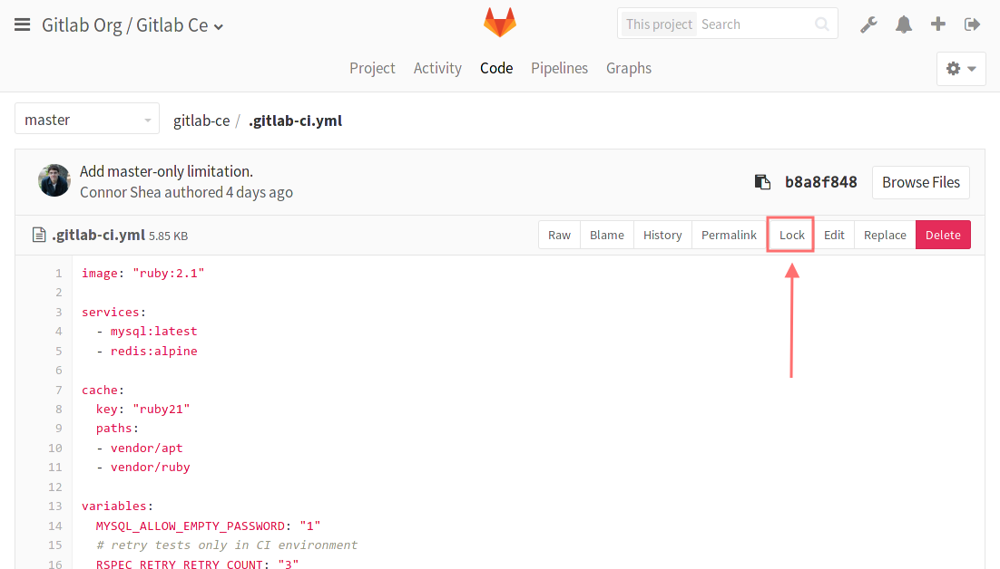

# File Locking **(FREE)**

Preventing wasted work caused by unresolvable merge conflicts requires
a different way of working. This means explicitly requesting write permissions,
and verifying no one else is editing the same file before you start.

Although branching strategies usually work well enough for source code and
plain text because different versions can be merged together, they do not work
for binary files.

When file locking is setup, lockable files are **read-only** by default.

When a file is locked, only the user who locked the file may modify it. This
user is said to "hold the lock" or have "taken the lock", since only one user
can lock a file at a time. When a file or directory is unlocked, the user is
said to have "released the lock".

GitLab supports two different modes of file locking:

- [Exclusive file locks](#exclusive-file-locks) for binary files: done **through
  the command line** with Git LFS and `.gitattributes`, it prevents locked
  files from being modified on any branch. **(FREE)**
- [Default branch locks](#default-branch-file-and-directory-locks): done
  **through the GitLab UI**, it prevents locked files and directories being
  modified on the default branch. **(PREMIUM)**

## Permissions

Locks can be created by any person who has at least
[Developer role](../permissions.md) in the repository.

Only the user who locked the file or directory can edit locked files. Other
users are prevented from modifying locked files by pushing, merging,
or any other means, and are shown an error like: `The path '.gitignore' is
locked by Administrator`.

## Exclusive file locks **(FREE)**

> [Introduced](https://gitlab.com/gitlab-org/gitlab-foss/-/issues/35856) in GitLab 10.5.

This process allows you to lock single files or file extensions and it is
done through the command line. It doesn't require GitLab paid subscriptions.

Git LFS is well known for tracking files to reduce the storage of
Git repositories, but it can also be user for [locking files](https://github.com/git-lfs/git-lfs/wiki/File-Locking).
This is the method used for Exclusive File Locks.

### Install Git LFS

Before getting started, make sure you have [Git LFS installed](../../topics/git/lfs/index.md) in your computer. Open a terminal window and run:

```shell
git-lfs --version
```

If it doesn't recognize this command, you must install it. There are
several [installation methods](https://git-lfs.github.com/) that you can
choose according to your OS. To install it with Homebrew:

```shell
brew install git-lfs
```

Once installed, **open your local repository in a terminal window** and
install Git LFS in your repository. If you're sure that LFS is already installed,
you can skip this step. If you're unsure, re-installing it does no harm:

```shell
git lfs install
```

Check this document to learn more about [using Git LFS](../../topics/git/lfs/index.md#using-git-lfs).

### Configure Exclusive File Locks

You need the [Maintainer role](../permissions.md) to configure
Exclusive File Locks for your project through the command line.

The first thing to do before using File Locking is to tell Git LFS which
kind of files are lockable. The following command stores PNG files
in LFS and flag them as lockable:

```shell
git lfs track "*.png" --lockable
```

After executing the above command a file named `.gitattributes` is
created or updated with the following content:

```shell
*.png filter=lfs diff=lfs merge=lfs -text lockable
```

You can also register a file type as lockable without using LFS (to be able, for example,
to lock/unlock a file you need in a remote server that
implements the LFS File Locking API). To do that you can edit the
`.gitattributes` file manually:

```shell
*.pdf lockable
```

The `.gitattributes` file is key to the process and **must**
be pushed to the remote repository for the changes to take effect.

After a file type has been registered as lockable, Git LFS makes
them read-only on the file system automatically. This means you
must **lock the file** before [editing it](#edit-lockable-files).

### Lock files

By locking a file, you verify that no one else is editing it, and
prevent anyone else from editing the file until you're done. On the other
hand, when you unlock a file, you communicate that you've finished editing
and allow other people to edit it.

To lock or unlock a file with Exclusive File Locking, open a terminal window
in your repository directory and run the commands as described below.

To **lock** a file:

```shell
git lfs lock path/to/file.png
```

To **unlock** a file:

```shell
git lfs unlock path/to/file.png
```

You can also unlock by file ID (given by LFS when you [view locked files](#view-exclusively-locked-files)):

```shell
git lfs unlock --id=123
```

If for some reason you need to unlock a file that was not locked by
yourself, you can use the `--force` flag as long as you have **Maintainer**
permissions to the project:

```shell
git lfs unlock --id=123 --force
```

You can normally push files to GitLab whether they're locked or unlocked.

NOTE:
Although multi-branch file locks can be created and managed through the Git LFS
command line interface, file locks can be created for any file.

### View exclusively-locked files

To list all the files locked with LFS locally, open a terminal window in your
repository and run:

```shell
git lfs locks
```

The output lists the locked files followed by the user who locked each of them
and the files' IDs.

On the repository file tree, GitLab displays an LFS badge for files
tracked by Git LFS plus a padlock icon on exclusively-locked files:


You can also [view and remove existing locks](#view-and-remove-existing-locks) from the GitLab UI.

NOTE:
When you rename an exclusively-locked file, the lock is lost. You must
lock it again to keep it locked.

### Edit lockable files

Once the file is [configured as lockable](#configure-exclusive-file-locks), it is set to read-only.
Therefore, you need to lock it before editing it.

Suggested workflow for shared projects:

1. Lock the file.
1. Edit the file.
1. Commit your changes.
1. Push to the repository.
1. Get your changes reviewed, approved, and merged.
1. Unlock the file.

## Default branch file and directory locks **(PREMIUM)**

> [Introduced](https://gitlab.com/gitlab-org/gitlab/-/merge_requests/440) in GitLab Enterprise Edition 8.9. Available in [GitLab Premium](https://about.gitlab.com/pricing/).

This process allows you to lock one file at a time through the GitLab UI and
requires access to [GitLab Premium](https://about.gitlab.com/pricing/)
or higher tiers.

Default branch file and directory locks only apply to the
[default branch](repository/branches/default.md) set in the project's settings.

Changes to locked files on the default branch are blocked, including merge
requests that modify locked files. Unlock the file to allow changes.

### Lock a file or a directory

To lock a file:

1. Open the file or directory in GitLab.
1. Click the **Lock** button, located near the Web IDE button.

   

An **Unlock** button is displayed if the file is already locked, and
is disabled if you do not have permission to unlock the file.

If you did not lock the file, hovering your cursor over the button shows
who locked the file.

### View and remove existing locks

The **Locked Files**, accessed from **Project > Repository** left menu, lists
all file and directory locks. Locks can be removed by their author, or any user
with the [Maintainer role](../permissions.md) and above.

This list shows all the files locked either through LFS or GitLab UI.
