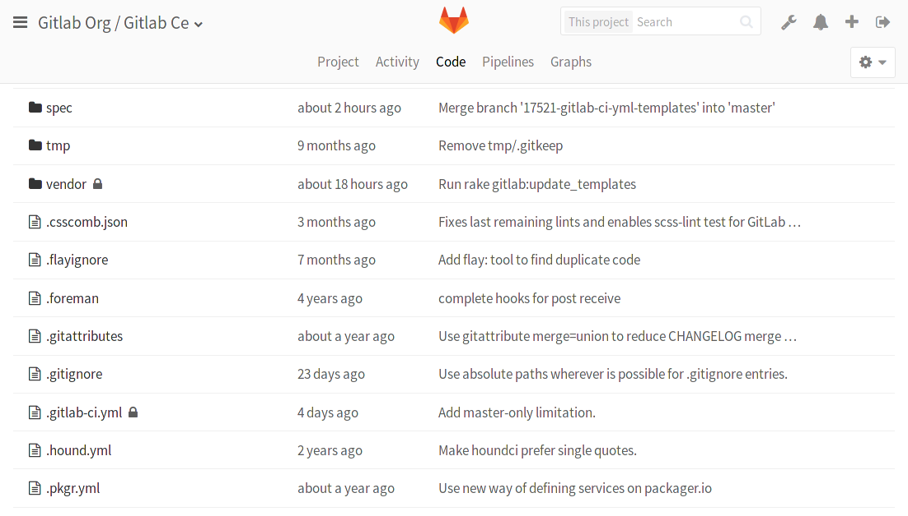

# File Locking **[PREMIUM]**

> [Introduced](https://gitlab.com/gitlab-org/gitlab-ee/merge_requests/440) in [GitLab Premium](https://about.gitlab.com/pricing/) 8.9.

File Locking helps you avoid merge conflicts and better manage your binary files.
Lock any file or directory, make your changes, and then unlock it so another
member of the team can edit it.

## Overview

Working with multiple people on the same file can be a risk. Conflicts
when merging a non-text file are hard to overcome and will require a lot
of manual work to resolve. With GitLab Premium, File
Locking helps you avoid merge conflicts and better manage your binary
files by preventing everyone, except you, from modifying a specific file
or entire directory.

## Use-cases

The file locking feature is useful in situations when:

- Multiple people are working on the same file and you want to avoid merge
  conflicts.
- Your repository contains binary files in which situation there is no easy
  way to tell the diff between yours and your colleagues' changes.
- Prevent design assets from being overwritten.

Locked directories are locked recursively, which means that everything that
lies under them is also locked.

## Locking a file or a directory

NOTE: **Note:**
Locking only works for the default branch you have set in the project's settings
(usually `master`).

To lock a file:

1. Navigate to your project's **Repository > Files**.
1. Pick the file you want to lock.
1. Click the "Lock" button.

    

To lock an entire directory, look for the "Lock" link next to "History".

After you lock a file or directory, it will appear as locked in the repository
view.



Once locked, any merge request to the default branch will fail
to merge until the file becomes unlocked.

## Unlocking a file or a directory

To unlock a file or a directory, follow the same procedure as when you locked
them. For a detailed view of every existing lock, see the next section on
"Viewing and managing existing locks".

You can unlock a file that yourself or someone else previously locked as long
as you have Maintainer or above [permissions](../permissions.md) to the project.

## Viewing and managing existing locks

To view or manage every existing lock, navigate to the
**Project > Repository > Locked Files** area. There, you can view all existing
locks and [remove the ones you have permission for](#permissions-on-file-locking).

## Permissions on file locking

The user that locks a file or directory **is the only one** that can edit and
push their changes back to the repository where the locked objects are located.

Locks can be created by any person who has [push access](../permissions.md) to the repository; i.e.,
Developer and higher level, and can be removed solely by their author and any
user with Maintainer permissions and above.

If a file is locked and you are not the author of its locked state, a
pre-receive hook will reject your changes when you try to push. In the
following example, a user who has no permissions on the locked `.gitignore`
file will see the message below:

```bash
Counting objects: 3, done.
Delta compression using up to 4 threads.
Compressing objects: 100% (3/3), done.
Writing objects: 100% (3/3), 320 bytes | 0 bytes/s, done.
Total 3 (delta 1), reused 0 (delta 0)
remote: GitLab: The path '.gitignore' is locked by Administrator
To https://example.com/gitlab-org/gitlab-ce.git
 ! [remote rejected] master -> master (pre-receive hook declined)
 error: failed to push some refs to 'https://example.com/gitlab-org/gitlab-ce.git'
```

Similarly, when a user that is not the author of the locked state of a file
accepts a merge request, an error message will appear stating that the file
is locked.


