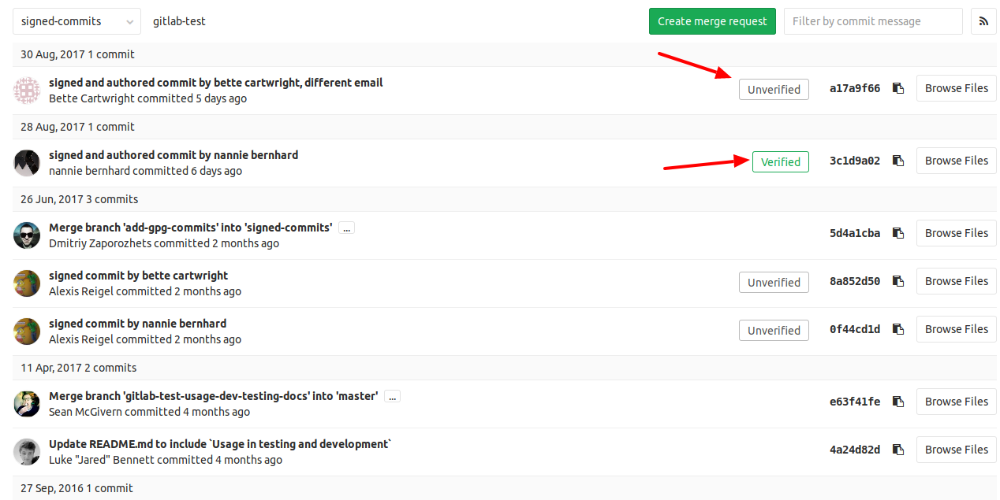

# Signing commits with GPG

> [Introduced][ce-9546] in GitLab 9.5.

GitLab can show whether a commit is verified or not when signed with a GPG key.
All you need to do is upload the public GPG key in your profile settings.

GPG verified tags are not supported yet.

## Getting started

Here are a few guides to get you started with GPG:

- [Git Tools - Signing Your Work](https://git-scm.com/book/en/v2/Git-Tools-Signing-Your-Work)
- [Managing OpenPGP Keys](https://riseup.net/en/security/message-security/openpgp/gpg-keys)
- [OpenPGP Best Practices](https://riseup.net/en/security/message-security/openpgp/best-practices)
- [Creating a new GPG key with subkeys](https://www.void.gr/kargig/blog/2013/12/02/creating-a-new-gpg-key-with-subkeys/) (advanced)

## How GitLab handles GPG

GitLab uses its own keyring to verify the GPG signature. It does not access any
public key server.

In order to have a commit verified on GitLab the corresponding public key needs
to be uploaded to GitLab. For a signature to be verified two prerequisites need
to be met:

1. The public key needs to be added your GitLab account
1. One of the emails in the GPG key matches your **primary** email

## Adding a GPG key

>**Note:**
Once you add a key, you cannot edit it, only remove it. In case the paste
didn't work, you'll have to remove the offending key and re-add it.

You can add a GPG key in your profile's settings:

1. On the upper right corner, click on your avatar and go to your **Settings**.

    

1. Navigate to the **GPG keys** tab and paste your _public_ key in the 'Key'
   box.

    

1. Finally, click on **Add key** to add it to GitLab. You will be able to see
   its fingerprint, the corresponding email address and creation date.

    

## Removing a GPG key

Removing a key **does not unverify** already signed commits. Commits that were
verified by using this key will stay verified. Only unpushed commits will stay
unverified once you remove this key. To unverify already signed commits, you need
to [revoke the associated GPG key](#revoking-a-gpg-key) from your account.

To remove a GPG key from your account:

1. On the upper right corner, click on your avatar and go to your **Settings**.
1. Navigate to the **GPG keys** tab.
1. Click on the trash icon besides the GPG key you want to delete.

## Revoking a GPG key

Revoking a key **unverifies** already signed commits. Commits that were
verified by using this key will change to an unverified state. Future commits
will also stay unverified once you revoke this key. This action should be used
in case your key has been compromised.

To revoke a GPG key:

1. On the upper right corner, click on your avatar and go to your **Settings**.
1. Navigate to the **GPG keys** tab.
1. Click on **Revoke** besides the GPG key you want to delete.

## Verifying commits

1. Within a project navigate to the **Commits** tab. Signed commits will show a
   badge containing either "Verified" or "Unverified", depending on the
   verification status of the GPG signature.

    

1. By clicking on the GPG badge, details of the signature are displayed.

    

    

[ce-9546]: https://gitlab.com/gitlab-org/gitlab-ce/merge_requests/9546
