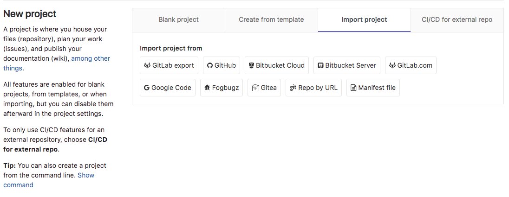
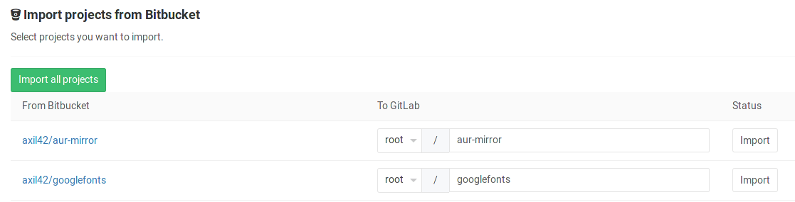

# Import your project from Bitbucket to GitLab

Import your projects from Bitbucket to GitLab with minimal effort.

## Overview

>**Note:**
The [Bitbucket integration][bb-import] must be first enabled in order to be
able to import your projects from Bitbucket. Ask your GitLab administrator
to enable this if not already.

- At its current state, the Bitbucket importer can import:
  - the repository description (GitLab 7.7+)
  - the Git repository data (GitLab 7.7+)
  - the issues (GitLab 7.7+)
  - the issue comments (GitLab 8.15+)
  - the pull requests (GitLab 8.4+)
  - the pull request comments (GitLab 8.15+)
  - the milestones (GitLab 8.15+)
  - the wiki (GitLab 8.15+)
- References to pull requests and issues are preserved (GitLab 8.7+)
- Repository public access is retained. If a repository is private in Bitbucket
  it will be created as private in GitLab as well.

## How it works

When issues/pull requests are being imported, the Bitbucket importer tries to find
the Bitbucket author/assignee in GitLab's database using the Bitbucket ID. For this
to work, the Bitbucket author/assignee should have signed in beforehand in GitLab
and **associated their Bitbucket account**. If the user is not
found in GitLab's database, the project creator (most of the times the current
user that started the import process) is set as the author, but a reference on
the issue about the original Bitbucket author is kept.

The importer will create any new namespaces (groups) if they don't exist or in
the case the namespace is taken, the repository will be imported under the user's
namespace that started the import process.

## Importing your Bitbucket repositories

1. Sign in to GitLab and go to your dashboard.
1. Click on **New project**.

    

1. Click on the "Bitbucket" button

    

1. Grant GitLab access to your Bitbucket account

    

1. Click on the projects that you'd like to import or **Import all projects**.
   You can also select the namespace under which each project will be
   imported.

    

[bb-import]: ../../../integration/bitbucket.md
[social sign-in]: ../../profile/account/social_sign_in.md
