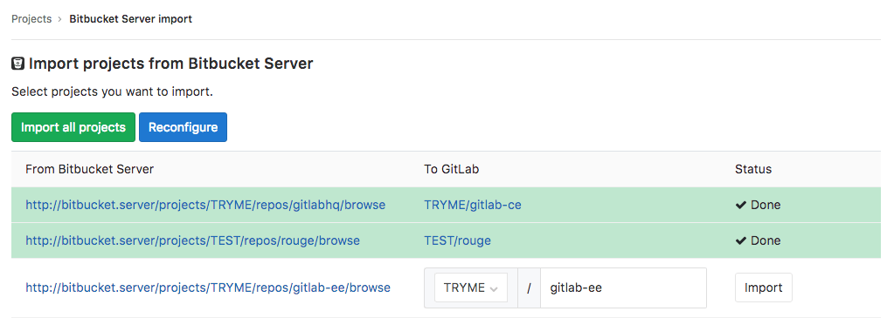

# Import your project from Bitbucket Server to GitLab

> [Introduced](https://gitlab.com/gitlab-org/gitlab-ce/merge_requests/20164)
in GitLab 11.2.

NOTE: **Note:**
The Bitbucket Server importer does not work with Bitbucket Cloud (aka bitbucket.org).
Use the [Bitbucket Cloud importer](bitbucket.md) for that.

Import your projects from Bitbucket Server to GitLab with minimal effort.

## Overview

- In its current state, the Bitbucket importer can import:
  - the repository description (GitLab 11.2+)
  - the Git repository data (GitLab 11.2+)
  - the pull requests (GitLab 11.2+)
  - the pull request comments (GitLab 11.2+)
- Repository public access is retained. If a repository is private in Bitbucket
  it will be created as private in GitLab as well.

## Limitations

1. Currently GitLab doesn't allow comments on arbitrary lines of code, so any
   Bitbucket comments out of bounds will be inserted as comments in the merge
   request.
1. Bitbucket Server allows multiple levels of threading. GitLab import
   will collapse this into one thread and quote part of the original comment.
1. Declined pull requests have unreachable commits, which prevents the GitLab
   importer from generating a proper diff. These pull requests will show up as
   empty changes.
1. Attachments in Markdown are currently not imported.
1. Task lists are not imported.
1. Emoji reactions are not imported

## How it works

The Bitbucket Server importer works as follows:

1. The user will be prompted to enter the URl, username, and password or personal access token to login to Bitbucket.
   These credentials are preserved only as long as the importer is running.
1. The importer will attempt to list all the current repositories on the Bitbucket Server.
1. Upon selection, the importer will clone the repository and import pull requests and comments.

### User assignment

When issues/pull requests are being imported, the Bitbucket importer tries to
find the author's e-mail address with a confirmed e-mail address in the GitLab
user database.  If no such user is available, the project creator is set as
the author. The importer will append a note in the comment to mark the original
creator.

The importer will create any new namespaces (groups) if they don't exist or in
the case the namespace is taken, the repository will be imported under the user's
namespace that started the import process.

## Importing your Bitbucket repositories

1. Sign in to GitLab and go to your dashboard.
1. Click on **New project**.
1. Click on the "Bitbucket Server" button. If the button is not present, enable the importer in
    **Admin > Application Settings > Visibility and access controls > Import sources**.

    

1. Enter your Bitbucket Server credentials.

    

1. Click on the projects that you'd like to import or **Import all projects**.
   You can also select the namespace under which each project will be
   imported.

    
