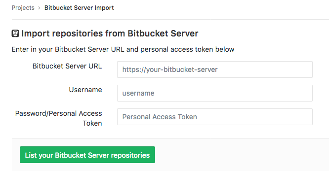
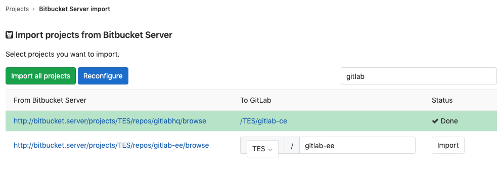

# Import your project from Bitbucket Server to GitLab **(FREE)**

> [Introduced](https://gitlab.com/gitlab-org/gitlab-foss/-/merge_requests/20164) in GitLab 11.2.

NOTE:
The Bitbucket Server importer does not work with [Bitbucket Cloud](https://bitbucket.org).
Use the [Bitbucket Cloud importer](bitbucket.md) for that.

Import your projects from Bitbucket Server to GitLab with minimal effort.

The Bitbucket importer can import:

- Repository description (GitLab 11.2+)
- Git repository data (GitLab 11.2+)
- Pull requests (GitLab 11.2+)
- Pull request comments (GitLab 11.2+)

When importing, repository public access is retained. If a repository is private in Bitbucket, it's
created as private in GitLab as well.

## Limitations

- GitLab doesn't allow comments on arbitrary lines of code, so any Bitbucket comments out of bounds
  are inserted as comments in the merge request.
- Bitbucket Server allows multiple levels of threading. GitLab import collapses this into one thread
  and quote part of the original comment.
- Declined pull requests have unreachable commits, which prevents the GitLab importer from
  generating a proper diff. These pull requests show up as empty changes.
- Attachments in Markdown are not imported.
- Task lists are not imported.
- Emoji reactions are not imported.
- Project filtering does not support fuzzy search (only `starts with` or `full match strings` are
  supported).

## How it works

The Bitbucket Server importer works as follows:

1. The user is prompted to enter the URL, username, and password (or personal access token) to log in to Bitbucket.
   These credentials are preserved only as long as the importer is running.
1. The importer attempts to list all the current repositories on the Bitbucket Server.
1. Upon selection, the importer clones the repository and import pull requests and comments.

### User assignment

When issues/pull requests are being imported, the Bitbucket importer tries to
find the author's email address with a confirmed email address in the GitLab
user database. If no such user is available, the project creator is set as
the author. The importer appends a note in the comment to mark the original
creator.

The importer creates any new namespaces (groups) if they don't exist or in
the case the namespace is taken, the repository is imported under the user's
namespace that started the import process.

#### User assignment by username

> - [Introduced](https://gitlab.com/gitlab-org/gitlab/-/issues/218609) in GitLab 13.4.
> - It's [deployed behind a feature flag](../../feature_flags.md), disabled by default.
> - It's disabled on GitLab.com.
> - It's not recommended for production use.
> - To use it in GitLab self-managed instances, ask a GitLab administrator to enable it.

WARNING:
This feature might not be available to you. Check the **version history** note above for details.

If you've enabled this feature, the importer tries to find a user in the GitLab user database with
the author's:

- `username`
- `slug`
- `displayName`

If the user is not found by any of these properties, the search falls back to the author's
`email` address.

Alternatively, if there is also no email address, the project creator is set as the author.

##### Enable or disable User assignment by username

User assignment by username is under development and not ready for production use. It is
deployed behind a feature flag that is **disabled by default**.
[GitLab administrators with access to the GitLab Rails console](../../../administration/feature_flags.md)
can enable it.

To enable it:

```ruby
Feature.enable(:bitbucket_server_user_mapping_by_username)
```

To disable it:

```ruby
Feature.disable(:bitbucket_server_user_mapping_by_username)
```

## Import your Bitbucket repositories

1. Sign in to GitLab and go to your dashboard.
1. Click on **New project**.
1. Click on the "Bitbucket Server" button. If the button is not present, enable the importer in
   **Admin > Application Settings > Visibility and access controls > Import sources**.

   

1. Enter your Bitbucket Server credentials.

   

1. Click on the projects that you'd like to import or **Import all projects**.
   You can also filter projects by name and select the namespace under which each project is
   imported.

   

## Troubleshooting

If the GUI-based import tool does not work, you can try to:

- Use the [GitLab Import API](../../../api/import.md#import-repository-from-bitbucket-server) Bitbucket server endpoint.
- Set up [Repository Mirroring](../repository/repository_mirroring.md), which provides verbose error output.

See the [troubleshooting](bitbucket.md#troubleshooting) section for [Bitbucket](bitbucket.md).
