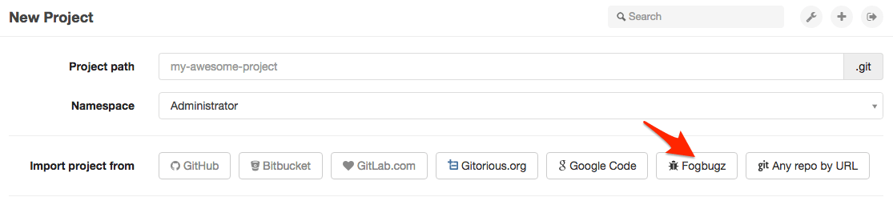
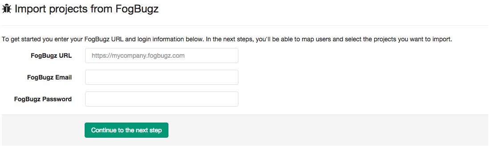
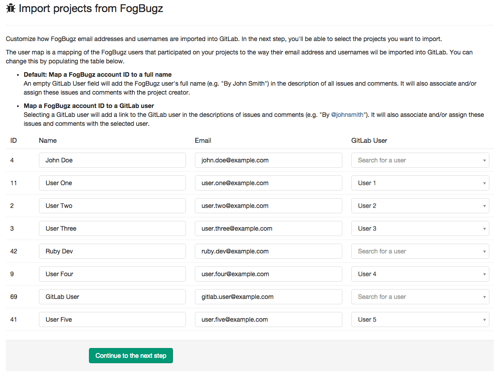

# Import your project from FogBugz to GitLab

It only takes a few simple steps to import your project from FogBugz.
The importer will import all of your cases and comments with original case
numbers and timestamps. You will also have the opportunity to map FogBugz
users to GitLab users.

1. From your GitLab dashboard click 'New project'
1. Click on the 'FogBugz' button

  

1. Enter your FogBugz URL, email address, and password.

  

1. Create mapping from FogBugz users to GitLab users.

  

1. Select the projects you wish to import by clicking the Import buttons

  

1. Once the import has finished click the link to take you to the project
dashboard. Follow the directions to push your existing repository.

  
