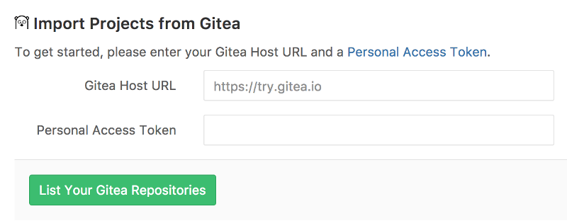
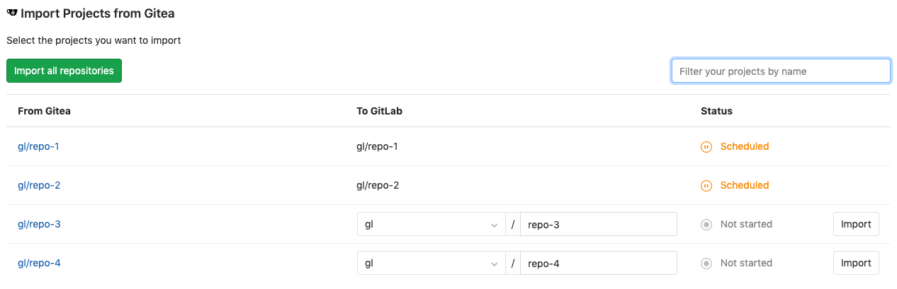

# Import your project from Gitea to GitLab

Import your projects from Gitea to GitLab with minimal effort.

## Overview

>**Note:**
This requires Gitea `v1.0.0` or newer.

- At its current state, Gitea importer can import:
  - the repository description (GitLab 8.15+)
  - the Git repository data (GitLab 8.15+)
  - the issues (GitLab 8.15+)
  - the pull requests (GitLab 8.15+)
  - the milestones (GitLab 8.15+)
  - the labels (GitLab 8.15+)
- Repository public access is retained. If a repository is private in Gitea
  it will be created as private in GitLab as well.

## How it works

Since Gitea is currently not an OAuth provider, author/assignee cannot be mapped
to users in your GitLab's instance. This means that the project creator (most of
the times the current user that started the import process) is set as the author,
but a reference on the issue about the original Gitea author is kept.

The importer will create any new namespaces (groups) if they don't exist or in
the case the namespace is taken, the repository will be imported under the user's
namespace that started the import process.

## Importing your Gitea repositories

The importer page is visible when you create a new project.

Click on the **Gitea** link and the import authorization process will start.

### Authorize access to your repositories using a personal access token

With this method, you will perform a one-off authorization with Gitea to grant
GitLab access your repositories:

1. Go to `https://your-gitea-instance/user/settings/applications` (replace
   `your-gitea-instance` with the host of your Gitea instance).
1. Click **Generate New Token**.
1. Enter a token description.
1. Click **Generate Token**.
1. Copy the token hash.
1. Go back to GitLab and provide the token to the Gitea importer.
1. Hit the **List Your Gitea Repositories** button and wait while GitLab reads
   your repositories' information. Once done, you'll be taken to the importer
   page to select the repositories to import.

### Select which repositories to import

After you've authorized access to your Gitea repositories, you will be
redirected to the Gitea importer page.

From there, you can see the import statuses of your Gitea repositories.

- Those that are being imported will show a _started_ status,
- those already successfully imported will be green with a _done_ status,
- whereas those that are not yet imported will have an **Import** button on the
  right side of the table.

You also can:

- Import all your Gitea projects in one go by hitting **Import all projects** in
  the upper left corner
- Filter projects by name. If filter is applied, hitting **Import all projects**
  will only import matched projects

You can also choose a different name for the project and a different namespace,
if you have the privileges to do so.
