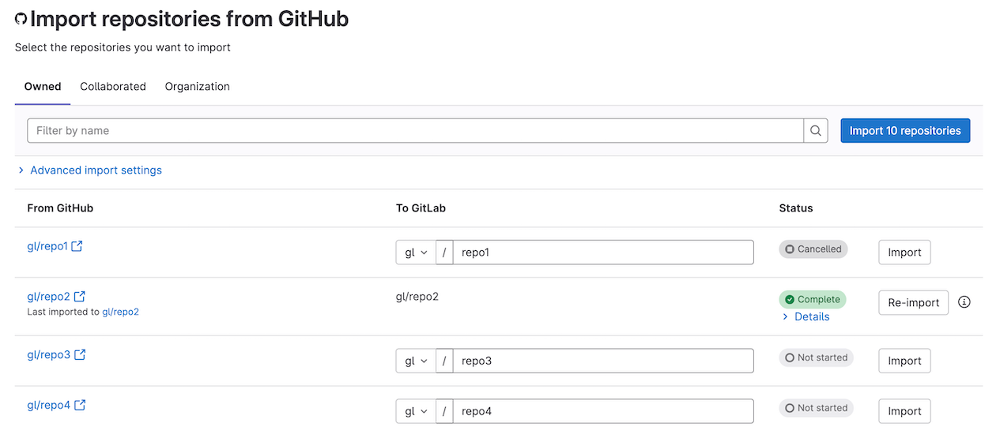

# Import your project from GitHub to GitLab

DETAILS:
**Tier:** Free, Premium, Ultimate
**Offering:** GitLab.com, Self-managed, GitLab Dedicated

> - [Introduced](https://gitlab.com/gitlab-org/gitlab/-/issues/381902) in GitLab 15.8, GitLab no longer automatically creates namespaces or groups that don't exist. GitLab also no longer falls back to using the user's personal namespace if the namespace or group name is taken.
> - [Introduced](https://gitlab.com/gitlab-org/gitlab/-/issues/388716) in GitLab 15.10, you no longer need to add any users to the parent group in GitLab to successfully import the **Require a pull request before merging - Allow specified actors to bypass required pull requests** branch protection rule.

You can import your GitHub projects from either GitHub.com or GitHub Enterprise. Importing projects does not
migrate or import any types of groups or organizations from GitHub to GitLab.

The namespace is a user or group in GitLab, such as `gitlab.com/sidney-jones` or
`gitlab.com/customer-success`.

Using the GitLab UI, the GitHub importer always imports from the
`github.com` domain. If you are importing from a self-hosted GitHub Enterprise Server domain, use the
[GitLab Import API](#use-the-api) GitHub endpoint.

You can change the target namespace and target repository name before you import.

<i class="fa fa-youtube-play youtube" aria-hidden="true"></i>
For an overview of the import process, see [How to migrate from GitHub to GitLab including Actions](https://www.youtube.com/watch?v=0Id5oMl1Kqs).

## Prerequisites

To import projects from GitHub, you must enable the
[GitHub import source](../../../administration/settings/import_and_export_settings.md#configure-allowed-import-sources).
If that import source is not enabled, ask your GitLab administrator to enable it. The GitHub import source is enabled
by default on GitLab.com.

### Permissions and roles

> - Requirement for Maintainer role instead of Developer role introduced in GitLab 16.0 and backported to GitLab 15.11.1 and GitLab 15.10.5.

To use the GitHub importer, you must have:

- Access to the GitHub project to import.
- At least the Maintainer role on the destination GitLab group to import to.

Also, the organization the GitHub repository belongs to must not impose restrictions of a
[third-party application access policy](https://docs.github.com/en/organizations/managing-oauth-access-to-your-organizations-data/about-oauth-app-access-restrictions)
on the GitLab instance you import to.

### Accounts for user contribution mapping

For user contribution mapping between GitHub and GitLab to work:

- Each GitHub author and assignee in the repository must have a
  [public-facing email address](https://docs.github.com/en/account-and-profile/setting-up-and-managing-your-personal-account-on-github/managing-email-preferences/setting-your-commit-email-address).
- The GitHub user's email address must match their GitLab email address.
- If a user's email address in GitHub is set as their secondary email address in GitLab, they must confirm it.

GitHub Enterprise does not require a public email address, so you might have to add it to existing accounts.

If the above requirements are not met, the importer can't map the particular user's contributions. In that case:

- The project creator is set as the author and assignee of issues and merge requests. The project creator is usually the
  user that initiated the import process. For some contributions that have a description or note such as pull requests,
  issue, notes, the importer amends the text with details of who originally created the contribution.
- Reviewers and approvals added on pull requests in GitHub cannot be imported. In this case, the importer creates comments
  describing that non-existent users were added as reviewers and approvers. However, the actual reviewer status and
  approval are not applied to the merge request in GitLab.

## Known issues

- GitHub pull request comments (known as diff notes in GitLab) created before 2017 are imported in separate threads.
  This occurs because of a limitation of the GitHub API that doesn't include `in_reply_to_id` for comments before 2017.
- Because of a [known issue](https://gitlab.com/gitlab-org/gitlab/-/issues/424400), Markdown attachments from
  repositories on GitHub Enterprise Server instances aren't imported.
- Because of a [known issue](https://gitlab.com/gitlab-org/gitlab/-/issues/418800), when importing projects that used
  [GitHub auto-merge](https://docs.github.com/en/pull-requests/collaborating-with-pull-requests/incorporating-changes-from-a-pull-request/automatically-merging-a-pull-request), the imported project in GitLab can have merge commits labeled "unverified" if the commit was signed with GitHub's internal GPG key.
- GitLab [can't import](https://gitlab.com/gitlab-org/gitlab/-/issues/424046) GitHub Markdown image attachments that
  were uploaded to private repositories before 2023-05-09. If you encounter this problem, would like to help us resolve the problem, and are willing to provide a sample repository
  for us, please add a comment to [issue 424046](https://gitlab.com/gitlab-org/gitlab/-/issues/424046) and we'll contact you.

## Import your GitHub repository into GitLab

Before you begin, ensure that any GitHub user you want to map to a GitLab user
has a GitLab email address that matches their
[publicly visible email address](https://docs.github.com/en/rest/users#get-a-user)
on GitHub.

If a GitHub user's public email address doesn't match any GitLab user email
address, the user's activity is associated with the user account that is
performing the import.

You can import your GitHub repository by either:

- [Using GitHub OAuth](#use-github-oauth)
- [Using a GitHub Personal Access Token](#use-a-github-personal-access-token)
- [Using the API](#use-the-api)

If importing from `github.com` you can use any method to import. Self-hosted GitHub Enterprise Server customers must use the API.

### Use GitHub OAuth

If you are importing to GitLab.com or to a self-managed GitLab that has GitHub OAuth [configured](../../../integration/github.md), you can use GitHub OAuth to import your repository.

This method has an advantage over using a [Personal Access Token (PAT)](#use-a-github-personal-access-token)
because the backend exchanges the access token with the appropriate permissions.

1. On the left sidebar, at the top, select **Create new** (**{plus}**) and **New project/repository**.
1. Select **Import project** and then **GitHub**.
1. Select **Authorize with GitHub**.
1. Proceed to [selecting which repositories to import](#select-which-repositories-to-import).

To use a different method to perform an import after previously performing
these steps, sign out of your GitLab account and sign in again.

### Use a GitHub Personal Access Token

To import your GitHub repository using a GitHub Personal Access Token:

1. Generate a GitHub personal access token. Only **classic** personal access tokens are supported.
   1. Go to <https://github.com/settings/tokens/new>.
   1. In the **Note** field, enter a token description.
   1. Select the `repo` scope.
   1. Optional. To [import collaborators](#select-additional-items-to-import), select the `read:org` scope.
   1. Select **Generate token**.
1. On the GitLab left sidebar, at the top, select **Create new** (**{plus}**) and **New project/repository**.
1. Select **Import project** and then **GitHub**.
1. Select **Authorize with GitHub**.
1. In the **Personal Access Token** field, paste the GitHub Personal Access Token.
1. Select **Authenticate**.
1. Proceed to [selecting which repositories to import](#select-which-repositories-to-import).

To use a different token to perform an import after previously performing
these steps, sign out of your GitLab account and sign in again, or revoke the
older token in GitHub.

### Use the API

The [GitLab REST API](../../../api/import.md#import-repository-from-github) can be used to import a GitHub repository. It has some advantages over using the GitLab UI:

- Can be used to import GitHub repositories that you do not own if they are public.
- It can be used to import from a GitHub Enterprise Server that is self-hosted.
- Can be used to set the `timeout_strategy` option that is not available to the UI.

The REST API is limited to authenticating with GitLab Personal Access Tokens.

To import your GitHub repository using the GitLab REST API:

1. Generate a GitHub personal access token. Only **classic** personal access tokens are supported.
   1. Go to <https://github.com/settings/tokens/new>.
   1. In the **Note** field, enter a token description.
   1. Select the `repo` scope.
   1. Optional. To [import collaborators](#select-additional-items-to-import), select the `read:org` scope.
   1. Select **Generate token**.
1. Use the [GitLab REST API](../../../api/import.md#import-repository-from-github) to import your GitHub repository.

### Filter repositories list

> - [Introduced](https://gitlab.com/gitlab-org/gitlab/-/issues/385113) in GitLab 16.0.

After you authorize access to your GitHub repositories, GitLab redirects you to the importer page and
your GitHub repositories are listed.

Use one of the following tabs to filter the list of repositories:

- **Owner** (default): Filter the list to the repositories that you are the owner of.
- **Collaborated**: Filter the list to the repositories that you have contributed to.
- **Organization**: Filter the list to the repositories that belong to an organization you are a member of.

When the **Organization** tab is selected, you can further narrow down your search by selecting an available GitHub organization from a dropdown list.

### Select additional items to import

> - [Introduced](https://gitlab.com/gitlab-org/gitlab/-/issues/373705) in GitLab 15.5.
> - Importing collaborators as an additional item was [introduced](https://gitlab.com/gitlab-org/gitlab/-/issues/398154) in GitLab 16.0.
> - Feature flag `github_import_extended_events` was introduced in GitLab 16.8. Disabled by default. This flag improves the performance of imports but removes the **Import issue and pull request events** option.
> - Feature flag `github_import_extended_events` was [enabled on GitLab.com and self-managed](https://gitlab.com/gitlab-org/gitlab/-/issues/435089) in GitLab 16.9.
> - Improved import performance made [generally available](https://gitlab.com/gitlab-org/gitlab/-/issues/435089) in GitLab 16.11. Feature flag `github_import_extended_events` removed.

To make imports as fast as possible, the following items aren't imported from GitHub by default:

- More than approximately 30,000 comments because of a [limitation of the GitHub API](#missing-comments).
- Markdown attachments from repository comments, release posts, issue descriptions, and pull request descriptions. These can include
  images, text, or binary attachments. If not imported, links in Markdown to attachments break after you remove the attachments from GitHub.

You can choose to import these items, but this could significantly increase import time. To import these items, select the appropriate fields in the UI:

- **Use alternative comments import method**. If importing GitHub projects with more than approximately 30,000 comments across all issues and pull requests, you should enable this method because of a
  [limitation of the GitHub API](#missing-comments).
- **Import Markdown attachments**.
- **Import collaborators** (selected by default). Leaving it selected might result in new users using a seat in the group or namespace,
  and being granted permissions [as high as project owner](#collaborators-members). Only direct collaborators are imported.
  Outside collaborators are never imported.

### Select which repositories to import

> - Ability to cancel pending or active imports [introduced](https://gitlab.com/gitlab-org/gitlab/-/issues/247325) in GitLab 15.7.
> - Ability to re-import projects [introduced](https://gitlab.com/gitlab-org/gitlab/-/issues/23905) in GitLab 15.9.

By default, the proposed repository namespaces match the names as they exist in GitHub, but based
on your permissions, you can choose to edit these names before you proceed to import any of them.

To select which repositories to import, next to any number of repositories select **Import** or
select **Import all repositories**.

Additionally, you can filter projects by name. If a filter is applied, **Import all repositories**
only imports matched repositories.

The **Status** column shows the import status of each repository. You can choose to keep the page
open and watch updates in real time or you can return to it later.

To cancel imports that are pending or in progress, next to the imported project, select **Cancel**.
If the import has already started, the imported files are kept.

To open an repository in GitLab URL after it has been imported, select its GitLab path.

Completed imports can be re-imported by selecting **Re-import** and specifying new name. This creates a new copy of the source project.



### Check status of imports

> - Details of partially completed imports with a list of entities that failed to import [introduced](https://gitlab.com/gitlab-org/gitlab/-/issues/386748) in GitLab 16.1.

After imports are completed, they can be in one of three states:

- **Complete**: GitLab imported all repository entities.
- **Partially completed**: GitLab failed to import some repository entities.
- **Failed**: GitLab aborted the import after a critical error occurred.

Expand **Details** to see a list of [repository entities](#imported-data) that failed to import.

## Mirror a repository and share pipeline status

DETAILS:
**Tier:** Premium, Ultimate
**Offering:** GitLab.com, Self-managed, GitLab Dedicated

Depending on your GitLab tier, [repository mirroring](../repository/mirror/index.md) can be set up to keep
your imported repository in sync with its GitHub copy.

Additionally, you can configure GitLab to send pipeline status updates back to GitHub with the
[GitHub Project Integration](../integrations/github.md).

If you import your project using [CI/CD for external repository](../../../ci/ci_cd_for_external_repos/index.md), then both
of the above are automatically configured.

NOTE:
Mirroring does not sync any new or updated pull requests from your GitHub project.

## Improve the speed of imports on self-managed instances

Administrator access on the GitLab server is required for these steps.

### Increase the number of Sidekiq workers

For large projects it may take a while to import all data. To reduce the time necessary, you can increase the number of
Sidekiq workers that process the following queues:

- `github_importer`
- `github_importer_advance_stage`

For an optimal experience, it's recommended having at least 4 Sidekiq processes (each running a number of threads equal
to the number of CPU cores) that *only* process these queues. It's also recommended that these processes run on separate
servers. For 4 servers with 8 cores this means you can import up to 32 objects (for example, issues) in parallel.

Reducing the time spent in cloning a repository can be done by increasing network throughput, CPU capacity, and disk
performance (by using high performance SSDs, for example) of the disks that store the Git repositories (for your GitLab instance).
Increasing the number of Sidekiq workers does *not* reduce the time spent cloning repositories.

### Enable GitHub OAuth using a GitHub Enterprise Cloud OAuth App

If you belong to a [GitHub Enterprise Cloud organization](https://docs.github.com/en/enterprise-cloud@latest/get-started/onboarding) you can configure your self-managed GitLab instance to obtain a higher [GitHub API rate limit](https://docs.github.com/en/rest/using-the-rest-api/rate-limits-for-the-rest-api?apiVersion=2022-11-28#primary-rate-limit-for-authenticated-users).

GitHub API requests are usually subject to a rate limit of 5,000 requests per hour. Using the steps below, you obtain a higher 15,000 requests per hour rate limit, resulting in a faster overall import time.

Prerequisites:

- You have access to a
  [GitHub Enterprise Cloud organization](https://docs.github.com/en/enterprise-cloud@latest/get-started/onboarding/getting-started-with-github-enterprise-cloud).
- GitLab is configured to enable [GitHub OAuth](../../../integration/github.md#enable-github-oauth-in-gitlab).

To enable a higher rate limit:

- [Create an OAuth app in GitHub](../../../integration/github.md#create-an-oauth-app-in-github). Ensure that the OAuth app is owned by the Enterprise Cloud Organization, not your personal GitHub account.
- Perform the project import using [GitHub OAuth](#use-github-oauth).
- Optional. By default, sign-in is enabled for all configured OAuth providers.
  If you want to enable GitHub OAuth for imports but you want to
  prevent the ability for users to sign in to your GitLab instance with GitHub,
  you can
  [disable sign-in with GitHub](../../../integration/omniauth.md#enable-or-disable-sign-in-with-an-omniauth-provider-without-disabling-import-sources).

## Imported data

The following items of a project are imported:

- Repository description.
- Git repository data.
- All project branches.
- All branches of forks of the project related to open pull requests, but not closed pull requests. Branches from forks are imported with a naming scheme similar to `GH-SHA-username/pull-request-number/fork-name/branch`.
- Branch protection rules. [Introduced](https://gitlab.com/gitlab-org/gitlab/-/issues/22650) in GitLab 15.4.
- Collaborators (members). [Introduced](https://gitlab.com/gitlab-org/gitlab/-/issues/388716) in GitLab 15.10. From GitLab 16.0, can
  be imported [as an additional item](#select-additional-items-to-import).
- Issues.
- Pull requests.
- Wiki pages.
- Milestones.
- Labels.
- Release notes content.
- Attachments for:
  - Release notes. [Introduced](https://gitlab.com/gitlab-org/gitlab/-/issues/15620) in GitLab 15.4.
  - Comments. [Introduced](https://gitlab.com/gitlab-org/gitlab/-/issues/18052) in GitLab 15.5.
  - Issue description. [Introduced](https://gitlab.com/gitlab-org/gitlab/-/issues/18052) in GitLab 15.5.
  - Pull Request description. [Introduced](https://gitlab.com/gitlab-org/gitlab/-/issues/18052) in GitLab 15.5.

  All attachment imports are disabled by default behind
  `github_importer_attachments_import` [feature flag](../../../administration/feature_flags.md). From GitLab 15.5, can
  be imported [as an additional item](#select-additional-items-to-import). The feature flag was removed.
- Pull request review comments.
- Regular issue and pull request comments.
- [Git Large File Storage (LFS) Objects](../../../topics/git/lfs/index.md).
- Pull request reviews.
- Pull request assigned reviewers. [Introduced](https://gitlab.com/gitlab-org/gitlab/-/issues/355137) in GitLab 15.6.
- Pull request "merged by" information.
- Pull request comments replies in discussions. [Introduced](https://gitlab.com/gitlab-org/gitlab/-/issues/336596) in
  GitLab 14.5.
- Pull request review comments suggestions. [Introduced](https://gitlab.com/gitlab-org/gitlab/-/issues/340624) in GitLab 14.7.
- Issue events and pull requests events. [Introduced](https://gitlab.com/groups/gitlab-org/-/epics/7673) in GitLab 15.4
  with `github_importer_issue_events_import` [feature flag](../../../administration/feature_flags.md) disabled by default.
  From GitLab 15.5, can be imported [as an additional item](#select-additional-items-to-import). The feature flag was
  removed.

References to pull requests and issues are preserved. Each imported repository maintains visibility level unless that
[visibility level is restricted](../../public_access.md#restrict-use-of-public-or-internal-projects), in which case it
defaults to the default project visibility.

### Branch protection rules and project settings

When they are imported, supported GitHub branch protection rules are mapped to either:

- GitLab branch protection rules.
- Project-wide GitLab settings.

| GitHub rule                                                                                         | GitLab rule                                                                                                                                                                                                                                                          | Introduced in |
|:----------------------------------------------------------------------------------------------------|:---------------------------------------------------------------------------------------------------------------------------------------------------------------------------------------------------------------------------------------------------------------------|:--------------|
| **Require conversation resolution before merging** for the project's default branch                 | **All threads must be resolved** [project setting](../merge_requests/index.md#prevent-merge-unless-all-threads-are-resolved)                                                                                                                                         | [GitLab 15.5](https://gitlab.com/gitlab-org/gitlab/-/issues/371110) |
| **Require a pull request before merging**                                                           | **No one** option in the **Allowed to push and merge** list of [branch protection settings](../protected_branches.md#add-protection-to-existing-branches)                                                                                                            | [GitLab 15.5](https://gitlab.com/gitlab-org/gitlab/-/issues/370951) |
| **Require signed commits** for the project's default branch                                         | **Reject unsigned commits** GitLab [push rule](../repository/push_rules.md#prevent-unintended-consequences)                                                                                                                                                          | [GitLab 15.5](https://gitlab.com/gitlab-org/gitlab/-/issues/370949) |
| **Allow force pushes - Everyone**                                                                   | **Allowed to force push** [branch protection setting](../protected_branches.md#allow-force-push-on-a-protected-branch)                                                                                                                                               | [GitLab 15.6](https://gitlab.com/gitlab-org/gitlab/-/issues/370943) |
| **Require a pull request before merging - Require review from Code Owners**                         | **Require approval from code owners** [branch protection setting](../protected_branches.md#require-code-owner-approval-on-a-protected-branch)                                                                                                                        | [GitLab 15.6](https://gitlab.com/gitlab-org/gitlab/-/issues/376683) |
| **Require a pull request before merging - Allow specified actors to bypass required pull requests** | List of users in the **Allowed to push and merge** list of [branch protection settings](../protected_branches.md#add-protection-to-existing-branches). Without a **Premium** subscription, the list of users that are allowed to push and merge is limited to roles. | [GitLab 15.8](https://gitlab.com/gitlab-org/gitlab/-/issues/384939) |

Mapping GitHub rule **Require status checks to pass before merging** to
[external status checks](../merge_requests/status_checks.md) was considered in issue
[370948](https://gitlab.com/gitlab-org/gitlab/-/issues/370948). However, this rule is not imported during project import
into GitLab due to technical difficulties. You can still create [external status checks](../merge_requests/status_checks.md)
manually.

### Collaborators (members)

> - [Introduced](https://gitlab.com/gitlab-org/gitlab/-/issues/388716) in GitLab 15.10.

These GitHub collaborator roles are mapped to these GitLab [member roles](../../permissions.md#roles):

| GitHub role | Mapped GitLab role |
|:------------|:-------------------|
| Read        | Guest              |
| Triage      | Reporter           |
| Write       | Developer          |
| Maintain    | Maintainer         |
| Admin       | Owner              |

GitHub Enterprise Cloud has
[custom repository roles](https://docs.github.com/en/enterprise-cloud@latest/organizations/managing-user-access-to-your-organizations-repositories/managing-repository-roles/about-custom-repository-roles).
These roles aren't supported and cause partially completed imports.

To import GitHub collaborators, you must have at least the Write role on the GitHub project. Otherwise collaborators import is skipped.

## Import from GitHub Enterprise on an internal network

If your GitHub Enterprise instance is on a internal network that is inaccessible to the internet, you can use a reverse proxy
to allow GitLab.com to access the instance.

The proxy needs to:

- Forward requests to the GitHub Enterprise instance.
- Convert to the public proxy hostname all occurrences of the internal hostname in:
  - The API response body.
  - The API response `Link` header.

GitHub API uses the `Link` header for pagination.

After configuring the proxy, test it by making API requests. Below there are some examples of commands to test the API:

```shell
curl --header "Authorization: Bearer <YOUR-TOKEN>" "https://{PROXY_HOSTNAME}/user"

### URLs in the response body should use the proxy hostname

{
  "login": "example_username",
  "id": 1,
  "url": "https://{PROXY_HOSTNAME}/users/example_username",
  "html_url": "https://{PROXY_HOSTNAME}/example_username",
  "followers_url": "https://{PROXY_HOSTNAME}/api/v3/users/example_username/followers",
  ...
  "created_at": "2014-02-11T17:03:25Z",
  "updated_at": "2022-10-18T14:36:27Z"
}
```

```shell
curl --head --header "Authorization: Bearer <YOUR-TOKEN>" "https://{PROXY_DOMAIN}/api/v3/repos/{repository_path}/pulls?states=all&sort=created&direction=asc"

### Link header should use the proxy hostname

HTTP/1.1 200 OK
Date: Tue, 18 Oct 2022 21:42:55 GMT
Server: GitHub.com
Content-Type: application/json; charset=utf-8
Cache-Control: private, max-age=60, s-maxage=60
...
X-OAuth-Scopes: repo
X-Accepted-OAuth-Scopes:
github-authentication-token-expiration: 2022-11-22 18:13:46 UTC
X-GitHub-Media-Type: github.v3; format=json
X-RateLimit-Limit: 5000
X-RateLimit-Remaining: 4997
X-RateLimit-Reset: 1666132381
X-RateLimit-Used: 3
X-RateLimit-Resource: core
Link: <https://{PROXY_DOMAIN}/api/v3/repositories/1/pulls?page=2>; rel="next", <https://{PROXY_DOMAIN}/api/v3/repositories/1/pulls?page=11>; rel="last"
```

Also test that cloning the repository using the proxy does not fail:

```shell
git clone -c http.extraHeader="Authorization: basic <base64 encode YOUR-TOKEN>" --mirror https://{PROXY_DOMAIN}/{REPOSITORY_PATH}.git
```

### Sample reverse proxy configuration

The following configuration is an example on how to configure Apache HTTP Server as a reverse proxy

WARNING:
For simplicity, the snippet does not have configuration to encrypt the connection between the client and the proxy. However, for security reasons you should include that
configuration. See [sample Apache TLS/SSL configuration](https://ssl-config.mozilla.org/#server=apache&version=2.4.41&config=intermediate&openssl=1.1.1k&guideline=5.6).

```plaintext
# Required modules
LoadModule filter_module lib/httpd/modules/mod_filter.so
LoadModule reflector_module lib/httpd/modules/mod_reflector.so
LoadModule substitute_module lib/httpd/modules/mod_substitute.so
LoadModule deflate_module lib/httpd/modules/mod_deflate.so
LoadModule headers_module lib/httpd/modules/mod_headers.so
LoadModule proxy_module lib/httpd/modules/mod_proxy.so
LoadModule proxy_connect_module lib/httpd/modules/mod_proxy_connect.so
LoadModule proxy_http_module lib/httpd/modules/mod_proxy_http.so
LoadModule ssl_module lib/httpd/modules/mod_ssl.so

<VirtualHost GITHUB_ENTERPRISE_HOSTNAME:80>
  ServerName GITHUB_ENTERPRISE_HOSTNAME

  # Enables reverse-proxy configuration with SSL support
  SSLProxyEngine On
  ProxyPass "/" "https://GITHUB_ENTERPRISE_HOSTNAME/"
  ProxyPassReverse "/" "https://GITHUB_ENTERPRISE_HOSTNAME/"

  # Replaces occurrences of the local GitHub Enterprise URL with the Proxy URL
  # GitHub Enterprise compresses the responses, the filters INFLATE and DEFLATE needs to be used to
  # decompress and compress the response back
  AddOutputFilterByType INFLATE;SUBSTITUTE;DEFLATE application/json
  Substitute "s|https://GITHUB_ENTERPRISE_HOSTNAME|https://PROXY_HOSTNAME|ni"
  SubstituteMaxLineLength 50M

  # GitHub API uses the response header "Link" for the API pagination
  # For example:
  #   <https://example.com/api/v3/repositories/1/issues?page=2>; rel="next", <https://example.com/api/v3/repositories/1/issues?page=3>; rel="last"
  # The directive below replaces all occurrences of the GitHub Enterprise URL with the Proxy URL if the
  # response header Link is present
  Header edit* Link "https://GITHUB_ENTERPRISE_HOSTNAME" "https://PROXY_HOSTNAME"
</VirtualHost>
```

## Troubleshooting

### Manually continue a previously failed import process

In some cases, the GitHub import process can fail to import the repository. This causes GitLab to abort the project import process and requires the
repository to be imported manually. Administrators can manually import the repository for a failed import process:

1. Open a Rails console.
1. Run the following series of commands in the console:

   ```ruby
   project_id = <PROJECT_ID>
   github_access_token =  <GITHUB_ACCESS_TOKEN>
   github_repository_path = '<GROUP>/<REPOSITORY>'

   github_repository_url = "https://#{github_access_token}@github.com/#{github_repository_path}.git"

   # Find project by ID
   project = Project.find(project_id)
   # Set import URL and credentials
   project.import_url = github_repository_url
   project.import_type = 'github'
   project.import_source = github_repository_path
   project.save!
   # Create an import state if the project was created manually and not from a failed import
   project.create_import_state if project.import_state.blank?
   # Set state to start
   project.import_state.force_start

   # Optional: If your import had certain optional stages selected or a timeout strategy
   # set, you can reset them here. Below is an example.
   # The params follow the format documented in the API:
   # https://docs.gitlab.com/ee/api/import.html#import-repository-from-github
   Gitlab::GithubImport::Settings
   .new(project)
   .write(
     timeout_strategy: "optimistic",
     optional_stages: {
       single_endpoint_issue_events_import: true,
       single_endpoint_notes_import: true,
       attachments_import: true,
       collaborators_import: true
     }
   )

   # Trigger import from second step
   Gitlab::GithubImport::Stage::ImportRepositoryWorker.perform_async(project.id)
   ```

### Errors when importing large projects

The GitHub importer might encounter some errors when importing large projects.

#### Missing comments

The GitHub API has a limit that prevents more than approximately 30,000 notes or diff notes from being imported.
When this limit is reached, the GitHub API instead returns the following error:

```plaintext
In order to keep the API fast for everyone, pagination is limited for this resource. Check the rel=last link relation in the Link response header to see how far back you can traverse.
```

If you are importing GitHub projects with a large number of comments, you should select the **Use alternative comments import method**
[additional item to import](#select-additional-items-to-import) checkbox. This setting makes the import process take longer because it increases the number of network requests
required to perform the import.

#### Reduce GitHub API request objects per page

Some GitHub API endpoints might return a `500` or `502` error for project imports from large repositories.
To reduce the chance of these errors, in the group project importing the data, enable the
`github_importer_lower_per_page_limit` feature flag. When enabled, the flag reduces the
page size from `100` to `50`.

To enable this feature flag:

1. Start a [Rails console](../../../administration/operations/rails_console.md#starting-a-rails-console-session).
1. Run the following `enable` command:

   ```ruby
   group = Group.find_by_full_path('my/group/fullpath')

   # Enable
   Feature.enable(:github_importer_lower_per_page_limit, group)
   ```

To disable the feature flag, run this command:

```ruby
# Disable
Feature.disable(:github_importer_lower_per_page_limit, group)
```

### GitLab instance cannot connect to GitHub

Self-managed instances that run GitLab 15.10 or earlier, and are behind proxies, cannot resolve DNS for `github.com` or `api.github.com`.
In this situation, the GitLab instance fails to connect to GitHub during the import and you must add `github.com` and `api.github.com`
entries in the [allowlist for local requests](../../../security/webhooks.md#allow-outbound-requests-to-certain-ip-addresses-and-domains).
