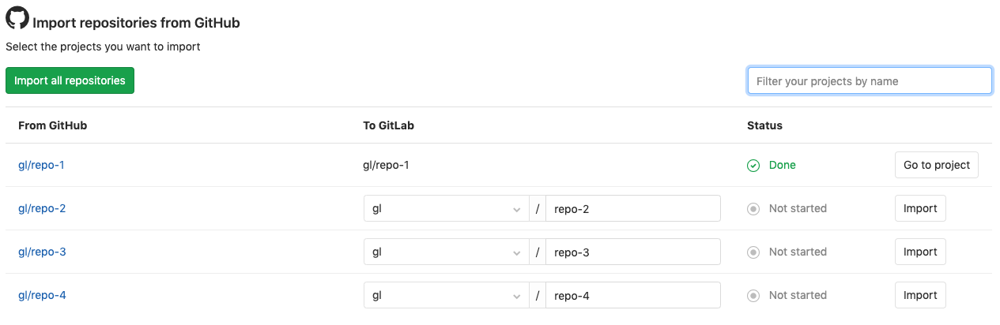

# Import your project from GitHub to GitLab

Using the importer, you can import your GitHub repositories to GitLab.com or to
your self-managed GitLab instance.

## Overview

NOTE: **Note:**
These instructions work for users on GitLab.com, but if you are an
administrator of a self-managed GitLab instance or if you are importing from GitHub Enterprise,
you must enable [GitHub integration](../../../integration/github.md). GitHub integration is the only method for
importing from GitHub Enterprise. If you are using GitLab.com, you can alternatively import
GitHub repositories using a [personal access token](#using-a-github-token),
but this method is not recommended because it cannot associate all user activity
(such as issues and pull requests) with matching GitLab users.
If you are an administrator of a self-managed GitLab instance, you can also use the
[GitHub Rake task](../../../administration/raketasks/github_import.md) to import projects from
GitHub without the constraints of a Sidekiq worker.

The following aspects of a project are imported:

- Repository description (GitLab.com & 7.7+)
- Git repository data (GitLab.com & 7.7+)
- Issues (GitLab.com & 7.7+)
- Pull requests (GitLab.com & 8.4+)
- Wiki pages (GitLab.com & 8.4+)
- Milestones (GitLab.com & 8.7+)
- Labels (GitLab.com & 8.7+)
- Release note descriptions (GitLab.com & 8.12+)
- Pull request review comments (GitLab.com & 10.2+)
- Regular issue and pull request comments

References to pull requests and issues are preserved (GitLab.com & 8.7+), and
each imported repository maintains visibility level unless that [visibility
level is restricted](../../../public_access/public_access.md#restricting-the-use-of-public-or-internal-projects),
in which case it defaults to the default project visibility.

## How it works

When issues and pull requests are being imported, the importer attempts to find their GitHub authors and
assignees in the database of the GitLab instance (note that pull requests are called "merge requests" in GitLab).

For this association to succeed, each GitHub author and assignee in the repository
must meet one of the following conditions prior to the import:

- Have previously logged in to a GitLab account using the GitHub icon.
- Have a GitHub account with a
  [primary email address](https://help.github.com/en/github/setting-up-and-managing-your-github-user-account/setting-your-commit-email-address)
  that matches their GitLab account's email address.

If a user referenced in the project is not found in GitLab's database, the project creator (typically the user
that initiated the import process) is set as the author/assignee, but a note on the issue mentioning the original
GitHub author is added.

The importer creates any new namespaces (groups) if they do not exist, or, if the namespace is taken, the
repository is imported under the namespace of the user who initiated the import process. The namespace/repository
name can also be edited, with the proper permissions.

The importer will also import branches on forks of projects related to open pull requests. These branches will be
imported with a naming scheme similar to `GH-SHA-username/pull-request-number/fork-name/branch`. This may lead to
a discrepancy in branches compared to those of the GitHub repository.

For additional technical details, you can refer to the
[GitHub Importer](../../../development/github_importer.md "Working with the GitHub importer")
developer documentation.

For an overview of the import process, see the video [Migrating from GitHub to GitLab](https://youtu.be/VYOXuOg9tQI).

## Import your GitHub repository into GitLab

### Using the GitHub integration

Before you begin, ensure that any GitHub users who you want to map to GitLab users have either:

- A GitLab account that has logged in using the GitHub icon
  \- or -
- A GitLab account with an email address that matches the [public email address](https://help.github.com/en/github/setting-up-and-managing-your-github-user-account/setting-your-commit-email-address) of the GitHub user

User-matching attempts occur in that order, and if a user is not identified either way, the activity is associated with
the user account that is performing the import.

NOTE: **Note:**
If you are using a self-managed GitLab instance or if you are importing from GitHub Enterprise, this process requires that you have configured
[GitHub integration](../../../integration/github.md).

1. From the top navigation bar, click **+** and select **New project**.
1. Select the **Import project** tab and then select **GitHub**.
1. Select the first button to **List your GitHub repositories**. You are redirected to a page on [GitHub](https://github.com) to authorize the GitLab application.
1. Click **Authorize gitlabhq**. You are redirected back to GitLab's Import page and all of your GitHub repositories are listed.
1. Continue on to [selecting which repositories to import](#selecting-which-repositories-to-import).

### Using a GitHub token

NOTE: **Note:**
Using a personal access token to import projects is not recommended. If you are a GitLab.com user,
you can use a personal access token to import your project from GitHub, but this method cannot
associate all user activity (such as issues and pull requests) with matching GitLab users.
If you are an administrator of a self-managed GitLab instance or if you are importing from
GitHub Enterprise, you cannot use a personal access token.
The [GitHub integration method (above)](#using-the-github-integration) is recommended for all users.
Read more in the [How it works](#how-it-works) section.

If you are not using the GitHub integration, you can still perform an authorization with GitHub to grant GitLab access your repositories:

1. Go to <https://github.com/settings/tokens/new>
1. Enter a token description.
1. Select the repo scope.
1. Click **Generate token**.
1. Copy the token hash.
1. Go back to GitLab and provide the token to the GitHub importer.
1. Hit the **List Your GitHub Repositories** button and wait while GitLab reads your repositories' information.
   Once done, you'll be taken to the importer page to select the repositories to import.

### Selecting which repositories to import

After you have authorized access to your GitHub repositories, you are redirected to the GitHub importer page and
your GitHub repositories are listed.

1. By default, the proposed repository namespaces match the names as they exist in GitHub, but based on your permissions,
   you can choose to edit these names before you proceed to import any of them.
1. Select the **Import** button next to any number of repositories, or select **Import all repositories**. Additionally,
   you can filter projects by name. If filter is applied, **Import all repositories** only imports matched repositories.
1. The **Status** column shows the import status of each repository. You can choose to leave the page open and it will
   update in realtime or you can return to it later.
1. Once a repository has been imported, click its GitLab path to open its GitLab URL.

## Mirroring and pipeline status sharing

Depending your GitLab tier, [project mirroring](../repository/repository_mirroring.md) can be set up to keep
your imported project in sync with its GitHub copy.

Additionally, you can configure GitLab to send pipeline status updates back GitHub with the
[GitHub Project Integration](../integrations/github.md). **(PREMIUM)**

If you import your project using [CI/CD for external repo](../../../ci/ci_cd_for_external_repos/index.md), then both
of the above are automatically configured. **(PREMIUM)**

## Improving the speed of imports on self-managed instances

NOTE: **Note:**
Admin access to the GitLab server is required.

For large projects it may take a while to import all data. To reduce the time necessary, you can increase the number of
Sidekiq workers that process the following queues:

- `github_importer`
- `github_importer_advance_stage`

For an optimal experience, it's recommended having at least 4 Sidekiq processes (each running a number of threads equal
to the number of CPU cores) that *only* process these queues. It's also recommended that these processes run on separate
servers. For 4 servers with 8 cores this means you can import up to 32 objects (e.g., issues) in parallel.

Reducing the time spent in cloning a repository can be done by increasing network throughput, CPU capacity, and disk
performance (e.g., by using high performance SSDs) of the disks that store the Git repositories (for your GitLab instance).
Increasing the number of Sidekiq workers will *not* reduce the time spent cloning repositories.
