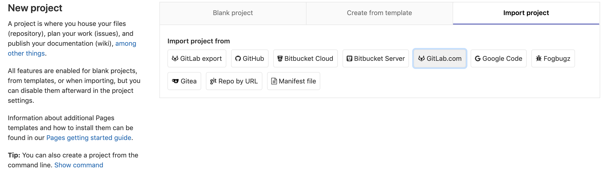
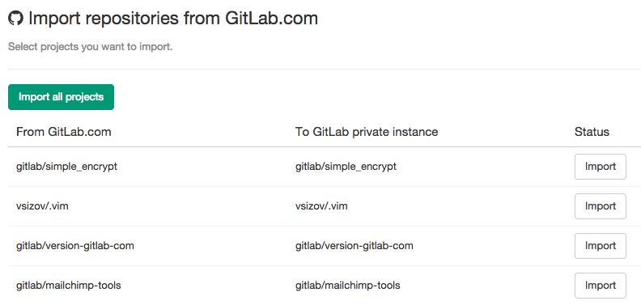

# Project importing from GitLab.com to your private GitLab instance **(FREE)**

You can import your existing GitLab.com projects to your GitLab instance, but keep in
mind that it is possible only if GitLab.com integration is enabled on your GitLab instance.
[Read more about GitLab.com integration for self-managed GitLab instances](../../../integration/gitlab.md).

To get to the importer page you need to go to "New project" page.

NOTE:
If you are interested in importing Wiki and Merge Request data to your new instance,
you'll need to follow the instructions for [exporting a project](../settings/import_export.md#exporting-a-project-and-its-data)

Go to the **Import Projects** tab, then click on **GitLab.com**, and you are redirected to GitLab.com
for permission to access your projects. After accepting, you are automatically redirected to the importer.

To import a project, click "Import". The importer imports your repository and issues.
Once the importer is done, a new GitLab project is created with your imported data.
