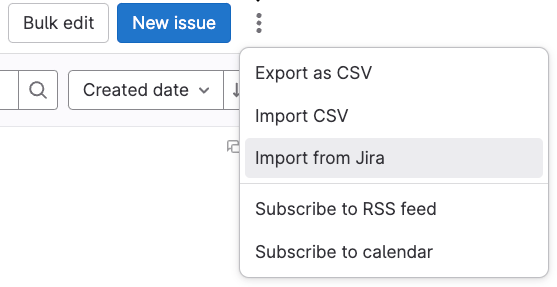
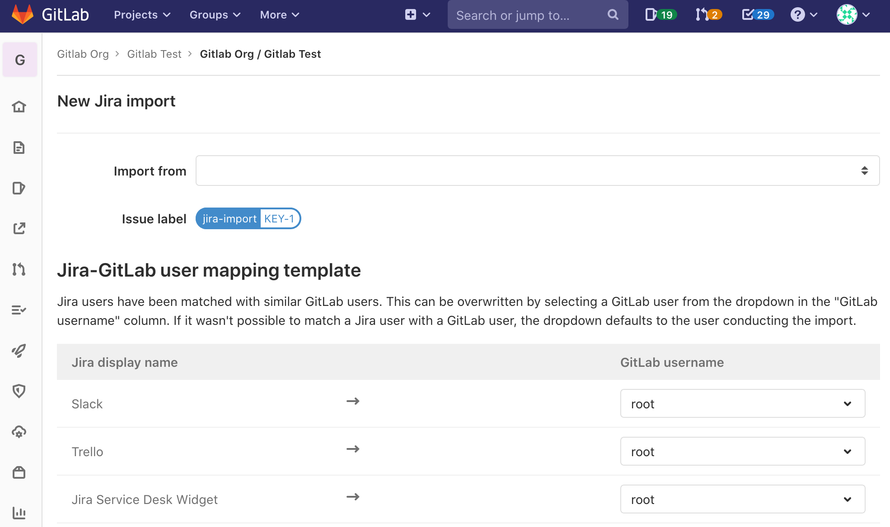

DETAILS:
**Tier:** Free, Premium, Ultimate
**Offering:** GitLab.com, GitLab Self-Managed, GitLab Dedicated

Using GitLab Jira importer, you can import your Jira issues to GitLab.com or to
GitLab Self-Managed.

Jira issues import is an MVC, project-level feature, meaning that issues from multiple
Jira projects can be imported into a GitLab project. MVC version imports issue title and description
and some other issue metadata as a section in the issue description.

## Known limitations

GitLab imports the following information directly:

- The issue's title, description, and labels.
- You can also map Jira users to GitLab project members when preparing for the import.

Other Jira issue metadata that is not formally mapped to GitLab issue fields is
imported into the GitLab issue's description as plain text.

Text in Jira issues is not parsed to GitLab Flavored Markdown which can result in broken text formatting.
For more information, see [issue 379104](https://gitlab.com/gitlab-org/gitlab/-/issues/379104).

There is an [epic](https://gitlab.com/groups/gitlab-org/-/epics/2738) tracking the addition of issue assignees, comments, and much more in the future
iterations of the GitLab Jira importer.

## Prerequisites

- To be able to import issues from a Jira project you must have read access on Jira
  issues and at least the Maintainer role for the GitLab project that you wish to import into.
- This feature uses the existing GitLab [Jira issue integration](../../../integration/jira/_index.md).
  Make sure you have the integration set up before trying to import Jira issues.

## Import Jira issues to GitLab

NOTE:
Importing Jira issues is done as an asynchronous background job, which
may result in delays based on import queues load, system load, or other factors.
Importing large projects may take several minutes depending on the size of the import.

To import Jira issues to a GitLab project:

1. On the **{issues}** **Issues** page, select **Actions** (**{ellipsis_v}**) **> Import from Jira**.

   

   The **Import from Jira** option is only visible if you have the [correct permissions](#prerequisites).

   The following form appears.
   If you've previously set up the [Jira issues integration](../../../integration/jira/_index.md), you can now see
   the Jira projects that you have access to in the dropdown list.

   

1. Select the **Import from** dropdown list and select the Jira project that you wish to import issues from.

   In the **Jira-GitLab user mapping template** section, the table shows to which GitLab users your Jira
   users are mapped.
   When the form appears, the dropdown list defaults to the user conducting the import.

1. To change any of the mappings, select the dropdown list in the **GitLab username** column and
   select the user you want to map to each Jira user.

   The dropdown list may not show all the users, so use the search bar to find a specific
   user in this GitLab project.

1. Select **Continue**. You're presented with a confirmation that import has started.

   While the import is running in the background, you can navigate
   to the **Issues** page to see the new issues appearing in the list.

1. To check the status of your import, go to the Jira import page again.
