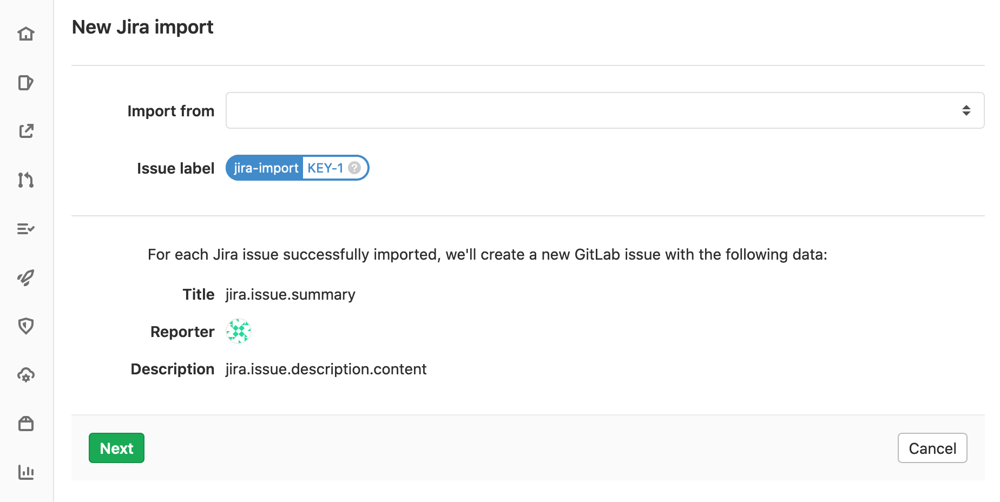
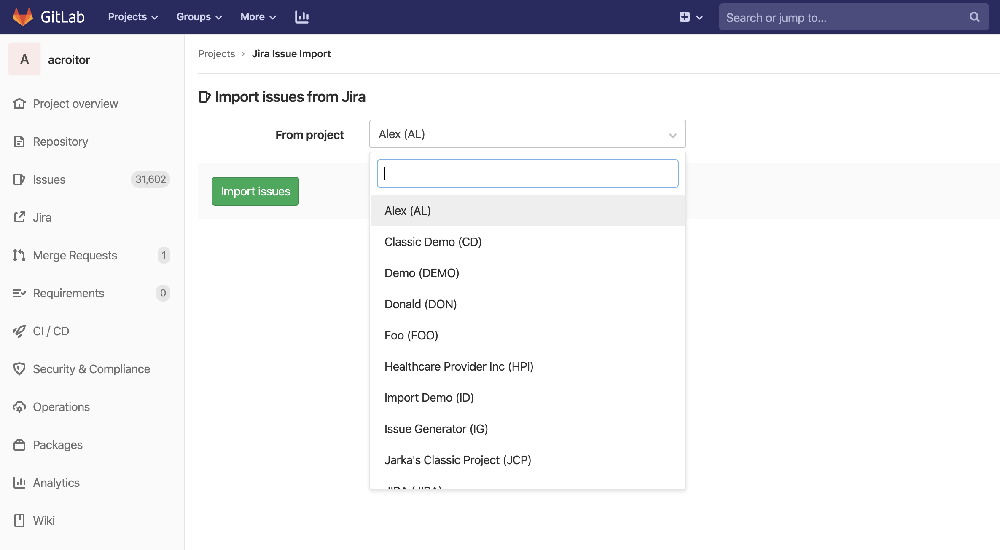

# Import your Jira project issues to GitLab

> [Introduced](https://gitlab.com/groups/gitlab-org/-/epics/2766) in GitLab 12.10.

Using GitLab Jira importer, you can import your Jira issues to GitLab.com or to
your self-managed GitLab instance.

Jira issues import is an MVC, project-level feature, meaning that issues from multiple
Jira projects can be imported into a GitLab project. MVC version imports issue title and description
as well as some other issue metadata as a section in the issue description.

## Future iterations

As of GitLab 12.10, the Jira issue importer only brings across the title and description of
an issue.

There is an [epic](https://gitlab.com/groups/gitlab-org/-/epics/2738) tracking the
addition of items such as issue assignees, labels, comments, user mapping, and much more.
These will be included in the future iterations of the GitLab Jira importer.

## Prerequisites

### Permissions

In order to be able to import issues from a Jira project you need to have read access on Jira
issues and a [Maintainer or higher](../../permissions.md#project-members-permissions) role in the
GitLab project that you wish to import into.

### Jira integration

This feature uses the existing GitLab [Jira integration](../integrations/jira.md).

Make sure you have the integration set up before trying to import Jira issues.

## Import Jira issues to GitLab

To import Jira issues to a GitLab project, follow the steps below.

NOTE: **Note:**
Importing Jira issues is done as an asynchronous background job, which
may result in delays based on import queues load, system load, or other factors.
Importing large projects may take several minutes depending on the size of the import.

1. On the **{issues}** **Issues** page, click the **Import Issues** (**{import}**) button.
1. Select **Import from Jira**.

   

   The following form appears.

   

   If you've previously set up the [Jira integration](../integrations/jira.md), you now see the Jira
   projects that you have access to in the dropdown.

1. Select the Jira project that you wish to import issues from.

   

1. Click **Import Issues**. You're presented with a confirmation that import has started.
   While the import is running in the background, you can navigate away from the import status page
   to the issues page, and you'll see the new issues appearing in the issues list.

1. To check the status of your import, go back to the Jira import page.

   
