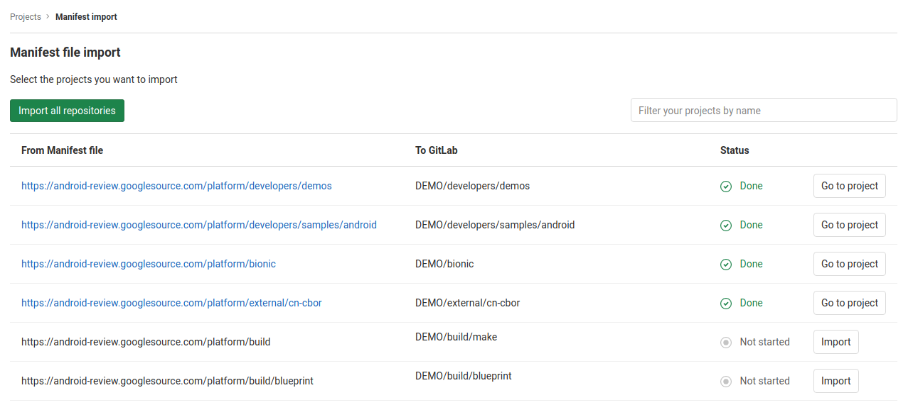

# Import multiple repositories by uploading a manifest file **(FREE)**

> [Introduced](https://gitlab.com/gitlab-org/gitlab-foss/-/issues/28811) in GitLab 11.2.

GitLab allows you to import all the required Git repositories
based on a manifest file like the one used by the
[Android repository](https://android.googlesource.com/platform/manifest/+/2d6f081a3b05d8ef7a2b1b52b0d536b2b74feab4/default.xml).
This feature can be very handy when you need to import a project with many
repositories like the Android Open Source Project (AOSP).

## Requirements

GitLab must be using PostgreSQL for its database, since
[subgroups](../../group/subgroups/index.md) are needed for the manifest import
to work.

Read more about the [database requirements](../../../install/requirements.md#database).

## Manifest format

A manifest must be an XML file. There must be one `remote` tag with a `review`
attribute that contains a URL to a Git server, and each `project` tag must have
a `name` and `path` attribute. GitLab will then build the URL to the repository
by combining the URL from the `remote` tag with a project name.
A path attribute is used to represent the project path in GitLab.

Below is a valid example of a manifest file:

```xml
<manifest>
  <remote review="https://android.googlesource.com/" />

  <project path="build/make" name="platform/build" />
  <project path="build/blueprint" name="platform/build/blueprint" />
</manifest>
```

As a result, the following projects are created:

| GitLab                                          | Import URL                                                  |
|:------------------------------------------------|:------------------------------------------------------------|
| `https://gitlab.com/YOUR_GROUP/build/make`      | <https://android.googlesource.com/platform/build>           |
| `https://gitlab.com/YOUR_GROUP/build/blueprint` | <https://android.googlesource.com/platform/build/blueprint> |

## Import the repositories

To start the import:

1. From your GitLab dashboard click **New project**.
1. Switch to the **Import project** tab.
1. Click on the **Manifest file** button.
1. Provide GitLab with a manifest XML file.
1. Select a group you want to import to (you need to create a group first if you don't have one).
1. Click **List available repositories**. At this point, you are redirected
   to the import status page with projects list based on the manifest file.
1. Check the list and click **Import all repositories** to start the import.

   
