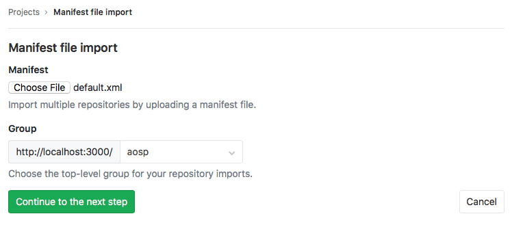
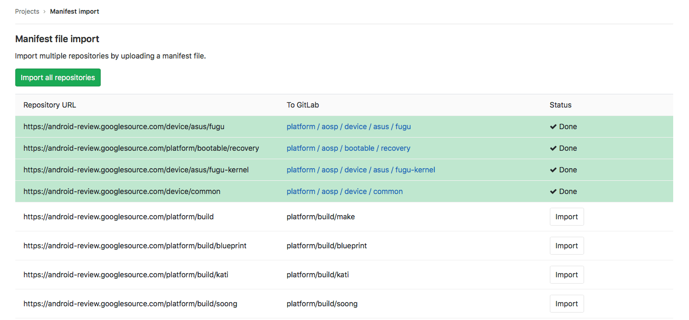

# Import multiple repositories by uploading a manifest file

GitLab allows you to import all the required git repositories 
based a manifest file like the one used by the Android repository.


>**Note:** 
This feature requires [subgroups](user/group/subgroups/index.md) to be supported by your database. 

You can do it by following next steps: 

1. From your GitLab dashboard click **New project**
1. Switch to the **Import project** tab
1. Click on the **Manifest file** button
1. Provide GitLab with a manifest xml file
1. Select a group you want to import to (you need to create a group first if you don't have one)
1. Click **List available repositories** 
1. You will be redirected to the import status page with projects list based on manifest file
1. Check the list and click 'Import all repositories' to start import.





### Manifest format

A manifest must be an XML file. There must be one `remote` tag with `review` attribute
that contains a URL to a git server. Each `project` tag must have `name` and `path` attribute. 
GitLab will build URL to the repository by combining URL from `remote` tag with a project name.
A path attribute will be used to represent project path in GitLab system. 

Below is a valid example of manifest file.

```xml
<manifest>
  <remote review="https://android-review.googlesource.com/" />

  <project path="build/make" name="platform/build" />
  <project path="build/blueprint" name="platform/build/blueprint" />
</manifest>
```

As result next projects will be created: 

| GitLab | Import URL |
|---|---|
| https://gitlab/YOUR_GROUP/build/make | https://android-review.googlesource.com/platform/build | 
| https://gitlab/YOUR_GROUP/build/blueprint | https://android-review.googlesource.com/platform/build/blueprint | 
