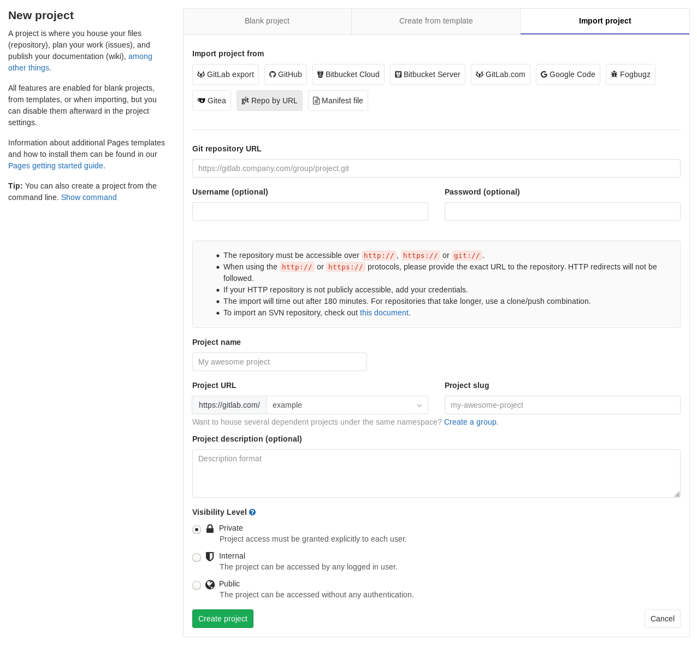

# Import project from repository by URL **(FREE)**

You can import your existing repositories by providing the Git URL:

<!-- vale gitlab.Spelling = NO -->
<!-- vale gitlab.SubstitutionWarning = NO -->

1. From your GitLab dashboard click **New project**.
1. Switch to the **Import project** tab.
1. Click on the **Repo by URL** button.
1. Fill in the "Git repository URL" and the remaining project fields.
1. Click **Create project** to begin the import process.
1. Once complete, you will be redirected to your newly created project.

<!-- vale gitlab.Spelling = YES -->
<!-- vale gitlab.SubstitutionWarning = YES -->

