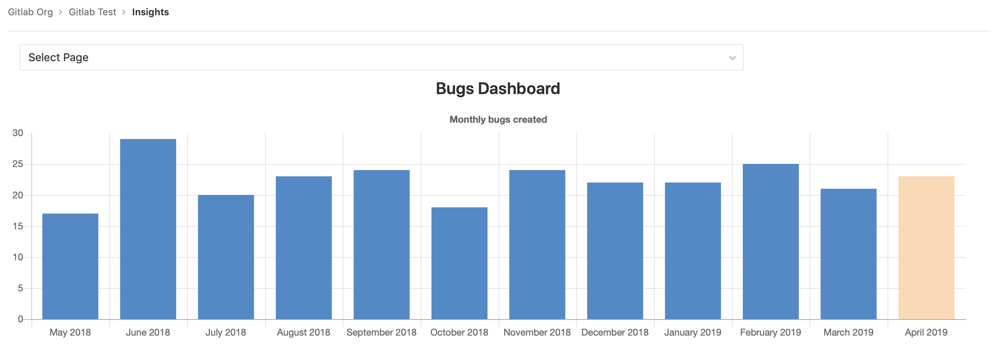
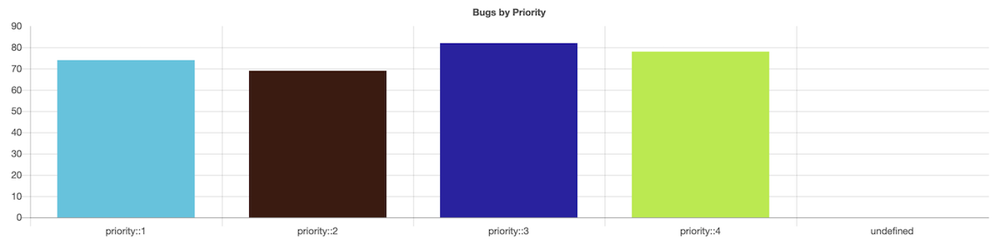
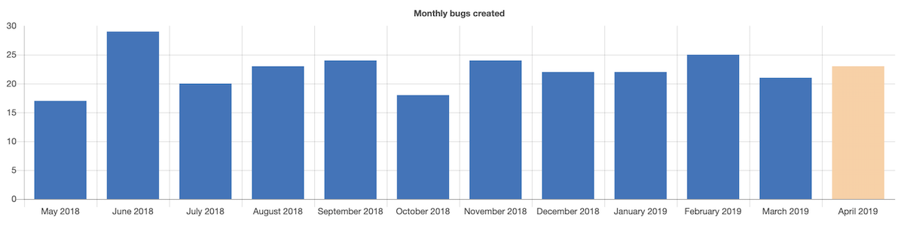
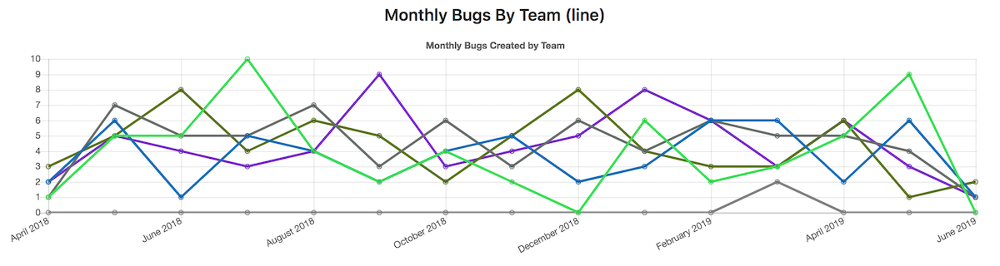

# Insights **(ULTIMATE)**

> [Introduced](https://gitlab.com/groups/gitlab-org/-/epics/725) in [GitLab Ultimate](https://about.gitlab.com/pricing/) 12.0.

Configure the Insights that matter for your projects to explore data such as
triage hygiene, issues created/closed per a given period, average time for merge
requests to be merged and much more.



NOTE:
This feature is [also available at the group level](../../group/insights/index.md).

## View your project's Insights

You can access your project's Insights by clicking the **Analytics > Insights**
link in the left sidebar.

## Configure your Insights

Insights are configured using a YAML file called `.gitlab/insights.yml` within
a project. That file is used in the project's Insights page.

See [Writing your `.gitlab/insights.yml`](#writing-your-gitlabinsightsyml) below
for details about the content of this file.

NOTE:
After the configuration file is created, you can also
[use it for your project's group](../../group/insights/index.md#configure-your-insights).

NOTE:
If the project doesn't have any configuration file, it attempts to use
the group configuration if possible. If the group doesn't have any
configuration, the default configuration is used.

## Permissions

If you have access to view a project, then you have access to view their
Insights.

NOTE:
Issues or merge requests that you don't have access to (because you don't have
access to the project they belong to, or because they are confidential) are
filtered out of the Insights charts.

You may also consult the [group permissions table](../../permissions.md#group-members-permissions).

## Writing your `.gitlab/insights.yml`

The `.gitlab/insights.yml` file defines the structure and order of the Insights
charts displayed in each Insights page of your project or group.

Each page has a unique key and a collection of charts to fetch and display.

For example, here's a single definition for Insights that displays one page with one chart:

```yaml
bugsCharts:
  title: "Charts for bugs"
  charts:
    - title: "Monthly bugs created"
      description: "Open bugs created per month"
      type: bar
      query:
        issuable_type: issue
        issuable_state: opened
        filter_labels:
          - bug
        group_by: month
        period_limit: 24
```

Each chart definition is made up of a hash composed of key-value pairs.

For example, here's single chart definition:

```yaml
- title: "Monthly bugs created"
  description: "Open bugs created per month"
  type: bar
  query:
    issuable_type: issue
    issuable_state: opened
    filter_labels:
      - bug
    group_by: month
    period_limit: 24
```

## Configuration parameters

A chart is defined as a list of parameters that define the chart's behavior.

The following table lists available parameters for charts:

| Keyword                                            | Description |
|:---------------------------------------------------|:------------|
| [`title`](#title)                                  | The title of the chart. This displays on the Insights page. |
| [`description`](#description)                      | A description for the individual chart. This displays above the relevant chart. |
| [`type`](#type)                                    | The type of chart: `bar`, `line` or `stacked-bar`. |
| [`query`](#query)                                  | A hash that defines the conditions for issues / merge requests to be part of the chart. |

## Parameter details

The following are detailed explanations for parameters used to configure
Insights charts.

### `title`

`title` is the title of the chart as it displays on the Insights page.
For example:

```yaml
monthlyBugsCreated:
  title: "Monthly bugs created"
```

### `description`

The `description` text is displayed above the chart, but below the title. It's used
to give extra details regarding the chart, for example:

```yaml
monthlyBugsCreated:
  title: "Monthly bugs created"
  description: "Open bugs created per month"
```

### `type`

`type` is the chart type.

For example:

```yaml
monthlyBugsCreated:
  title: "Monthly bugs created"
  type: bar
```

Supported values are:

| Name  | Example |
| ----- | ------- |
| `bar` |  |
| `bar` (time series, i.e. when `group_by` is used) |  |
| `line` |  |
| `stacked-bar` |  |

### `query`

`query` allows to define the conditions for issues / merge requests to be part
of the chart.

Example:

```yaml
monthlyBugsCreated:
  title: "Monthly bugs created"
  description: "Open bugs created per month"
  type: bar
  query:
    issuable_type: issue
    issuable_state: opened
    filter_labels:
      - bug
    collection_labels:
      - S1
      - S2
      - S3
      - S4
    group_by: week
    period_limit: 104
```

#### `query.issuable_type`

Defines the type of "issuable" you want to create a chart for.

Supported values are:

- `issue`: The chart displays issues' data.
- `merge_request`: The chart displays merge requests' data.

#### `query.issuable_state`

Filter by the current state of the queried "issuable".

By default, the `opened` state filter is applied.

Supported values are:

- `opened`: Open issues / merge requests.
- `closed`: Closed Open issues / merge requests.
- `locked`: Issues / merge requests that have their discussion locked.
- `merged`: Merged merge requests.
- `all`: Issues / merge requests in all states

#### `query.filter_labels`

Filter by labels currently applied to the queried "issuable".

By default, no labels filter is applied. All the defined labels must be
currently applied to the "issuable" in order for it to be selected.

Example:

```yaml
monthlyBugsCreated:
  title: "Monthly regressions created"
  type: bar
  query:
    issuable_type: issue
    issuable_state: opened
    filter_labels:
      - bug
      - regression
```

#### `query.collection_labels`

Group "issuable" by the configured labels.

By default, no grouping is done. When using this keyword, you need to
set `type` to either `line` or `stacked-bar`.

Example:

```yaml
weeklyBugsBySeverity:
  title: "Weekly bugs by severity"
  type: stacked-bar
  query:
    issuable_type: issue
    issuable_state: opened
    filter_labels:
      - bug
    collection_labels:
      - S1
      - S2
      - S3
      - S4
```

#### `query.group_by`

Define the X-axis of your chart.

Supported values are:

- `day`: Group data per day.
- `week`: Group data per week.
- `month`: Group data per month.

#### `query.period_limit`

Define how far "issuables" are queried in the past (using the `query.period_field`).

The unit is related to the `query.group_by` you defined. For instance if you
defined `query.group_by: 'day'`  then `query.period_limit: 365` would mean
"Gather and display data for the last 365 days".

By default, default values are applied depending on the `query.group_by`
you defined.

| `query.group_by` | Default value |
| ---------------- | ------------- |
| `day`            | 30            |
| `week`           | 4             |
| `month`          | 12            |

#### `query.period_field`

Define the timestamp field used to group "issuables".

Supported values are:

- `created_at` (default): Group data using the `created_at` field.
- `closed_at`: Group data using the `closed_at` field (for issues only).
- `merged_at`: Group data using the `merged_at` field (for merge requests only).

The `period_field` is automatically set to:

- `closed_at` if `query.issuable_state` is `closed`
- `merged_at` if `query.issuable_state` is `merged`
- `created_at` otherwise

NOTE:
Until [this bug](https://gitlab.com/gitlab-org/gitlab/-/issues/26911), is resolved,
you may see `created_at` in place of `merged_at`. `created_at` is used instead.

### `projects`

> [Introduced](https://gitlab.com/gitlab-org/gitlab/-/issues/10904) in [GitLab Ultimate](https://about.gitlab.com/pricing/) 12.4.

You can limit where the "issuables" can be queried from:

- If `.gitlab/insights.yml` is used for a [group's insights](../../group/insights/index.md#configure-your-insights), with `projects`, you can limit the projects to be queried. By default, all projects currently under the group are used.
- If `.gitlab/insights.yml` is used for a project's insights, specifying any other projects yields no results. By default, the project itself is used.

#### `projects.only`

The `projects.only` option specifies the projects which the "issuables"
should be queried from.

Projects listed here are ignored when:

- They don't exist.
- The current user doesn't have sufficient permissions to read them.
- They are outside of the group.

In the following `insights.yml` example, we specify the projects
the queries are used on. This example is useful when setting
a group's insights:

```yaml
monthlyBugsCreated:
  title: "Monthly bugs created"
  description: "Open bugs created per month"
  type: bar
  query:
    issuable_type: issue
    issuable_state: opened
    filter_labels:
      - bug
  projects:
    only:
      - 3                         # You can use the project ID
      - groupA/projectA           # Or full project path
      - groupA/subgroupB/projectC # Projects in subgroups can be included
      - groupB/project            # Projects outside the group will be ignored
```

## Complete example

```yaml
.projectsOnly: &projectsOnly
  projects:
    only:
      - 3
      - groupA/projectA
      - groupA/subgroupB/projectC

bugsCharts:
  title: "Charts for bugs"
  charts:
    - title: "Monthly bugs created"
      description: "Open bugs created per month"
      type: bar
      <<: *projectsOnly
      query:
        issuable_type: issue
        issuable_state: opened
        filter_labels:
          - bug
        group_by: month
        period_limit: 24

    - title: "Weekly bugs by severity"
      type: stacked-bar
      <<: *projectsOnly
      query:
        issuable_type: issue
        issuable_state: opened
        filter_labels:
          - bug
        collection_labels:
          - S1
          - S2
          - S3
          - S4
        group_by: week
        period_limit: 104

    - title: "Monthly bugs by team"
      type: line
      <<: *projectsOnly
      query:
        issuable_type: merge_request
        issuable_state: opened
        filter_labels:
          - bug
        collection_labels:
          - Manage
          - Plan
          - Create
        group_by: month
        period_limit: 24
```
