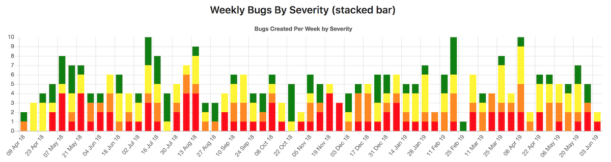

DETAILS:
**Tier:** Ultimate
**Offering:** GitLab.com, GitLab Self-Managed, GitLab Dedicated

Insights are interactive bar charts that display the number of items (for example, bugs created) per month.

Configure insights and create custom reports for your projects and groups to explore data such as:

- Issues created and closed during a specified period.
- Average time for merge requests to be merged.
- Triage hygiene.

## View insights

Prerequisites:

- For project insights, you must have access to the project and permission to view information about its merge requests and issues.
- For group insights, you must have permission to view the group.

To view insights for a project or group:

1. On the left sidebar, select **Search or go to** and find your project or group.
1. Select **Analyze > Insights**.
1. To view a report, from the **Select report** dropdown list, select the report you want to view.

### Access insights reports with deep links

You can direct users to a specific report in insights by using the deep-linked URL.

To create a deep link, append the report key to the end of the insights report URL.
For example, a GitLab report with the key `bugsCharts` has the deep link URL `https://gitlab.com/gitlab-org/gitlab/insights/#/bugsCharts`.

## Interact with insights charts

You can interact with the insights charts to view details about your group's activity.

### Display different reports

To display one of the available reports on the insights page:

- From the **Select report** dropdown list, select the report you want to display.

### View bar chart annotations

To view annotations:

- Hover over each bar in the chart.

### Zoom in on chart

Insights display data from the last 90 days. You can zoom in to display data only from a subset of the 90-day range.

To do this, select the pause icons (**{status-paused}**) and slide them along the horizontal axis:

- To change the start date, slide the left pause icon to the left or right.
- To change the end date, slide the right pause icon to the left or right.

### Exclude dimensions from charts

By default, insights display all available dimensions on the chart.

To exclude a dimension, from the legend below the chart, select the name of the dimension.

### Drill down on charts

> - [Introduced](https://gitlab.com/gitlab-org/gitlab/-/issues/372215/) in GitLab 16.7.
> - [Changed](https://gitlab.com/gitlab-org/gitlab/-/issues/436704) to extend support to all `issuables` charts in GitLab 16.9.

You can drill down into the data of all charts whose `query.data_source` is `issuables`.

To view a drill-down report of the data for a specific priority or severity in a month:

- On the chart, select the bar stack you want to drill down on.

## Configure project insights

Prerequisites:

- Depending on your project configuration, you must have at least the Developer role.

Project insights are configured with the [`.gitlab/insights.yml`](#insights-configuration-file) file in the project. If a project doesn't have a configuration file, it uses the [group configuration](#configure-group-insights).

The `.gitlab/insights.yml` file is a YAML file where you define:

- The structure and order of charts in a report.
- The style of charts displayed in the report of your project or group.

To configure project insights, create a file `.gitlab/insights.yml` either:

- Locally, in the root directory of your project, and push your changes.
- From the UI:
  1. On the left sidebar, select **Search or go to** and find your project.
  1. Above the file list, select the branch you want to commit to, select the plus icon, then select **New file**.
  1. In the **File name** text box, enter `.gitlab/insights.yml`.
  1. In the large text box, update the file contents.
  1. Select **Commit changes**.

After you create the configuration file, you can also
use it for the project's group.

## Configure group insights

GitLab reads insights from the
[default configuration file](https://gitlab.com/gitlab-org/gitlab/-/blob/master/ee/fixtures/insights/default.yml).

To configure group insights:

1. In a project that belongs to your group, [create a `.gitlab/insights.yml` file](#configure-project-insights).
1. On the left sidebar, select **Search or go to** and find your group.
1. Select **Settings > Analytics**.
1. In the **Insights** section, select the project that contains your `.gitlab/insights.yml` configuration file.
1. Select **Save changes**.

## Insights configuration file

In the `.gitlab/insights.yml` file:

- [Configuration parameters](#insights-configuration-parameters) define the chart behavior.
- Each report has a unique key and a collection of charts to fetch and display.
- Each chart definition is made up of a hash composed of key-value pairs.

The following example shows a single definition that displays one report with one chart.

```yaml
bugsCharts:
  title: "Charts for bugs"
  charts:
    - title: "Monthly bugs created"
      description: "Open bugs created per month"
      type: bar
      query:
        data_source: issuables
        params:
          issuable_type: issue
          issuable_state: opened
          filter_labels:
            - bug
          group_by: month
          period_limit: 24
```

## Insights configuration parameters

The following table lists the chart parameters:

| Keyword                                            | Description |
|:---------------------------------------------------|:------------|
| [`title`](#title)                                  | The title of the chart. This displays on the Insights page. |
| [`description`](#description)                      | A description for the individual chart. This displays above the relevant chart. |
| [`type`](#type)                                    | The type of chart: `bar`, `line` or `stacked-bar`. |
| [`query`](#query)                                  | A hash that defines the data source and filtering conditions for the chart. |

### `title`

Use `title` to update the chart title. The title displays on the insights report.

**Example:**

```yaml
monthlyBugsCreated:
  title: "Monthly bugs created"
```

### `description`

Use `description` to add a description of the chart. The description displays above the chart, below the title.

**Example:**

```yaml
monthlyBugsCreated:
  title: "Monthly bugs created"
  description: "Open bugs created per month"
```

### `type`

Use `type` to define the chart type.

**Supported values:**

| Name  | Example: |
| ----- | ------- |
| `bar` |  |
| `bar` (time series with `group_by`) |  |
| `line` |  |
| `stacked-bar` |  |

The `dora` data source supports the `bar` and `line` [chart types](#type).

**Example:**

```yaml
monthlyBugsCreated:
  title: "Monthly bugs created"
  type: bar
```

### `query`

Use `query` to define the data source and filtering conditions for the chart.

**Example:**

```yaml
monthlyBugsCreated:
  title: "Monthly bugs created"
  description: "Open bugs created per month"
  type: bar
  query:
    data_source: issuables
    params:
      issuable_type: issue
      issuable_state: opened
      filter_labels:
        - bug
      collection_labels:
        - S1
        - S2
        - S3
        - S4
      group_by: week
      period_limit: 104
```

The legacy format without the `data_source` parameter is still supported:

```yaml
monthlyBugsCreated:
  title: "Monthly bugs created"
  description: "Open bugs created per month"
  type: bar
  query:
    issuable_type: issue
    issuable_state: opened
    filter_labels:
      - bug
    collection_labels:
      - S1
      - S2
      - S3
      - S4
    group_by: week
    period_limit: 104
```

#### `query.data_source`

> - [Introduced](https://gitlab.com/groups/gitlab-org/-/epics/725) in GitLab 15.3.

Use `data_source` to define the data source that exposes the data.

**Supported values:**

- `issuables`: Exposes merge request or issue data.
- `dora`: Exposes DORA metrics.

#### `issuable` query parameters

##### `query.params.issuable_type`

Use `query.params.issuable_type` to define the type of issuable to create a chart for.

**Supported values:**

- `issue`: The chart displays issues' data.
- `merge_request`: The chart displays merge requests' data.

##### `query.params.issuable_state`

Use `query.params.issuable_state` to filter by the current state of the queried issuable.

By default, the `opened` state filter is applied.

**Supported values:**

- `opened`: Open issues or merge requests.
- `closed`: Closed issues or merge requests.
- `locked`: Issues or merge requests that have their discussion locked.
- `merged`: Merged merge requests.
- `all`: Issues or merge requests in all states.

##### `query.params.filter_labels`

Use `query.params.filter_labels` to filter by labels applied to the queried issuable.

By default, no label filter is applied. All defined labels must
be applied to the issuable for it to be selected.

**Example:**:

```yaml
monthlyBugsCreated:
  title: "Monthly regressions created"
  type: bar
  query:
    data_source: issuables
    params:
      issuable_type: issue
      issuable_state: opened
      filter_labels:
        - bug
        - regression
```

##### `query.params.collection_labels`

Use `query.params.collection_labels` to group issuables by the configured labels.
Grouping is not applied by default.

**Example:**

```yaml
weeklyBugsBySeverity:
  title: "Weekly bugs by severity"
  type: stacked-bar
  query:
    data_source: issuables
    params:
      issuable_type: issue
      issuable_state: opened
      filter_labels:
        - bug
      collection_labels:
        - S1
        - S2
        - S3
        - S4
```

##### `query.group_by`

Use `query.group_by` to define the X-axis of the chart.

**Supported values:**

- `day`: Group data per day.
- `week`: Group data per week.
- `month`: Group data per month.

##### `query.period_limit`

Use `query.period_limit` to define how far back in time to query issuables (using the `query.period_field`).

The unit is related to the value defined in `query.group_by`. For example, if you
defined `query.group_by: 'day'`, and `query.period_limit: 365`, the chart displays data from the last 365 days.

By default, default values are applied depending on the `query.group_by`
you defined.

| `query.group_by` | Default value |
| ---------------- | ------------- |
| `day`            | 30            |
| `week`           | 4             |
| `month`          | 12            |

#### `query.period_field`

Use `query.period_field` to define the timestamp field by which to group issuables.

**Supported values:**

- `created_at` (default): Group data using the `created_at` field.
- `closed_at`: Group data using the `closed_at` field (for issues only).
- `merged_at`: Group data using the `merged_at` field (for merge requests only).

The `period_field` is automatically set to:

- `closed_at` if `query.issuable_state` is `closed`
- `merged_at` if `query.issuable_state` is `merged`
- `created_at` otherwise

NOTE:
Until [this bug](https://gitlab.com/gitlab-org/gitlab/-/issues/26911), is resolved,
you may see `created_at` in place of `merged_at`. `created_at` is used instead.

#### `DORA` query parameters

> - [Introduced](https://gitlab.com/gitlab-org/gitlab/-/issues/367248) in GitLab 15.3.

Use DORA-specific queries with the `dora` data source to create a DORA chart definition.

**Example:**

```yaml
dora:
  title: "DORA charts"
  charts:
    - title: "DORA deployment frequency"
      type: bar # or line
      query:
        data_source: dora
        params:
          metric: deployment_frequency
          group_by: day
          period_limit: 10
      projects:
        only:
          - 38
    - title: "DORA lead time for changes"
      description: "DORA lead time for changes"
      type: bar
      query:
        data_source: dora
        params:
          metric: lead_time_for_changes
          group_by: day
          environment_tiers:
            - staging
          period_limit: 30
```

##### `query.metric`

Use `query.metric` to define the [DORA metrics](../../../api/dora/metrics.md#the-value-field) to query.

**Supported values:**

- `deployment_frequency` (default)
- `lead_time_for_changes`
- `time_to_restore_service`
- `change_failure_rate`

##### `query.group_by`

Use `query.group_by` to define the X-axis of your chart.

**Supported values:**

- `day` (default): Group data per day.
- `month`: Group data per month.

##### `query.period_limit`

Use `query.period_limit` to define how far the metrics are queried in the past (default: 15). The maximum period is 180 days or 6 months.

##### `query.environment_tiers`

Use `query.environment_tiers` to define an array of environments to include the calculation.

**Supported values:**

- `production`(default)
- `staging`
- `testing`
- `development`
- `other`

### `projects`

Use `projects` to limit where issuables are queried from:

- If `.gitlab/insights.yml` is used for a group's insights, use `projects` to define the projects from which to query issuables. By default, all projects under the group are used.
- If `.gitlab/insights.yml` is used for a project's insights, specifying other projects does not yield results. By default, the project is used.

#### `projects.only`

Use `projects.only` to specify the projects from which issuables
are queried.

Projects listed in this parameter are ignored when:

- They don't exist.
- The current user doesn't have sufficient permissions to read them.
- They are outside the group.

**Example:**

```yaml
monthlyBugsCreated:
  title: "Monthly bugs created"
  description: "Open bugs created per month"
  type: bar
  query:
    data_source: issuables
    params:
      issuable_type: issue
      issuable_state: opened
      filter_labels:
        - bug
  projects:
    only:
      - 3                         # You can use the project ID
      - groupA/projectA           # Or full project path
      - groupA/subgroupB/projectC # Projects in subgroups can be included
      - groupB/project            # Projects outside the group will be ignored
```

## Complete insights configuration example

```yaml
.projectsOnly: &projectsOnly
  projects:
    only:
      - 3
      - groupA/projectA
      - groupA/subgroupB/projectC

bugsCharts:
  title: "Charts for bugs"
  charts:
    - title: "Monthly bugs created"
      description: "Open bugs created per month"
      type: bar
      <<: *projectsOnly
      query:
        data_source: issuables
        params:
          issuable_type: issue
          issuable_state: opened
          filter_labels:
            - bug
          group_by: month
          period_limit: 24

    - title: "Weekly bugs by severity"
      type: stacked-bar
      <<: *projectsOnly
      query:
        data_source: issuables
        params:
          issuable_type: issue
          issuable_state: opened
          filter_labels:
            - bug
          collection_labels:
            - S1
            - S2
            - S3
            - S4
          group_by: week
          period_limit: 104

    - title: "Monthly bugs by team"
      type: line
      <<: *projectsOnly
      query:
        data_source: issuables
        params:
          issuable_type: merge_request
          issuable_state: opened
          filter_labels:
            - bug
          collection_labels:
            - Manage
            - Plan
            - Create
          group_by: month
          period_limit: 24
```
