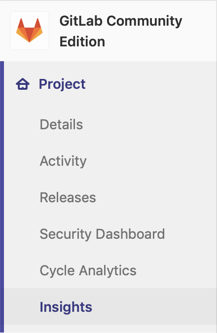
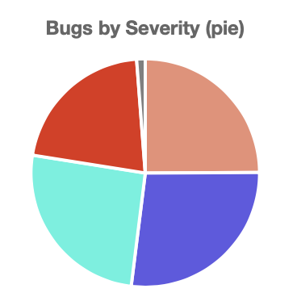

# Insights **[ULTIMATE]**

> [Introduced](https://gitlab.com/groups/gitlab-org/-/epics/725) in [GitLab Ultimate](https://about.gitlab.com/pricing/) 12.0.

Configure the Insights that matter for your projects to explore data such as
triage hygiene, issues created/closed per a given period, average time for merge
requests to be merged and much more.


NOTE: **Note:**
This feature is [also available at the group level](../../group/insights/index.md).

## View your project's Insights

You can access your project's Insights by clicking the **Project > Insights**
link in the left sidebar:



## Configure your Insights

Insights are configured using a YAML file called `.gitlab/insights.yml` within
a project. That file will then be used in the project's Insights page.

See [Writing your `.gitlab/insights.yml`](#writing-your-gitlabinsightsyml) below
for details about the content of this file.

NOTE: **Note:**
Once the configuration file is created, you can also
[use it for your project's group](../../group/insights/index.md#configure-your-insights).

NOTE: **Note:**
If the project doesn't have any configuration file, it'll try to use
the group configuration if possible. If the group doesn't have any
configuration, the default configuration will be used.

## Permissions

If you have access to view a project, then you have access to view their
Insights.

NOTE: **Note:**
Issues or merge requests that you don't have access to (because you don't have
access to the project they belong to, or because they are confidential) are
filtered out of the Insights charts.

You may also consult the [group permissions table](../../permissions.md#group-members-permissions).

## Writing your `.gitlab/insights.yml`

The `.gitlab/insights.yml` file defines the structure and order of the Insights
charts that will be displayed in each Insights page of your project or group.

Each page has a unique key and a collection of charts to fetch and display.

For example, here's a single definition for Insights that will display one page with one chart:

```yaml
bugsCharts:
  title: 'Charts for Bugs'
  charts:
    - title: Monthly Bugs Created (bar)
      type: bar
      query:
        issuable_type: issue
        issuable_state: opened
        filter_labels:
          - bug
        group_by: month
        period_limit: 24
```

Each chart definition is made up of a hash composed of key-value pairs.

For example, here's single chart definition:

```yaml
- title: Monthly Bugs Created (bar)
  type: bar
  query:
    issuable_type: issue
    issuable_state: opened
    filter_labels:
      - bug
    group_by: month
    period_limit: 24
```

## Configuration parameters

A chart is defined as a list of parameters that define the chart's behavior.

The following table lists available parameters for charts:

| Keyword                                            | Description |
|:---------------------------------------------------|:------------|
| [`title`](#title)                                  | The title of the chart. This will displayed on the Insights page. |
| [`type`](#type)                                    | The type of chart: `bar`, `line`, `stacked-bar`, `pie` etc. |
| [`query`](#query)                                  | A hash that defines the conditions for issues / merge requests to be part of the chart. |

## Parameter details

The following are detailed explanations for parameters used to configure
Insights charts.

### `title`

`title` is the title of the chart as it will be displayed on the Insights page.
For example:

```yaml
monthlyBugsCreated:
  title: Monthly Bugs Created (bar)
```

### `type`

`type` is the chart type.

For example:

```yaml
monthlyBugsCreated:
  title: Monthly Bugs Created (bar)
  type: bar
```

Supported values are:

| Name  | Example |
| ----- | ------- |
| `bar` |  |
| `bar` (time series, i.e. when `group_by` is used) |  |
| `pie` |  |
| `line` |  |
| `stacked-bar` |  |

### `query`

`query` allows to define the conditions for issues / merge requests to be part
of the chart.

Example:

```yaml
monthlyBugsCreated:
  title: Monthly Bugs Created (bar)
  type: bar
  query:
    issuable_type: issue
    issuable_state: opened
    filter_labels:
      - bug
    collection_labels:
      - S1
      - S2
      - S3
      - S4
    group_by: week
    period_limit: 104
```

#### `query.issuable_type`

Defines the type of "issuable" you want to create a chart for.

Supported values are:

- `issue`: The chart will display issues' data.
- `merge_request`: The chart will display merge requests' data.

#### `query.issuable_state`

Filter by the state of the queried "issuable".

If you omit it, the `opened` state filter will be applied.

Supported values are:

- `opened`: Open issues / merge requests.
- `closed`: Closed Open issues / merge requests.
- `locked`: Issues / merge requests that have their discussion locked.
- `merged`: Merged merge requests.
- `all`: Issues / merge requests in all states

#### `query.filter_labels`

Filter by labels applied to the queried "issuable".

If you omit it, no labels filter will be applied. All the defined labels must be
applied to the "issuable" in order for it to be selected.

Example:

```yaml
monthlyBugsCreated:
  title: Monthly regressions Created (bar)
  type: bar
  query:
    issuable_type: issue
    issuable_state: opened
    filter_labels:
      - bug
      - regression
```

#### `query.collection_labels`

Group "issuable" by the configured labels.

If you omit it, no grouping will be done. When using this keyword, you need to
set `type` to either `line` or `stacked-bar`.

Example:

```yaml
weeklyBugsBySeverity:
  title: Weekly Bugs By Severity (stacked bar)
  type: stacked-bar
  query:
    issuable_type: issue
    issuable_state: opened
    filter_labels:
      - bug
    collection_labels:
      - S1
      - S2
      - S3
      - S4
```

#### `query.group_by`

Define the X-axis of your chart.

Supported values are:

- `day`: Group data per day.
- `week`: Group data per week.
- `month`: Group data per month.

#### `query.period_limit`

Define how far "issuables" are queried in the past.

The unit is related to the `query.group_by` you defined. For instance if you
defined `query.group_by: 'day'`  then `query.period_limit: 365` would mean
"Gather and display data for the last 365 days".

If you omit it, default values will be applied depending on the `query.group_by`
you defined.

| `query.group_by` | Default value |
| ---------------- | ------------- |
| `day`            | 30            |
| `week`           | 4             |
| `month`          | 12            |

## Complete example

```yaml
bugsCharts:
  title: 'Charts for Bugs'
  charts:
    - title: Monthly Bugs Created (bar)
      type: bar
      query:
        issuable_type: issue
        issuable_state: opened
        filter_labels:
          - bug
        group_by: month
        period_limit: 24
    - title: Weekly Bugs By Severity (stacked bar)
      type: stacked-bar
      query:
        issuable_type: issue
        issuable_state: opened
        filter_labels:
          - bug
        collection_labels:
          - S1
          - S2
          - S3
          - S4
        group_by: week
        period_limit: 104
    - title: Monthly Bugs By Team (line)
      type: line
      query:
        issuable_type: merge_request
        issuable_state: opened
        filter_labels:
          - bug
        collection_labels:
          - Manage
          - Plan
          - Create
        group_by: month
        period_limit: 24
```
