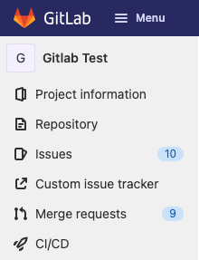

DETAILS:
**Tier:** Free, Premium, Ultimate
**Offering:** GitLab.com, GitLab Self-Managed, GitLab Dedicated

You can integrate an [external issue tracker](../../../integration/external-issue-tracker.md)
with GitLab. If your preferred issue tracker is not listed in the
[integrations list](../../../integration/external-issue-tracker.md#configure-an-external-issue-tracker),
you can enable a custom issue tracker.

After you enable the custom issue tracker, a link to the issue tracker displays
on the left sidebar in your project.

## Enable a custom issue tracker

To enable a custom issue tracker in a project:

1. On the left sidebar, select **Search or go to** and find your project.
1. Select **Settings > Integrations**.
1. Select **Custom issue tracker**.
1. Under **Enable integration**, select the **Active** checkbox.
1. Fill in the required fields:

   - **Project URL**: The URL to view all the issues in the custom issue tracker.
   - **Issue URL**: The URL to view an issue in the custom issue tracker. The URL must contain `:id`.
     GitLab replaces `:id` with the issue number (for example,
     `https://customissuetracker.com/project-name/:id`, which becomes
     `https://customissuetracker.com/project-name/123`).
   - **New issue URL**:
     <!-- The line below was originally added in January 2018: https://gitlab.com/gitlab-org/gitlab/-/commit/778b231f3a5dd42ebe195d4719a26bf675093350 -->
     **This URL is not used and an [issue exists](https://gitlab.com/gitlab-org/gitlab/-/issues/327503) to remove it.**
     Enter any URL.

1. Optional. Select **Test settings**.
1. Select **Save changes**.

## Reference issues in a custom issue tracker

You can reference issues in a custom issue tracker using:

- `#<ID>`, where `<ID>` is a number (for example, `#143`).
- `<PROJECT>-<ID>` (for example `API_32-143`) where:
  - `<PROJECT>` starts with a capital letter, followed by capital letters, numbers, or underscores.
  - `<ID>` is a number.

The `<PROJECT>` part is ignored in links, which always point to the address specified in **Issue URL**.

We suggest using the longer format (`<PROJECT>-<ID>`) if you have both internal and external issue
trackers enabled. If you use the shorter format, and an issue with the same ID exists in the
internal issue tracker, the internal issue is linked.
