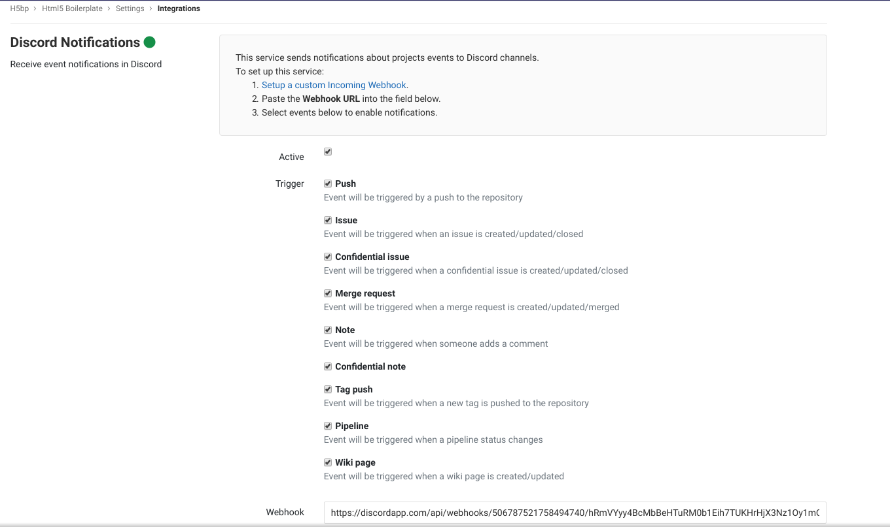

# Discord Notifications service

> [Introduced](https://gitlab.com/gitlab-org/gitlab-ce/merge_requests/22684) in GitLab 11.5.

The Discord Notifications service sends notifications from GitLab to the channel for which the webhook was created.

## On Discord

1. Open the channel in which you want to see the notifications.
1. From the channel menu, select **Edit channel**.
1. Click on **Webhooks** menu item.
1. Click on **Create Webhook** and fill in the name of the bot that will post the messages. Optionally define avatar.
1. Copy the **WEBHOOK URL** of your webhook and click **Save**.

See also [Intro to Webhooks](https://support.discordapp.com/hc/en-us/articles/228383668-Intro-to-Webhooks) article. 

## On GitLab

When you have the **Webhook URL** for your Discord Notifications channel webhook, you can set up the GitLab service.

1. Navigate to the [Integrations page](project_services.md#accessing-the-project-services) in your project's settings, i.e. **Project > Settings > Integrations**.
1. Select the **Discord Notifications** project service to configure it.
1. Check the **Active** checkbox to turn on the service.
1. Check the checkboxes corresponding to the GitLab events you want to receive.
1. Paste the **Webhook URL** that you copied from the Discord Notifications configuration step.
1. Configure the remaining options and click `Save changes`.

Your Discord Notifications channel will now start receiving GitLab event notifications as configured.

