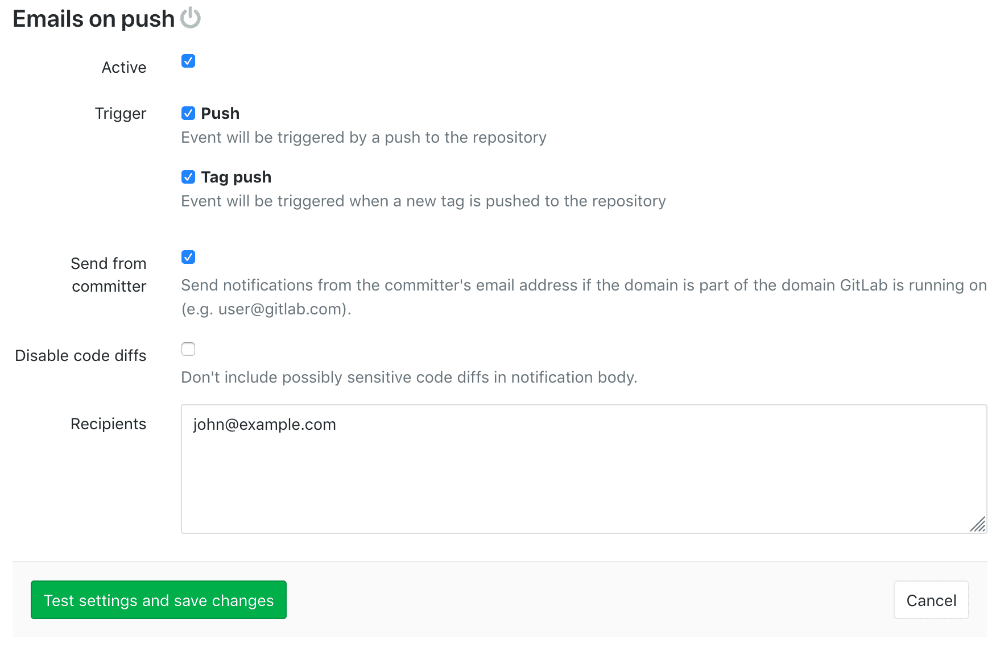

## Enabling emails on push

To receive email notifications for every change that is pushed to the project, visit
your project's **Settings > Services > Emails on push** and activate the service.

In the _Recipients_ area, provide a list of emails separated by commas.

You can configure any of the following settings depending on your preference.

+ **Push events** - Email will be triggered when a push event is recieved
+ **Tag push events** - Email will be triggered when a tag is created and pushed
+ **Send from committer** - Send notifications from the committer's email address if the domain is part of the domain GitLab is running on (e.g. `user@gitlab.com`).
+ **Disable code diffs** - Don't include possibly sensitive code diffs in notification body.

---

