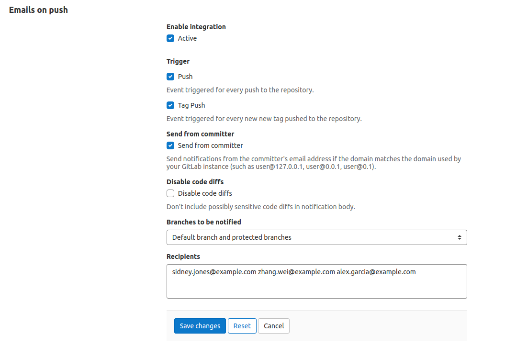
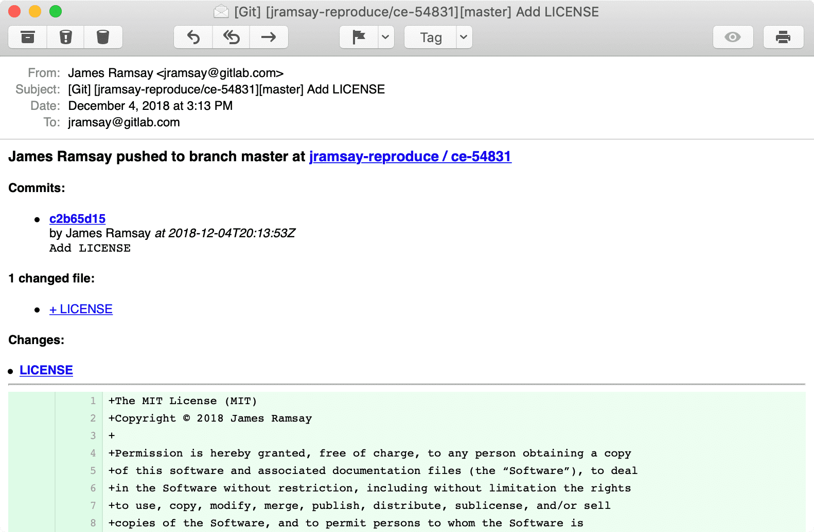

# Enabling emails on push **(FREE)**

By enabling this service, you receive email notifications for every change
that is pushed to your project.

From the [Integrations page](overview.md#accessing-integrations)
select **Emails on push** service to activate and configure it.

In the _Recipients_ area, provide a list of emails separated by spaces or newlines.

The following options are available:

- **Push events** - Email is triggered when a push event is received.
- **Tag push events** - Email is triggered when a tag is created and pushed.
- **Send from committer** - Send notifications from the committer's email address if the domain matches the domain used by your GitLab instance (such as `user@gitlab.com`).
- **Disable code diffs** - Don't include possibly sensitive code diffs in notification body.

| Settings | Notification |
| --- | --- |
|  |  |
