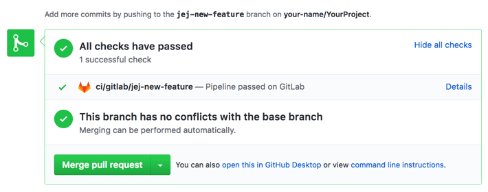

DETAILS:
**Tier:** Premium, Ultimate
**Offering:** GitLab.com, GitLab Self-Managed, GitLab Dedicated

You can update GitHub with pipeline status updates from GitLab.
The GitHub integration can help you if you use GitLab for CI/CD.

This project integration is separate from the [instance-wide GitHub integration](../import/github.md#mirror-a-repository-and-share-pipeline-status)
and is automatically configured when you import a [GitHub project](../../../integration/github.md).

## Configure the integration

This integration requires a [GitHub API token](https://docs.github.com/en/authentication/keeping-your-account-and-data-secure/managing-your-personal-access-tokens)
with `repo:status` access granted.

Complete these steps on GitHub:

1. Go to your **Personal access tokens** page at <https://github.com/settings/tokens>.
1. Select **Generate new token**.
1. Under **Note**, enter a name for the new token.
1. Ensure `repo:status` is selected and select **Generate token**.
1. Copy the generated token to use in GitLab.

Complete these steps in GitLab:

1. On the left sidebar, select **Search or go to** and find your project.
1. Select **Settings > Integrations**.
1. Select **GitHub**.
1. Ensure the **Active** checkbox is selected.
1. In **Token**, paste the token you generated on GitHub.
1. In **Repository URL**, enter the path to your project on GitHub, such as `https://github.com/username/repository`.
1. Optional. To disable [static status check names](#static-or-dynamic-status-check-names), clear the **Enable static status check names** checkbox.
1. Optional. Select **Test settings**.
1. Select **Save changes**.

After configuring the integration, see [Pipelines for external pull requests](../../../ci/ci_cd_for_external_repos/_index.md#pipelines-for-external-pull-requests)
to configure pipelines to run for open pull requests.

### Static or dynamic status check names

A status check name can be static or dynamic:

- **Static**: The hostname of your
  GitLab instance is appended to the status check name.

- **Dynamic**: The branch name is appended
  to the status check name.

The **Enable static status check names** option enables you to configure
required status checks in GitHub, which need a consistent (static) name to work correctly.

If you [disable this option](#configure-the-integration),
GitLab uses dynamic status check names instead.
