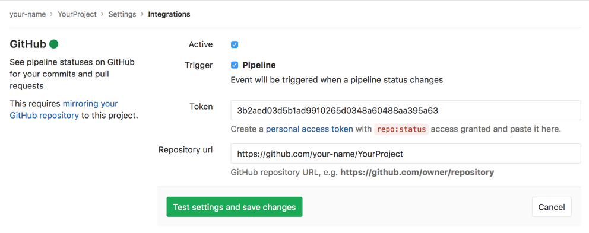

# GitHub Project Integration

GitLab provides integration for updating pipeline statuses on GitHub. This is especially useful if using GitLab for CI/CD only.

This project integration is separate from the [instance wide GitHub integration][gh-integration] and is automatically configured on [GitHub import][gh-import].

## Configuration

### Complete these steps on GitHub

This integration requires a [GitHub API token](https://github.com/settings/tokens) with `repo:status` access granted:

1. Go to your "Personal access tokens" page at https://github.com/settings/tokens
1. Click "Generate New Token"
1. Ensure that `repo:status` is checked and click "Generate token"
1. Copy the generated token to use on GitLab

### Complete these steps on GitLab

1. Navigate to the project you want to configure.
1. Navigate to the [Integrations page](project_services.md#accessing-the-project-services)
1. Click "GitHub".
1. Select the "Active" checkbox.
1. Paste the token you've generated on GitHub
1. Enter the path to your project on GitHub, such as "https://github.com/your-name/YourProject/"
1. Save or optionally click "Test Settings".

[gh-import]: ../import/github.md#mirroring
[gh-integration]: ../../../integration/github.md
