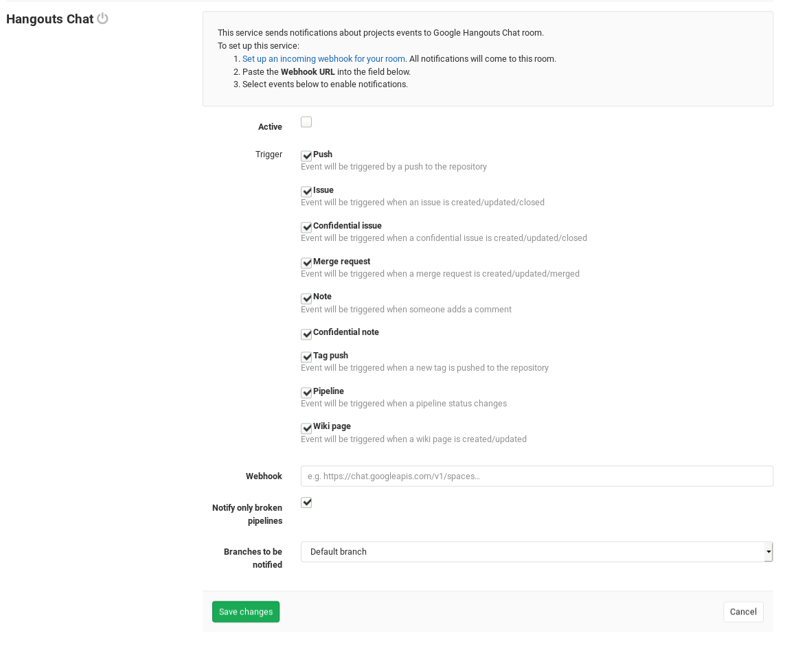

# Hangouts Chat service

The Hangouts Chat service sends notifications from GitLab to the room for which the webhook was created.

## On Hangouts Chat

1. Open the chat room in which you want to see the notifications.
1. From the chat room menu, select **Configure Webhooks**.
1. Click on **ADD WEBHOOK** and fill in the name of the bot that will post the messages. Optionally define avatar.
1. Click **SAVE** and copy the **Webhook URL** of your webhook.

See also [the Hangouts Chat documentation for configuring incoming webhooks](https://developers.google.com/hangouts/chat/how-tos/webhooks)

## On GitLab

When you have the **Webhook URL** for your Hangouts Chat room webhook, you can setup the GitLab service.

1. Navigate to the [Integrations page](project_services.md#accessing-the-project-services) in your project's settings, i.e. **Project > Settings > Integrations**.
1. Select the **Hangouts Chat** project service to configure it.
1. Check the **Active** checkbox to turn on the service.
1. Check the checkboxes corresponding to the GitLab events you want to receive.
1. Paste the **Webhook URL** that you copied from the Hangouts Chat configuration step.
1. Configure the remaining options and click `Save changes`.

Your Hangouts Chat room will now start receiving GitLab event notifications as configured.

