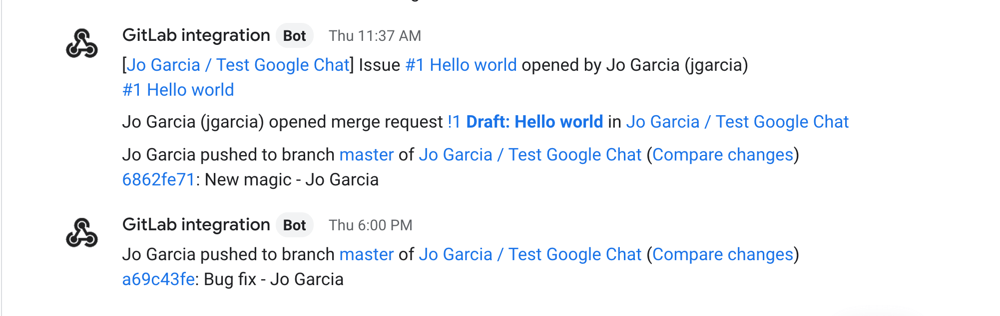

# Google Chat integration **(FREE)**

> [Introduced](https://gitlab.com/gitlab-org/gitlab-foss/-/issues/43756) in GitLab 11.2.

Integrate your project to send notifications from GitLab to a
room of your choice in [Google Chat](https://chat.google.com/) (former Google
Hangouts).

## How it works

To enable this integration, first you need to create a webhook for the room in
Google Chat where you want to receive the notifications from your project.

After that, enable the integration in GitLab and choose the events you want to
be notified about in your Google Chat room.

For every selected event in your project, GitLab acts like a bot sending
notifications to Google Chat:

## In Google Chat

Select a room and create a webhook:

1. Enter the room where you want to receive notifications from GitLab.
1. Open the room dropdown menu on the top-left and select **Manage webhooks**.
1. Enter the name for your webhook, for example "GitLab integration".
1. (Optional) Add an avatar for your bot.
1. Select **Save**.
1. Copy the webhook URL.

For further details, see [the Google Chat documentation for configuring webhooks](https://developers.google.com/chat/how-tos/webhooks).

## In GitLab

Enable the Google Chat integration in GitLab:

1. In your project, go to **Settings > Integrations** and select **Google Chat**.
1. Scroll down to the end of the page where you find a **Webhook** field.
1. Enter the webhook URL you copied from Google Chat.
1. Select the events you want to be notified about in your Google Chat room.
1. (Optional) Select **Test settings** to verify the connection.
1. Select **Save changes**.

To test the integration, make a change based on the events you selected and
see the notification in your Google Chat room.
