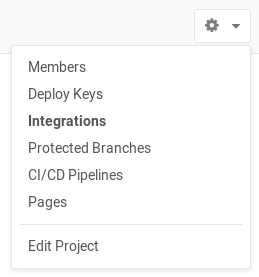

# Project integrations

You can find the available integrations under the **Integrations** page by
navigating to the cog icon in the upper right corner of your project. You need
to have at least [master permission][permissions] on the project.

## Project services

Project services allow you to integrate GitLab with other applications.
They are a bit like plugins in that they allow a lot of freedom in
adding functionality to GitLab.

[Learn more about project services.](project_services.md)

## Project webhooks

Project webhooks allow you to trigger a URL if for example new code is pushed or
a new issue is created. You can configure webhooks to listen for specific events
like pushes, issues or merge requests. GitLab will send a POST request with data
to the webhook URL.

[Learn more about webhooks.](webhooks.md)

[permissions]: ../../permissions.md
