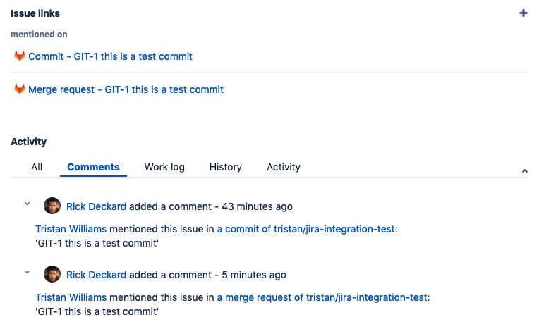
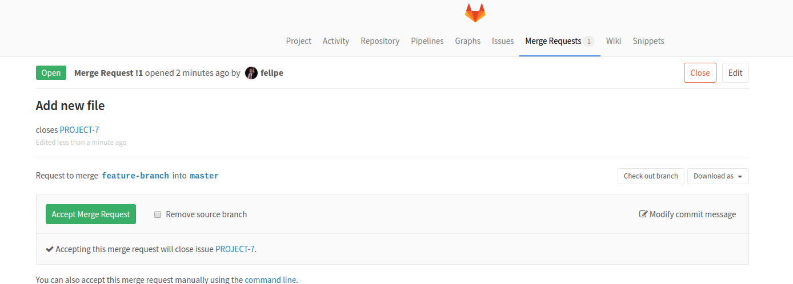
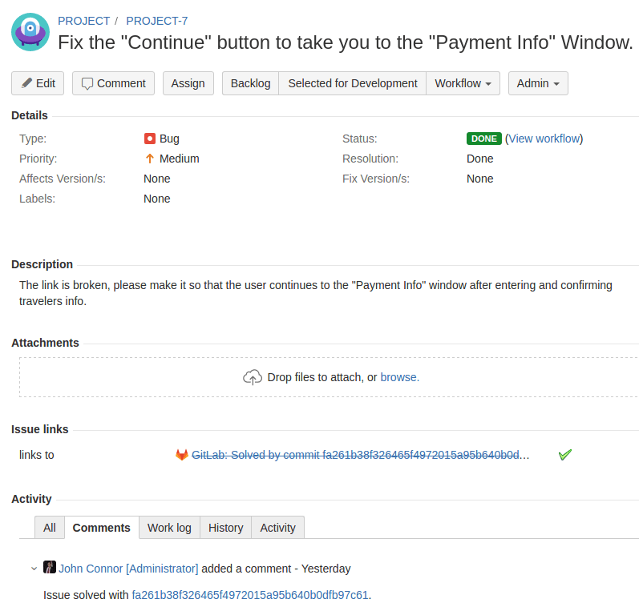
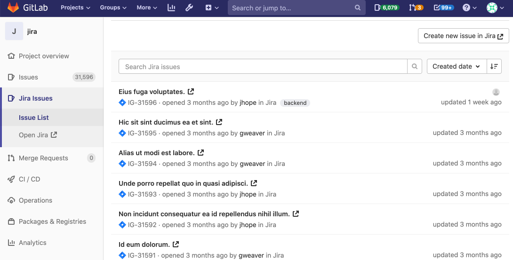

# GitLab Jira integration **(FREE)**

You can use Jira to track work implemented in GitLab. The Jira integration with GitLab makes the
process of working across these systems more efficient.

The GitLab Jira integration, available in every GitLab project by default, allows you to connect
to any Jira instance, whether on Atlassian cloud or self-managed.

You can also install the [Jira Development Panel integration](../../../integration/jira/index.md).
For more information about the differences between the two integrations, see
[Jira integrations](jira_integrations.md).

After you set up this integration, you can cross-reference activity in the GitLab project with any
of your projects in Jira. This includes the ability to close or transition Jira issues when work is
completed in GitLab and:

- Mention a Jira issue ID in a commit message or MR (merge request) and:
  - GitLab links to the Jira issue.
  - The Jira issue adds a comment with details and a link back to the activity in GitLab.
- Mention that a commit or MR resolves or closes a specific Jira issue and when it's merged to the default branch:
  - The GitLab MR displays a note that it closed the Jira issue. Prior to the merge, MRs indicate which issue they close.
  - The Jira issue shows the activity and is closed or otherwise transitioned as specified in your GitLab settings.
- Run a pipeline on an MR linked to a Jira issue:
  - The Jira issue shows the current pipeline status (in the sidebar as "builds").
- Deploy to an environment from an MR linked to a Jira issue:
  - The Jira issue shows the status of the deployment (in the sidebar as "deployments").
- Create or modify a feature flag that mentions a Jira issue in its description:
  - The Jira issue shows the details of the feature-flag (in the sidebar as "feature flags").
- View a list of Jira issues directly in GitLab. **(PREMIUM)**
- Create a Jira issue from a vulnerability. **(ULTIMATE)**

Additional features provided by the Jira Development Panel integration include:

- In a Jira issue, display relevant GitLab information in the [development panel](https://support.atlassian.com/jira-software-cloud/docs/view-development-information-for-an-issue/), including related branches, commits, and merge requests.
- Use Jira [Smart Commits](https://confluence.atlassian.com/fisheye/using-smart-commits-960155400.html) in GitLab to add Jira comments, log time spent on the issue, or apply any issue transition.
- Showing pipeline, deployment, and feature flags in Jira issues.

## Configuration

<i class="fa fa-youtube-play youtube" aria-hidden="true"></i>
For an overview, see [Agile Management - GitLab-Jira Basic Integration](https://www.youtube.com/watch?v=fWvwkx5_00E&feature=youtu.be).

Each GitLab project can be configured to connect to an entire Jira instance. That means one GitLab
project can interact with _all_ Jira projects in that instance, once configured. For:

- The [view Jira issues](#view-jira-issues) feature, you must associate a GitLab project with a
  specific Jira project.
- Other features, you do not have to explicitly associate a GitLab project with any single Jira
  project.

If you have one Jira instance, you can pre-fill the settings. For more information, see the
documentation for:

- [Project integration management](../../admin_area/settings/project_integration_management.md).
- [Services Templates](services_templates.md).

To enable the Jira service in GitLab, you must:

1. Configure the project in Jira.
1. Enter the correct values in GitLab.

### Configure Jira

The process for configuring Jira depends on whether you host Jira on your own server or on
[Atlassian cloud](https://www.atlassian.com/cloud).

#### Jira Server

Jira Server supports basic authentication. When connecting, a **username and password** are
required. Connecting to Jira Server via CAS is not possible. For more information, see
[set up a user in Jira Server](../../../integration/jira/jira_server_configuration.md).

#### Jira on Atlassian cloud

Jira on Atlassian cloud supports authentication through an API token. When connecting to Jira on
Atlassian cloud, an **email and API token** are required. For more information, see
[set up a user in Jira on Atlassian cloud](../../../integration/jira/jira_cloud_configuration.md).

### Configure GitLab

> **Notes:**
>
> - The supported Jira versions are `v6.x`, `v7.x`, and `v8.x`.
> - In order to support Oracle's Access Manager, GitLab sends additional cookies
>   to enable Basic Auth. The cookie being added to each request is `OBBasicAuth` with
>   a value of `fromDialog`.

To enable the Jira integration in a project:

1. Go to the project's [Integrations page](overview.md#accessing-integrations) and select the
   **Jira** service.

1. Select **Enable integration**.

1. Select **Trigger** actions.
   This determines whether a mention of a Jira issue in GitLab commits, merge requests, or both,
   should link the Jira issue back to that source commit/MR and transition the Jira issue, if
   indicated.

1. To include a comment on the Jira issue when the above reference is made in GitLab, select
   **Enable comments**.

1. To transition Jira issues when a [closing reference](../issues/managing_issues.md#closing-issues-automatically) is made in GitLab,
   select **Enable Jira transitions**.

1. Enter the further details on the page as described in the following table.

   | Field | Description |
   | ----- | ----------- |
   | `Web URL` | The base URL to the Jira instance web interface which is being linked to this GitLab project. For example, `https://jira.example.com`. |
   | `Jira API URL` | The base URL to the Jira instance API. Web URL value is used if not set. For example, `https://jira-api.example.com`. Leave this field blank (or use the same value of `Web URL`) if using **Jira on Atlassian cloud**. |
   | `Username or Email` | Created in [configure Jira](#configure-jira) step. Use `username` for **Jira Server** or `email` for **Jira on Atlassian cloud**. |
   | `Password/API token` | Created in [configure Jira](#configure-jira) step. Use `password` for **Jira Server** or `API token` for **Jira on Atlassian cloud**. |

1. To enable users to view Jira issues inside the GitLab project, select **Enable Jira issues** and
   enter a Jira project key. **(PREMIUM)**

   You can only display issues from a single Jira project within a given GitLab project.

   WARNING:
   If you enable Jira issues with the setting above, all users that have access to this GitLab project
   are able to view all issues from the specified Jira project.

1. To enable creation of issues for vulnerabilities, select **Enable Jira issues creation from vulnerabilities**.

   1. Select the **Jira issue type**. If the dropdown is empty, select refresh (**{retry}**) and try again.

1. To verify the Jira connection is working, select **Test settings**.

1. Select **Save changes**.

Your GitLab project can now interact with all Jira projects in your instance and the project now
displays a Jira link that opens the Jira project.

#### Automatic issue transitions

> [Introduced](https://gitlab.com/gitlab-org/gitlab/-/merge_requests/...) in GitLab 13.10.

In this mode the referenced Jira issue is transitioned to the next available status with a category of "Done".

See the [Configure GitLab](#configure-gitlab) section, check the **Enable Jira transitions** setting and select the **Move to Done** option.

#### Custom issue transitions

For advanced workflows you can specify custom Jira transition IDs.

See the [Configure GitLab](#configure-gitlab) section, check the **Enable Jira transitions** setting, select the **Custom transitions** option, and enter your transition IDs in the text field.

If you insert multiple transition IDs separated by `,` or `;`, the issue is moved to each state, one after another, using the given order. If a transition fails the sequence is aborted.

To see the transition IDs on Jira Cloud, edit a workflow in the **Text** view.
The transition IDs display in the **Transitions** column.

On Jira Server you can get the transition IDs in either of the following ways:

1. By using the API, with a request like `https://yourcompany.atlassian.net/rest/api/2/issue/ISSUE-123/transitions`
   using an issue that is in the appropriate "open" state
1. By mousing over the link for the transition you want and looking for the
   "action" parameter in the URL

Note that the transition ID may vary between workflows (for example, bug vs. story),
even if the status you are changing to is the same.

#### Disabling comments on Jira issues

You can continue to have GitLab cross-link a source commit/MR with a Jira issue while disabling the comment added to the issue.

See the [Configure GitLab](#configure-gitlab) section and uncheck the **Enable comments** setting.

## Jira issues

By now you should have [configured Jira](#configure-jira) and enabled the
[Jira service in GitLab](#configure-gitlab). If everything is set up correctly
you should be able to reference and close Jira issues by just mentioning their
ID in GitLab commits and merge requests.

Jira issue IDs must be formatted in uppercase for the integration to work.

### Reference Jira issues

When GitLab project has Jira issue tracker configured and enabled, mentioning
Jira issues in GitLab automatically adds a comment in Jira issue with the
link back to GitLab. This means that in comments in merge requests and commits
referencing an issue, `PROJECT-7` for example, adds a comment in Jira issue in the
format:

```plaintext
USER mentioned this issue in RESOURCE_NAME of [PROJECT_NAME|LINK_TO_COMMENT]:
ENTITY_TITLE
```

- `USER` A user that mentioned the issue. This is the link to the user profile in GitLab.
- `LINK_TO_THE_COMMENT` Link to the origin of mention with a name of the entity where Jira issue was mentioned.
- `RESOURCE_NAME` Kind of resource which referenced the issue. Can be a commit or merge request.
- `PROJECT_NAME` GitLab project name.
- `ENTITY_TITLE` Merge request title or commit message first line.



For example, the following commit references the Jira issue with `PROJECT-1` as its ID:

```shell
git commit -m "PROJECT-1 Fix spelling and grammar"
```

### Close Jira issues

Jira issues can be closed directly from GitLab by using trigger words in
commits and merge requests. When a commit which contains the trigger word
followed by the Jira issue ID in the commit message is pushed, GitLab
adds a comment in the mentioned Jira issue and immediately closes it (provided
the transition ID was set up correctly).

There are currently three trigger words, and you can use either one to achieve
the same goal:

- `Resolves PROJECT-1`
- `Closes PROJECT-1`
- `Fixes PROJECT-1`

where `PROJECT-1` is the ID of the Jira issue.

Note the following:

- Only commits and merges into the project's default branch (usually `master`)
  close an issue in Jira. You can change your project's default branch under
  [project settings](img/jira_project_settings.png).
- The Jira issue is not transitioned if it has a resolution.

Let's consider the following example:

1. For the project named `PROJECT` in Jira, we implemented a new feature
   and created a merge request in GitLab.
1. This feature was requested in Jira issue `PROJECT-7` and the merge request
   in GitLab contains the improvement
1. In the merge request description we use the issue closing trigger
   `Closes PROJECT-7`.
1. Once the merge request is merged, the Jira issue is automatically closed
   with a comment and an associated link to the commit that resolved the issue.

In the following screenshot you can see what the link references to the Jira
issue look like.



Once this merge request is merged, the Jira issue is automatically closed
with a link to the commit that resolved the issue.



### View Jira issues **(PREMIUM)**

> [Introduced](https://gitlab.com/groups/gitlab-org/-/epics/3622) in [GitLab Premium](https://about.gitlab.com/pricing/) 13.2.

You can browse, search, and view issues from a selected Jira project directly in GitLab,
if your GitLab administrator [has configured it](#configure-gitlab):

1. In the left navigation bar, go to **Jira > Issues list**.
1. The issue list sorts by **Created date** by default, with the newest issues listed at the top:

   

1. To display the most recently updated issues first, click **Last updated**.
1. In GitLab versions 13.10 and later, you can view [individual Jira issues](#view-a-jira-issue).

Issues are grouped into tabs based on their [Jira status](https://confluence.atlassian.com/adminjiraserver070/defining-status-field-values-749382903.html):

- The **Open** tab displays all issues with a Jira status in any category other than Done.
- The **Closed** tab displays all issues with a Jira status categorized as Done.
- The **All** tab displays all issues of any status.

#### View a Jira issue

> - [Introduced](https://gitlab.com/gitlab-org/gitlab/-/issues/299832) in [GitLab Premium](https://about.gitlab.com/pricing/) 13.10 behind a feature flag, disabled by default.
> - [Feature flag removed](https://gitlab.com/gitlab-org/gitlab/-/issues/299832) in [GitLab Premium](https://about.gitlab.com/pricing/) 13.11.

When viewing the [Jira issues list](#view-jira-issues), select an issue from the
list to open it in GitLab:


#### Search and filter the issues list

To refine the list of issues, use the search bar to search for any text
contained in an issue summary (title) or description.

You can also filter by labels, status, reporter, and assignee using URL parameters.
Enhancements to be able to use these through the user interface are [planned](https://gitlab.com/groups/gitlab-org/-/epics/3622).

- To filter issues by `labels`, specify one or more labels as part of the `labels[]`
parameter in the URL. When using multiple labels, only issues that contain all specified
labels are listed. `/-/integrations/jira/issues?labels[]=backend&labels[]=feature&labels[]=QA`

- To filter issues by `status`, specify the `status` parameter in the URL.
`/-/integrations/jira/issues?status=In Progress`

- To filter issues by `reporter`, specify a reporter's Jira display name for the
`author_username` parameter in the URL. `/-/integrations/jira/issues?author_username=John Smith`

- To filter issues by `assignee`, specify their Jira display name for the
`assignee_username` parameter in the URL. `/-/integrations/jira/issues?assignee_username=John Smith`

## Troubleshooting

If these features do not work as expected, it is likely due to a problem with the way the integration settings were configured.

### GitLab is unable to comment on a Jira issue

Make sure that the Jira user you set up for the integration has the
correct access permission to post comments on a Jira issue and also to transition
the issue, if you'd like GitLab to also be able to do so.
Jira issue references and update comments do not work if the GitLab issue tracker is disabled.

### GitLab is unable to close a Jira issue

Make sure the `Transition ID` you set within the Jira settings matches the one
your project needs to close an issue.

Make sure that the Jira issue is not already marked as resolved; that is,
the Jira issue resolution field is not set. (It should not be struck through in
Jira lists.)

### CAPTCHA

CAPTCHA may be triggered after several consecutive failed login attempts
which may lead to a `401 unauthorized` error when testing your Jira integration.
If CAPTCHA has been triggered, you can't use Jira's REST API to
authenticate with the Jira site. You need to log in to your Jira instance
and complete the CAPTCHA.
