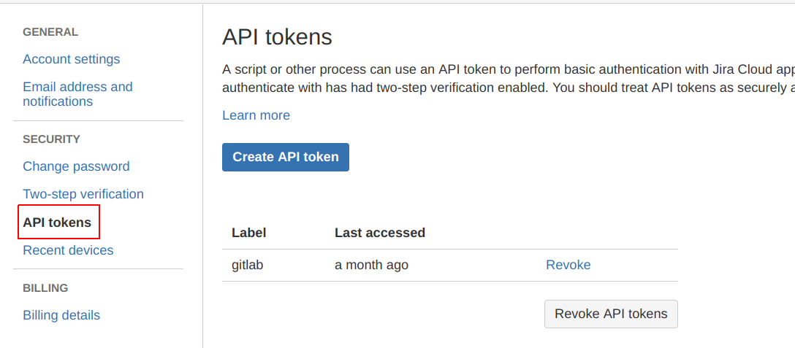
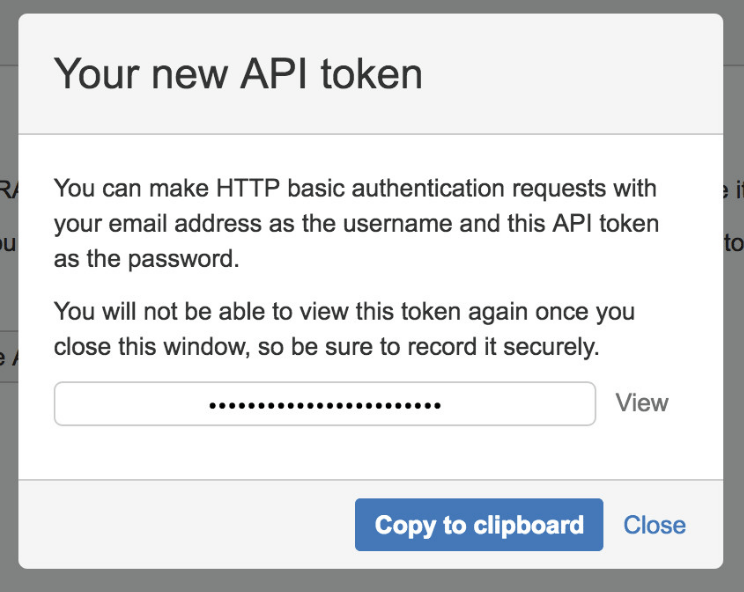

# Creating an API token in Jira Cloud

An API token is needed when integrating with Jira Cloud, follow the steps
below to create one:

1. Log in to [`id.atlassian.com`](https://id.atlassian.com/manage-profile/security/api-tokens) with your email address.

   NOTE: **Note**
   It is important that the user associated with this email address has *write* access
   to projects in Jira.

1. Click **Create API token**.

1. Click **Copy**, or click **View** and write down the new API token. It is required when [configuring GitLab](jira.md#configuring-gitlab).

The Jira configuration is complete. You need the newly created token, and the associated email address, when [configuring GitLab](jira.md#configuring-gitlab) in the next section.
