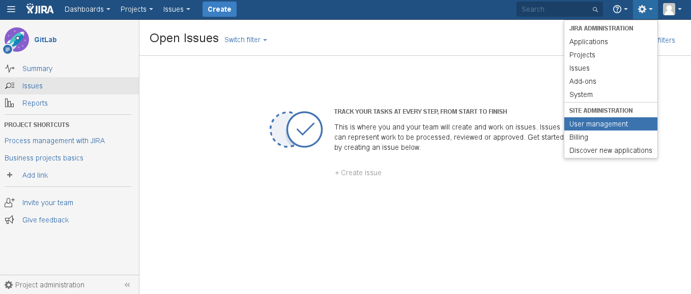
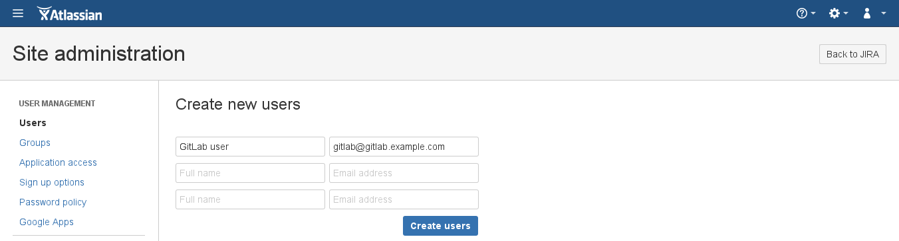
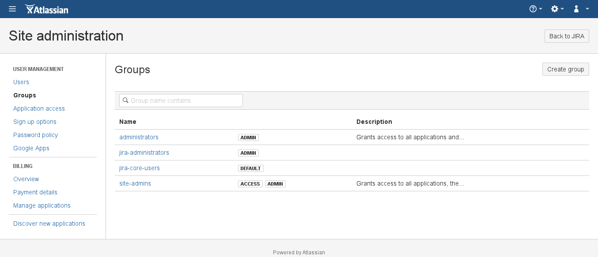
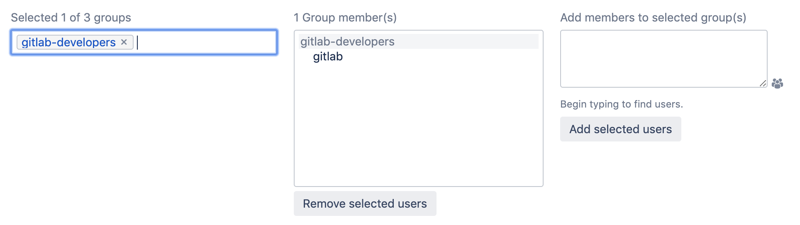
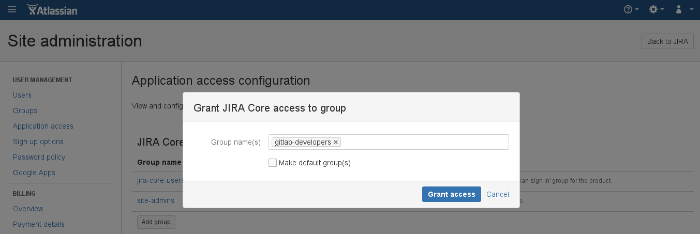

# Creating a username and password for Jira Server

We need to create a user in Jira to have access to all projects that need to integrate with GitLab.

As an example, we create a user named `gitlab` and add it to a new group
named `gitlab-developers`.

NOTE: **Note:**
It is important that the Jira user created for the integration is given 'write'
access to your Jira projects. This is covered in the process below.

1. Log in to your Jira instance as an administrator and under **Jira Administration**
   go to **User Management** to create a new user.

   

1. The next step is to create a new user (e.g., `gitlab`) who has write access
   to projects in Jira. Enter the user's name and a _valid_ e-mail address
   since Jira sends a verification e-mail to set up the password.
   
   Jira creates the username automatically by using the e-mail
   prefix. You can change it later, if needed. Our integration does not support SSO (such as SAML). You
   need to create an HTTP basic authentication password. You can do this by visiting the user
   profile, looking up the username, and setting a password.

   

1. Create a `gitlab-developers` group (we give this group write access to Jira
   projects in a later step.) Go to the **Groups** tab on the left, and select **Add group**.

   

   Give it a name and click **Add group**.

1. Add the `gitlab` user to the `gitlab-developers` group by clicking **Edit members**.
   The `gitlab-developers` group should be listed in the leftmost box as a selected group.
   Under **Add members to selected group(s)**, enter `gitlab`.

   

   Click **Add selected users** and `gitlab` should appear in the **Group member(s)** box.
   This membership is saved automatically.

   

1. To give the newly-created group 'write' access, you need to create a **Permission Scheme**.
   To do this, click the gear icon and select **Issues**. Then click **Permission Schemes**.
   Click **Add Permission Scheme** and enter a **Name** and, optionally, a **Description**.

1. Once your permission scheme is created, you are taken back to the permissions scheme list.
   Locate your new permissions scheme and click **Permissions**. Next to **Administer Projects**,
   click **Edit**. In the resulting dialog box, select **Group** and select `gitlab-developers`
   from the dropdown.

   

The Jira configuration is complete. Write down the new Jira username and its
password as they are needed when [configuring GitLab in the next section](jira.md#configuring-gitlab).
