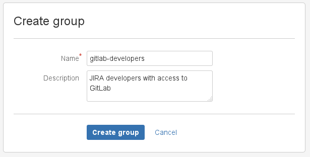

# Creating a username and password for JIRA server

We need to create a user in Jira which will have access to all projects that
need to integrate with GitLab. Login to your Jira instance as admin and under
*Administration*, go to *User Management* and create a new user.

As an example, we'll create a user named `gitlab` and add it to the `Jira-developers`
group.

NOTE: **Note**
It is important that the user `gitlab` has 'write' access to projects in Jira.

We have split this stage in steps so it is easier to follow.

1. Log in to your Jira instance as an administrator and under **Administration**
   go to **User Management** to create a new user.

     

1. The next step is to create a new user (e.g., `gitlab`) who has write access
   to projects in Jira. Enter the user's name and a _valid_ e-mail address
   since Jira sends a verification e-mail to set up the password.
   _**Note:** Jira creates the username automatically by using the e-mail
   prefix. You can change it later, if needed. Our integration does not support SSO (such as SAML). You will need to create
    an HTTP basic authentication password. You can do this by visiting the user
    profile, looking up the username, and setting a password._

     

1. Create a `gitlab-developers` group which will have write access
   to projects in Jira. Go to the **Groups** tab and select **Create group**.

     

     Give it an optional description and click **Create group**.

     

1. To give the newly-created group 'write' access, go to
   **Application access > View configuration** and add the `gitlab-developers`
   group to Jira Core.

     

1. Add the `gitlab` user to the `gitlab-developers` group by going to
   **Users > GitLab user > Add group** and selecting the `gitlab-developers`
   group from the dropdown menu. Notice that the group says _Access_, which is
   intended as part of this process.

     

The Jira configuration is complete. Write down the new Jira username and its
password as they will be needed when [configuring GitLab in the next section](jira.md#configuring-gitlab).
