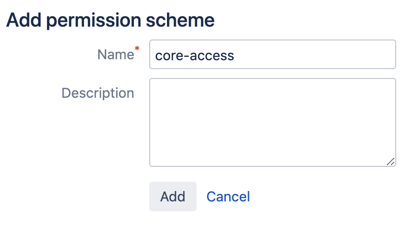

# Creating a username and password for JIRA server

We need to create a user in Jira which will have access to all projects that
need to integrate with GitLab. Login to your Jira instance as admin and under
*Administration*, go to *User Management* and create a new user.

As an example, we'll create a user named `gitlab` and add it to the `Jira-developers`
group.

NOTE: **Note**
It is important that the user `gitlab` has 'write' access to projects in Jira.

We have split this stage in steps so it is easier to follow.

1. Log in to your Jira instance as an administrator and under **Jira Administration**
   go to **User Management** to create a new user.

     

1. The next step is to create a new user (e.g., `gitlab`) who has write access
   to projects in Jira. Enter the user's name and a _valid_ e-mail address
   since Jira sends a verification e-mail to set up the password.
   _**Note:** Jira creates the username automatically by using the e-mail
   prefix. You can change it later, if needed. Our integration does not support SSO (such as SAML). You will need to create
    an HTTP basic authentication password. You can do this by visiting the user
    profile, looking up the username, and setting a password._

     

1. Create a `gitlab-developers` group (We will give write access to this group
   to projects in Jira in a later step). Go to the **Groups** tab and select **Create group**.

     

     Give it a name and click **Create group**.

1. Add the `gitlab` user to the `gitlab-developers` group by clicking **Edit members** 
   The `gitlab-developers` group should be selected on the left hand box. Under **Add members to selected group(s)**,
   type in `gitlab`.

     
     
   Click **Add selected users** and `gitlab` should appear in the middle box. It 
   is saved automatically.
   
     

1. To give the newly-created group 'write' access, you need to create a **Permission Scheme**.
   To do this, click the gear > **Issues**. On the left hand menu, click
    **Permission Schemes**. Click **Add Permission Scheme** and fill in a name
    and (optional) description.
    
     
    
1. Once your permission scheme is created, you'll be taken back to the permissions scheme list.
   Locate your new permissions scheme and click **Permissions**. Next to **Administer Projects**, 
   click **Edit**. In the resulting dialog box, select **Group** and select `gitlab-developers`
   from the dropdown.

     

The Jira configuration is complete. Write down the new Jira username and its
password as they will be needed when [configuring GitLab in the next section](jira.md#configuring-gitlab).
