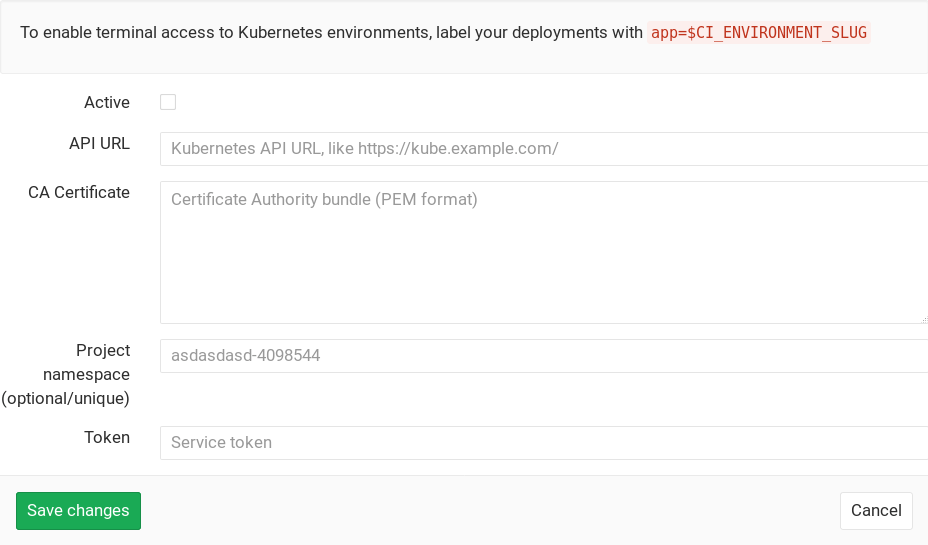

# GitLab Kubernetes / OpenShift integration

CAUTION: **Warning:**
The Kubernetes service integration has been deprecated in GitLab 10.3. If the
service is active, the cluster information will still be editable, however we
advise to disable and reconfigure the clusters using the new
[Clusters](../clusters/index.md) page. If the service is inactive, the fields
will not be editable. Read [GitLab 10.3 release post](https://about.gitlab.com/2017/12/22/gitlab-10-3-released/#kubernetes-integration-service) for more information.

GitLab can be configured to interact with Kubernetes, or other systems using the
Kubernetes API (such as OpenShift).

Each project can be configured to connect to a different Kubernetes cluster, see
the [configuration](#configuration) section.

## Configuration

Navigate to the [Integrations page](project_services.md#accessing-the-project-services)
of your project and select the **Kubernetes** service to configure it. Fill in
all the needed parameters, check the "Active" checkbox and hit **Save changes**
for the changes to take effect.

The Kubernetes service takes the following parameters:

- **API URL** -
  It's the URL that GitLab uses to access the Kubernetes API. Kubernetes
  exposes several APIs, we want the "base" URL that is common to all of them,
  e.g., `https://kubernetes.example.com` rather than `https://kubernetes.example.com/api/v1`.
- **CA certificate** (optional) -
  If the API is using a self-signed TLS certificate, you'll also need to include
  the `ca.crt` contents here.
- **Project namespace** (optional) - The following apply:
  - By default you don't have to fill it in; by leaving it blank, GitLab will
    create one for you.
  - Each project should have a unique namespace.
  - The project namespace is not necessarily the namespace of the secret, if
    you're using a secret with broader permissions, like the secret from `default`.
  - You should **not** use `default` as the project namespace.
  - If you or someone created a secret specifically for the project, usually
    with limited permissions, the secret's namespace and project namespace may
    be the same.
- **Token** -
  GitLab authenticates against Kubernetes using service tokens, which are
  scoped to a particular `namespace`. If you don't have a service token yet,
  you can follow the
  [Kubernetes documentation](https://kubernetes.io/docs/tasks/configure-pod-container/configure-service-account/)
  to create one. You can also view or create service tokens in the
  [Kubernetes dashboard](https://kubernetes.io/docs/tasks/access-application-cluster/web-ui-dashboard/#config)
  (under **Config > Secrets**).

TIP: **Tip:**
If you have a single cluster that you want to use for all your projects,
you can pre-fill the settings page with a default template. To configure the
template, see [Services Templates](services_templates.md).

## Deployment variables

The Kubernetes service exposes the following
[deployment variables](../../../ci/variables/README.md#deployment-variables) in the
GitLab CI/CD build environment:

- `KUBE_URL` - Equal to the API URL.
- `KUBE_TOKEN` - The Kubernetes token.
- `KUBE_NAMESPACE` - The Kubernetes namespace is auto-generated if not specified.
  The default value is `<project_name>-<project_id>`. You can overwrite it to
  use different one if needed, otherwise the `KUBE_NAMESPACE` variable will
  receive the default value.
- `KUBE_CA_PEM_FILE` - Only present if a custom CA bundle was specified. Path
  to a file containing PEM data.
- `KUBE_CA_PEM` (deprecated) - Only if a custom CA bundle was specified. Raw PEM data.
- `KUBECONFIG` - Path to a file containing `kubeconfig` for this deployment.
  CA bundle would be embedded if specified.

## What you can get with the Kubernetes integration

Here's what you can do with GitLab if you enable the Kubernetes integration.

### Deploy Boards (EEP)

> Available in [GitLab Enterprise Edition Premium][ee].

GitLab's Deploy Boards offer a consolidated view of the current health and
status of each CI [environment](../../../ci/environments.md) running on Kubernetes,
displaying the status of the pods in the deployment. Developers and other
teammates can view the progress and status of a rollout, pod by pod, in the
workflow they already use without any need to access Kubernetes.

[> Read more about Deploy Boards](https://docs.gitlab.com/ee/user/project/deploy_boards.html)

### Canary Deployments (EEP)

> Available in [GitLab Enterprise Edition Premium][ee].

Leverage [Kubernetes' Canary deployments](https://kubernetes.io/docs/concepts/cluster-administration/manage-deployment/#canary-deployments)
and visualize your canary deployments right inside the Deploy Board, without
the need to leave GitLab.

[> Read more about Canary Deployments](https://docs.gitlab.com/ee/user/project/canary_deployments.html)

### Kubernetes monitoring

Automatically detect and monitor Kubernetes metrics. Automatic monitoring of
[NGINX ingress](./prometheus_library/nginx.md) is also supported.

[> Read more about Kubernetes monitoring](prometheus_library/kubernetes.md)

### Auto DevOps

Auto DevOps automatically detects, builds, tests, deploys, and monitors your
applications.

To make full use of Auto DevOps(Auto Deploy, Auto Review Apps, and Auto Monitoring)
you will need the Kubernetes project integration enabled.

[> Read more about Auto DevOps](../../../topics/autodevops/index.md)

### Web terminals

NOTE: **Note:**
Introduced in GitLab 8.15. You must be the project owner or have `master` permissions
to use terminals. Support is limited to the first container in the
first pod of your environment.

When enabled, the Kubernetes service adds [web terminal](../../../ci/environments.md#web-terminals)
support to your [environments](../../../ci/environments.md). This is based on the `exec` functionality found in
Docker and Kubernetes, so you get a new shell session within your existing
containers. To use this integration, you should deploy to Kubernetes using
the deployment variables above, ensuring any pods you create are labelled with
`app=$CI_ENVIRONMENT_SLUG`. GitLab will do the rest!

[ee]: https://about.gitlab.com/gitlab-ee/
