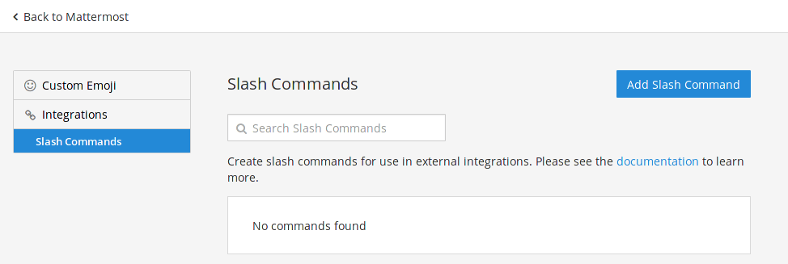
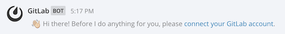
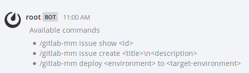

# Mattermost slash commands **(FREE)**

If your team uses [Mattermost](https://mattermost.com/) as a chat service, you can
integrate GitLab commands into Mattermost chat. This integration enables users to
run common operations, such as creating a GitLab issue, from the Mattermost chat
environment.

GitLab can also send events (such as `issue created`) to Mattermost as part of the
separately configured [Mattermost Notifications Service](mattermost.md).

## Prerequisites

Mattermost [3.4 or later](https://mattermost.com/blog/category/releases/) is required.
GitLab provides different methods of configuring Mattermost slash commands, depending
on your configuration:

- **Omnibus GitLab installations**: Mattermost is bundled with
  [Omnibus GitLab](https://docs.gitlab.com/omnibus/). To configure Mattermost for Omnibus GitLab, read the
  [Omnibus GitLab Mattermost documentation](https://docs.gitlab.com/omnibus/gitlab-mattermost/).
- **If Mattermost is installed on the same server as GitLab**, use the
  [automated configuration](#automated-configuration).
- **For all other installations**, use the [manual configuration](#manual-configuration).

## Automated configuration

If Mattermost is installed on the same server as GitLab, the configuration process can be
done for you by GitLab.

Go to the Mattermost Slash Command service on your project and click **Add to Mattermost** button.

## Manual configuration

To manually configure slash commands in Mattermost, you must:

1. [Enable custom slash commands](#enable-custom-slash-commands) in Mattermost.
1. [Get configuration values](#get-configuration-values-from-gitlab) from GitLab.
1. [Create a new slash command](#create-a-slash-command) in Mattermost.
1. [Provide the Mattermost token](#provide-the-mattermost-token-to-gitlab)  to GitLab.

### Enable custom slash commands

NOTE:
Omnibus GitLab installations are preconfigured. This step is required only for
installations from source.

To enable custom slash commands from the Mattermost administrator console:

1. Sign in to Mattermost as a user with administrator privileges.
1. Next to your username, click the **{ellipsis_v}** **Settings** icon, and
   select **System Console**.
1. Select **Integration Management**, and set these values to `TRUE`:
   - **Enable Custom Slash Commands**
   - **Enable integrations to override usernames**
   - **Enable integrations to override profile picture icons**
1. Click **Save**, but do not close this browser tab, because you need it in
   a later step.

### Get configuration values from GitLab

After you enable custom slash commands in Mattermost, you need configuration
information from GitLab. To get this information:

1. In a different browser tab than your current Mattermost session, sign in to
   GitLab as a user with [Administrator role](../../permissions.md).
1. On the top bar, select **Menu >** **{admin}** **Admin**.
1. In the left menu, select **Settings > Integrations**, then select
   **Mattermost slash commands**.
1. GitLab displays potential values for Mattermost settings. Copy the **Request URL**
   as you need it for the next step. All other values are suggestions.
1. Do not close this browser tab, because you need it in future steps.

Next, create a slash command in Mattermost with the values from GitLab.

### Create a slash command

To create a slash command, you need the values you obtained from GitLab in
the previous step:

1. In the Mattermost tab you left open when you
   [enabled custom slash commands](#enable-custom-slash-commands), go to your
   team page.
1. Click the **{ellipsis_v}** **Settings** icon, and select **Integrations**.
1. In the left menu, select **Slash commands**.
1. Click **Add Slash Command**:

   
1. Provide a **Display Name** and **Description** for your new command.
1. Provide a **Command Trigger Word** according to your application's configuration:

   - **If you intend to only connect one project to your Mattermost team**: Use
     `/gitlab` for your trigger word.
   - **If you intend to connect multiple projects**: Use a trigger word that relates
     to your project, such as `/project-name` or `/gitlab-project-name`.
1. For **Request URL**, provide the value you copied from GitLab when you
   [viewed configuration values](#get-configuration-values-from-gitlab).
1. For all other values, you may use the suggestions from GitLab or use your
   preferred values.
1. Copy the **Token** value, as you need it in a later step, and click **Done**.

### Provide the Mattermost token to GitLab

When you create a new slash command in Mattermost, it generates a token you must
provide to GitLab:

1. In the GitLab browser tab from
   [getting configuration values from GitLab](#get-configuration-values-from-gitlab),
   select the **Active** check box to enable this configuration.
1. In the **Token** field, paste the token you obtained from Mattermost.
   ensure that the **Active** toggle is enabled.

   

1. Click **Save changes** for the changes to take effect.

Your slash command can now communicate with your GitLab project.

## Authorizing Mattermost to interact with GitLab

The first time a user interacts with the newly created slash commands,
Mattermost triggers an authorization process.

This connects your Mattermost user with your GitLab user. You can
see all authorized chat accounts in your profile's page under **Chat**.

When the authorization process is complete, you can start interacting with
GitLab using the Mattermost commands.

## Available slash commands

The available slash commands for Mattermost are:

| Command | Description | Example |
| ------- | ----------- | ------- |
| <kbd>/&lt;trigger&gt; issue new &lt;title&gt; <kbd>⇧ Shift</kbd>+<kbd>↵ Enter</kbd> &lt;description&gt;</kbd> | Create a new issue in the project that `<trigger>` is tied to. `<description>` is optional. | `/gitlab issue new We need to change the homepage` |
| <kbd>/&lt;trigger&gt; issue show &lt;issue-number&gt;</kbd> | Show the issue with ID `<issue-number>` from the project that `<trigger>` is tied to. | `/gitlab issue show 42` |
| <kbd>/&lt;trigger&gt; deploy &lt;environment&gt; to &lt;environment&gt;</kbd> | Start the CI job that deploys from one environment to another, for example `staging` to `production`. CI/CD must be [properly configured](../../../ci/yaml/index.md). | `/gitlab deploy staging to production` |

To see a list of available commands to interact with GitLab, type the
trigger word followed by <kbd>help</kbd>. Example: `/gitlab help`

## Permissions

The permissions to run the [available commands](#available-slash-commands) derive from
the [permissions you have on the project](../../permissions.md#project-members-permissions).

## Troubleshooting

If an event is not being triggered, confirm that the channel you're using is a public one.
Mattermost webhooks do not have access to private channels.

If a private channel is required, you can edit the webhook's channel in Mattermost and
select a private channel. It is not possible to use different channels for
different types of notifications. All events are sent to the specified channel.

## Further reading

- [Mattermost slash commands documentation](https://docs.mattermost.com/developer/slash-commands.html)
- [Omnibus GitLab Mattermost](https://docs.gitlab.com/omnibus/gitlab-mattermost/)
