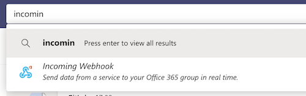

# Microsoft Teams service **(FREE)**

You can integrate Microsoft Teams with GitLab, and display notifications about GitLab projects
in Microsoft Teams. To integrate the services, you must:

1. [Configure Microsoft Teams](#configure-microsoft-teams) to enable a webhook
   to listen for changes.
1. [Configure your GitLab project](#configure-your-gitlab-project) to push notifications
   to the Microsoft Teams webhook.

## Configure Microsoft Teams

To configure Microsoft Teams to listen for notifications from GitLab:

1. In Microsoft Teams, search for "incoming webhook" in the search bar, and select the
   **Incoming Webhook** item:

   

1. Select **Add to a team**.
1. Select the team and channel you want to add the integration to.
1. Add a name for the webhook. The name is displayed next to every message that
   comes in through the webhook.
1. Copy the webhook URL, as you need it to configure GitLab.

## Configure your GitLab project

After you configure Microsoft Teams to receive notifications, you must configure
GitLab to send the notifications:

1. Sign in to GitLab as a user with [Administrator](../../permissions.md) and go
   to your project's page.
1. Go to **Settings > Integrations** and select **Microsoft Teams Notification**.
1. Select **Active** to enable the integration.
1. Select the check box next to each **Trigger** to enable:
   - Push
   - Issue
   - Confidential issue
   - Merge request
   - Note
   - Confidential note
   - Tag push
   - Pipeline - If you enable this trigger, you can also select **Notify only broken pipelines** to be notified only about failed pipelines.
   - Wiki page
1. In **Webhook**, paste the URL you copied when you
   [configured Microsoft Teams](#configure-microsoft-teams).
1. (Optional) If you enabled the pipeline trigger, you can select the
   **Notify only broken pipelines** check box to push notifications only when pipelines break.
1. Select the branches you want to send notifications for.
1. Click **Save changes**.

## Resources

- [Setting up an incoming webhook on Microsoft Teams](https://docs.microsoft.com/en-us/microsoftteams/platform/webhooks-and-connectors/how-to/connectors-using#setting-up-a-custom-incoming-webhook).
