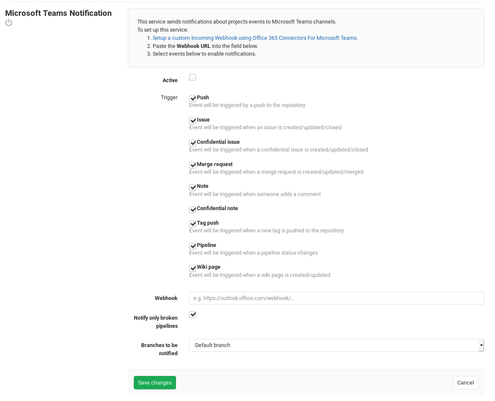

# Microsoft Teams service

## On Microsoft Teams

To enable Microsoft Teams integration you must create an incoming webhook integration on Microsoft Teams by following the steps described in this [document](https://docs.microsoft.com/en-us/microsoftteams/platform/concepts/connectors/connectors-using#setting-up-a-custom-incoming-webhook).

## On GitLab

After you set up Microsoft Teams, it's time to set up GitLab.

Navigate to the [Integrations page](project_services.md#accessing-the-project-services)
and select the **Microsoft Teams Notification** service to configure it.
There, you will see a checkbox with the following events that can be triggered:

- Push
- Issue
- Confidential issue
- Merge request
- Note
- Tag push
- Pipeline
- Wiki page

At the end fill in your Microsoft Teams details:

| Field | Description |
| ----- | ----------- |
| **Webhook** | The incoming webhook URL which you have to setup on Microsoft Teams. |
| **Notify only broken pipelines** | If you choose to enable the **Pipeline** event and you want to be only notified about failed pipelines. |

After you are all done, click **Save changes** for the changes to take effect.

