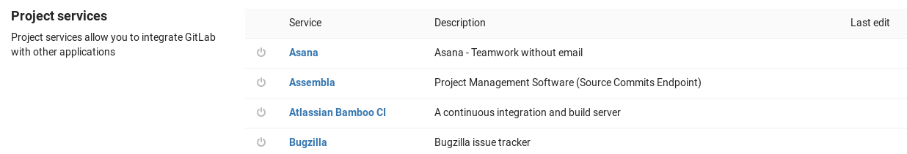

# Project services

Project services allow you to integrate GitLab with other applications. They
are a bit like plugins in that they allow a lot of freedom in adding
functionality to GitLab.

## Accessing the project services

You can find the available services under your project's
**Settings ➔ Integrations** page.

There are more than 20 services to integrate with. Click on the one that you
want to configure.

 

Below, you will find a list of the currently supported ones accompanied with
comprehensive documentation.

## Services

Click on the service links to see further configuration instructions and details.

| Service |	Description |
| ------- | ----------- |
| Asana     |	Asana - Teamwork without email |
| Assembla 	| Project Management Software (Source Commits Endpoint) |
| [Atlassian Bamboo CI](bamboo.md) | A continuous integration and build server |
| Buildkite | Continuous integration and deployments |
| [Bugzilla](bugzilla.md) | Bugzilla issue tracker |
| Campfire | Simple web-based real-time group chat |
| Custom Issue Tracker | Custom issue tracker |
| Drone CI | Continuous Integration platform built on Docker, written in Go |
| [Emails on push](emails_on_push.md) | Email the commits and diff of each push to a list of recipients |
| External Wiki | Replaces the link to the internal wiki with a link to an external wiki |
| Flowdock | Flowdock is a collaboration web app for technical teams |
| Gemnasium | Gemnasium monitors your project dependencies and alerts you about updates and security vulnerabilities |
| [GitHub](github.md) | Sends pipeline notifications to GitHub |
| [HipChat](hipchat.md) | Private group chat and IM |
| [Irker (IRC gateway)](irker.md) | Send IRC messages, on update, to a list of recipients through an Irker gateway |
| [JIRA](jira.md) | JIRA issue tracker |
| [Jenkins](../../../integration/jenkins.md) | An extendable open source continuous integration server |
| JetBrains TeamCity CI | A continuous integration and build server |
| [Kubernetes](kubernetes.md) _(Has been deprecated in GitLab 10.3)_ | A containerized deployment service |
| [Mattermost slash commands](mattermost_slash_commands.md) | Mattermost chat and ChatOps slash commands |
| [Mattermost Notifications](mattermost.md) | Receive event notifications in Mattermost |
| [Microsoft teams](microsoft_teams.md) |  Receive notifications for actions that happen on GitLab into a room on Microsoft Teams using Office 365 Connectors |
| Packagist | Update your project on Packagist, the main Composer repository |
| Pipelines emails | Email the pipeline status to a list of recipients |
| [Slack Notifications](slack.md) | Send GitLab events (e.g. issue created) to Slack as notifications |
| [Slack slash commands](slack_slash_commands.md) | Use slash commands in Slack to control GitLab |
| [GitLab Slack application](gitlab_slack_application.md) | Use Slack's official application
| PivotalTracker | Project Management Software (Source Commits Endpoint) |
| [Prometheus](prometheus.md) | Monitor the performance of your deployed apps |
| Pushover | Pushover makes it easy to get real-time notifications on your Android device, iPhone, iPad, and Desktop |
| [Redmine](redmine.md) | Redmine issue tracker |

## Services templates

Services templates is a way to set some predefined values in the Service of
your liking which will then be pre-filled on each project's Service.

Read more about [Services templates in this document](services_templates.md).

## Contributing to project services

Because GitLab is open source we can ship with the code and tests for all
plugins. This allows the community to keep the plugins up to date so that they
always work in newer GitLab versions.

For an overview of what projects services are available, please see the
[project_services source directory][projects-code].

Contributions are welcome!

[projects-code]: https://gitlab.com/gitlab-org/gitlab-ce/tree/master/app/models/project_services
[permissions]: ../../permissions.md
