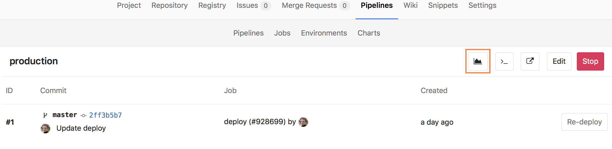

# Prometheus integration

> [Introduced][ce-8935] in GitLab 9.0.

GitLab offers powerful integration with [Prometheus] for monitoring your apps.
Metrics are retrieved from the configured Prometheus server, and then displayed
within the GitLab interface.

Each project can be configured with its own specific Prometheus server, see the
[configuration](#configuration) section for more details. If you have a single
Prometheus server which monitors all of your infrastructure, you can pre-fill
the settings page with a default template. To configure the template, see the
[Services templates](services_templates.md) document.

## Requirements

Integration with Prometheus requires the following:

1. GitLab 9.0 or higher
1. Your app must be deployed on [Kubernetes][]
1. Prometheus must be configured to collect Kubernetes metrics
1. Each metric must be have a label to indicate the environment
1. GitLab must have network connectivity to the Prometheus sever

There are a few steps necessary to set up integration between Prometheus and
GitLab.

## Configuring Prometheus to collect Kubernetes metrics

In order for Prometheus to collect Kubernetes metrics, you first must have a
Prometheus server up and running. You have two options here:

- If you installed Omnibus GitLab inside of Kubernetes, you can simply use the
  [bundled version of Prometheus][promgldocs]. In that case, follow the info in the
  [Omnibus GitLab section](#configuring-omnibus-gitlab-prometheus-to-monitor-kubernetes)
  below.
- If you are using GitLab.com or installed GitLab outside of Kubernetes, you
  will likely need to run a Prometheus server within the Kubernetes cluster.
  Once installed, the easiest way to monitor Kubernetes is to simply use
  Prometheus' support for [Kubernetes Service Discovery][prometheus-k8s-sd].
  In that case, follow the instructions on
  [configuring your own Prometheus server within Kubernetes](#configuring-your-own-prometheus-server-within-kubernetes).

### Configuring Omnibus GitLab Prometheus to monitor Kubernetes

With Omnibus GitLab running inside of Kubernetes, you can leverage the bundled
version of Prometheus to collect the required metrics.

1. Read how to configure the bundled Prometheus server in the
   [Administration guide][gitlab-prometheus-k8s-monitor].
1. Now that Prometheus is configured, proceed on
   [configuring the Prometheus project service in GitLab](#configuration-in-gitlab).

### Configuring your own Prometheus server within Kubernetes

Setting up and configuring Prometheus within Kubernetes is quick and painless.
The Prometheus project provides an [official Docker image][prometheus-docker-image]
which we can use as a starting point.

To get started quickly, we have provided a [sample YML file][prometheus-yml]
that can be used as a template. This file will create a `prometheus` **Namespace**,
**Service**, **Deployment**, and **ConfigMap** in Kubernetes. You can upload
this file to the Kubernetes dashboard using **+ Create** at the top right.


Or use `kubectl`:

```bash
kubectl apply -f path/to/prometheus.yml
```

Once deployed, you should see the Prometheus service, deployment, and
pod start within the `prometheus` namespace. The server will begin to collect
metrics from each Kubernetes Node in the cluster, based on the configuration
provided in the template.

Since GitLab is not running within Kubernetes, the template provides external
network access via a `NodePort` running on `30090`. This method allows access
to be controlled using provider firewall rules, like within Google Compute Engine.

Since a `NodePort` does not automatically have firewall rules created for it,
one will need to be created manually to allow access. In GCP/GKE, you will want
to confirm the Node that the Prometheus pod is running on. This can be done
either by looking at the Pod in the Kubernetes dashboard, or by running:

```bash
kubectl describe pods -n prometheus
```

Next on GKE, we need to get the `tag` of the Node or VM Instance, so we can
create an accurate firewall rule. The easiest way to do this is to go into the
Google Cloud Platform Compute console and select the VM instance that matches
the name of the Node gathered from the step above. In this case, the node tag
needed is `gke-prometheus-demo-5d5ada10-node`. Also make a note of the
**External IP**, which will be the IP address the Prometheus server is reachable
on.


Armed with the proper Node tag, the firewall rule can now be created
specifically for this node. To create the firewall rule, open the Google Cloud
Platform Networking console, and select **Firewall Rules**.

Create a new rule:

- Specify the source IP range to match your desired access list, which should
  include your GitLab server. A sample of GitLab.com's IP address range is
  available [in this issue][gitlab.com-ip-range], but note that GitLab.com's IPs
  are subject to change without prior notification.
- Allowed protocol and port should be `tcp:30090`.
- The target tags should match the Node tag identified earlier in this step.


---

Now that Prometheus is configured, proceed to
[configure the Prometheus project service in GitLab](##configuration-in-gitlab).

## Configuration in GitLab

The actual configuration of Prometheus integration within GitLab is very simple.
All you will need is the DNS or IP address of the Prometheus server you'd like
to integrate with.

1. Navigate to the [Integrations page](project_services.md#accessing-the-project-services)
1. Click the **Prometheus** service
1. Provide the base URL of the your server, for example `http://prometheus.example.com/`.
   The **Test Settings** button can be used to confirm connectivity from GitLab
   to the Prometheus server.


## Metrics and Labels

GitLab retrieves performance data from two metrics, `container_cpu_usage_seconds_total`
and `container_memory_usage_bytes`. These metrics are collected from the
Kubernetes pods via Prometheus, and report CPU and Memory utilization of each
container or Pod running in the cluster.

In order to isolate and only display relevant metrics for a given environment
however, GitLab needs a method to detect which pods are associated. To do that,
GitLab will specifically request metrics that have an `environment` tag that
matches the [$CI_ENVIRONMENT_SLUG][ci-environment-slug].

If you are using [GitLab Auto-Deploy][autodeploy] and one of the methods of
configuring Prometheus above, the `environment` will be automatically added.

### GitLab Prometheus queries

The queries utilized by GitLab are shown in the following table.

| Metric | Query |
| ------ | ----- |
| Average Memory (MB) | `(sum(container_memory_usage_bytes{container_name!="POD",environment="$CI_ENVIRONMENT_SLUG"}) / count(container_memory_usage_bytes{container_name!="POD",environment="$CI_ENVIRONMENT_SLUG"})) /1024/1024` |
| Average CPU Utilization (%) | `sum(rate(container_cpu_usage_seconds_total{container_name!="POD",environment="$CI_ENVIRONMENT_SLUG"}[2m])) / count(container_cpu_usage_seconds_total{container_name!="POD",environment="$CI_ENVIRONMENT_SLUG"}) * 100` |

## Monitoring CI/CD Environments

Once configured, GitLab will attempt to retrieve performance metrics for any
environment which has had a successful deployment. If monitoring data was
successfully retrieved, a Monitoring button will appear on the environment's
detail page.



Clicking on the Monitoring button will display a new page, showing up to the last
8 hours of performance data. It may take a minute or two for data to appear
after initial deployment.

## Determining performance impact of a merge

> [Introduced][ce-10408] in GitLab 9.2.

Developers can view the performance impact of their changes within the merge request workflow. When a source branch has been deployed to an environment, a sparkline will appear showing the average memory consumption of the app. The dot indicates when the current changes were deployed, with up to 30 minutes of performance data displayed before and after. The sparkline will be updated after each commit has been deployed.

Once merged and the target branch has been redeployed, the sparkline will switch to show the new environments this revision has been deployed to. 

Performance data will be available for the duration it is persisted on the Prometheus server.


## Troubleshooting

If the "Attempting to load performance data" screen continues to appear, it could be due to:

- No successful deployments have occurred to this environment.
- Prometheus does not have performance data for this environment, or the metrics
  are not labeled correctly. To test this, connect to the Prometheus server and
  [run a query](#gitlab-prometheus-queries), replacing `$CI_ENVIRONMENT_SLUG`
  with the name of your environment.

[autodeploy]: ../../../ci/autodeploy/index.md
[kubernetes]: https://kubernetes.io
[prometheus-k8s-sd]: https://prometheus.io/docs/operating/configuration/#<kubernetes_sd_config>
[prometheus]: https://prometheus.io
[gitlab-prometheus-k8s-monitor]: ../../../administration/monitoring/prometheus/index.md#configuring-prometheus-to-monitor-kubernetes
[prometheus-docker-image]: https://hub.docker.com/r/prom/prometheus/
[prometheus-yml]:samples/prometheus.yml
[gitlab.com-ip-range]: https://gitlab.com/gitlab-com/infrastructure/issues/434
[ci-environment-slug]: https://docs.gitlab.com/ce/ci/variables/#predefined-variables-environment-variables
[ce-8935]: https://gitlab.com/gitlab-org/gitlab-ce/merge_requests/8935
[ce-10408]: https://gitlab.com/gitlab-org/gitlab-ce/merge_requests/10408
[promgldocs]: ../../../administration/monitoring/prometheus/index.md
