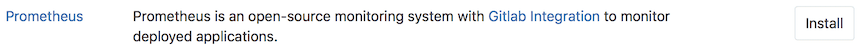
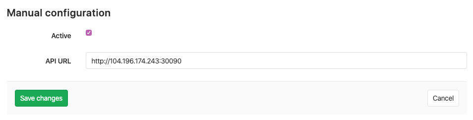
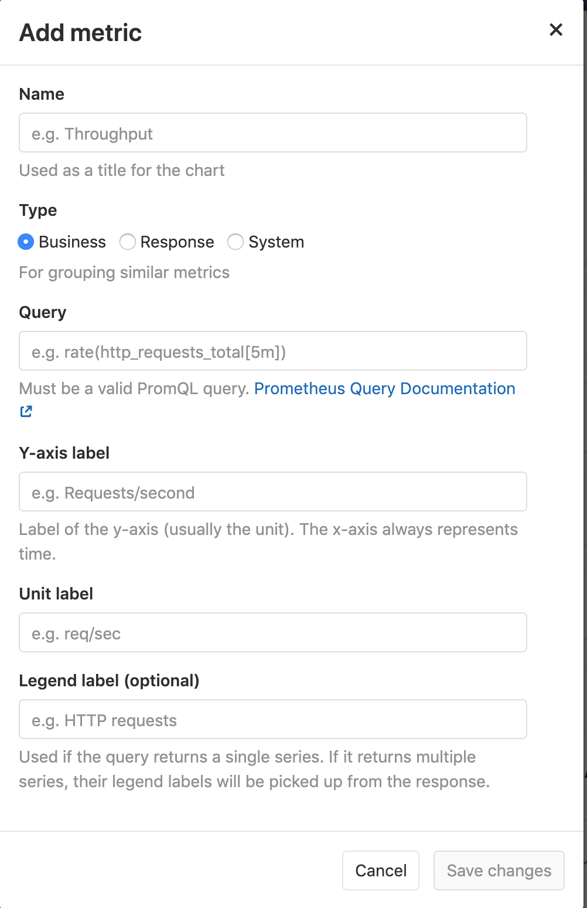
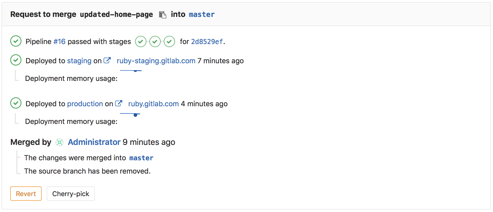

# Prometheus integration

> [Introduced][ce-8935] in GitLab 9.0.

GitLab offers powerful integration with [Prometheus] for monitoring key metrics of your apps, directly within GitLab.
Metrics for each environment are retrieved from Prometheus, and then displayed
within the GitLab interface.

There are two ways to setup Prometheus integration, depending on where your apps are running:
* For deployments on Kubernetes, GitLab can automatically [deploy and manage Prometheus](#managed-prometheus-on-kubernetes)
* For other deployment targets, simply [specify the Prometheus server](#manual-configuration-of-prometheus).

Once enabled, GitLab will automatically detect metrics from known services in the [metric library](#monitoring-ci-cd-environments). You are also able to [add your own metrics](#adding-additional-metrics) as well.

## Enabling Prometheus Integration

### Managed Prometheus on Kubernetes
> **Note**: [Introduced](https://gitlab.com/gitlab-org/gitlab-ce/issues/28916) in GitLab 10.5

GitLab can seamlessly deploy and manage Prometheus on a [connected Kubernetes cluster](../clusters/index.md), making monitoring of your apps easy.

#### Requirements

* A [connected Kubernetes cluster](../clusters/index.md)
* Helm Tiller [installed by GitLab](../clusters/index.md#installing-applications)

#### Getting started

Once you have a connected Kubernetes cluster with Helm installed, deploying a managed Prometheus is as easy as a single click.

1. Go to the `CI/CD > Kubernetes` page, to view your connected clusters
1. Select the cluster you would like to deploy Prometheus to
1. Click the **Install** button to deploy Prometheus to the cluster

#### About managed Prometheus deployments

Prometheus is deployed into the `gitlab-managed-apps` namespace, using the [official Helm chart](https://github.com/kubernetes/charts/tree/master/stable/prometheus). Prometheus is only accessible within the cluster, with GitLab communicating through the [Kubernetes API](https://kubernetes.io/docs/concepts/overview/kubernetes-api/).

The Prometheus server will [automatically detect and monitor](https://prometheus.io/docs/prometheus/latest/configuration/configuration/#%3Ckubernetes_sd_config%3E) nodes, pods, and endpoints. To configure a resource to be monitored by Prometheus, simply set the following [Kubernetes annotations](https://kubernetes.io/docs/concepts/overview/working-with-objects/annotations/):
* `prometheus.io/scrape` to `true` to enable monitoring of the resource.
* `prometheus.io/port` to define the port of the metrics endpoint.
* `prometheus.io/path` to define the path of the metrics endpoint. Defaults to `/metrics`.

CPU and Memory consumption is monitored, but requires [naming conventions](prometheus_library/kubernetes.html#specifying-the-environment) in order to determine the environment. If you are using [Auto DevOps](../../../topics/autodevops/), this is handled automatically.

The [NGINX Ingress](../clusters/index.md#installing-applications) that is deployed by GitLab to clusters, is automatically annotated for monitoring providing key response metrics: latency, throughput, and error rates.

### Manual configuration of Prometheus

#### Requirements

Integration with Prometheus requires the following:

1. GitLab 9.0 or higher
1. Prometheus must be configured to collect one of the [supported metrics](prometheus_library/metrics.md)
1. Each metric must be have a label to indicate the environment
1. GitLab must have network connectivity to the Prometheus server

#### Getting started

Installing and configuring Prometheus to monitor applications is fairly straight forward.

1. [Install Prometheus](https://prometheus.io/docs/introduction/install/)
1. Set up one of the [supported monitoring targets](prometheus_library/metrics.md)
1. Configure the Prometheus server to [collect their metrics](https://prometheus.io/docs/operating/configuration/#scrape_config)

#### Configuration in GitLab

The actual configuration of Prometheus integration within GitLab is very simple.
All you will need is the DNS or IP address of the Prometheus server you'd like
to integrate with.

1. Navigate to the [Integrations page](project_services.md#accessing-the-project-services)
1. Click the **Prometheus** service
1. Provide the base URL of the your server, for example `http://prometheus.example.com/`.
   The **Test Settings** button can be used to confirm connectivity from GitLab
   to the Prometheus server.

## Monitoring CI/CD Environments

Once configured, GitLab will attempt to retrieve performance metrics for any
environment which has had a successful deployment.

GitLab will automatically scan the Prometheus server for metrics from known serves like Kubernetes and NGINX, and attempt to identify individual environment. The supported metrics and scan process is detailed in our [Prometheus Metric Library documentation](prometheus_library/metrics.html). 

You can view the performance dashboard for an environment by [clicking on the monitoring button](../../../ci/environments.md#monitoring-environments).

### Adding additional metrics

> [Introduced](https://gitlab.com/gitlab-org/gitlab-ee/merge_requests/3799) in [GitLab Premium](https://about.gitlab.com/products/) 10.6.

Additional metrics can be monitored by adding them on the Prometheus integration page. Once saved, they will be displayed on the environment performance dashboard.

A few fields are required:
* **Name**: Chart title
* **Type**: Type of metric. Metrics of the same type will be shown together.
* **Query**: Valid [PromQL query](https://prometheus.io/docs/prometheus/latest/querying/basics/). Note, no validation is performed at this time. If the query is not valid, the dashboard will display an error.
* **Y-axis label**: Y axis title to display on the dashboard.
* **Unit label**: Query units, for example `req / sec`. Shown next to the value.

#### Query Variables

GitLab supports a limited set of [CI variables] in the Prometheus query. This is particularly useful for identifying a specific environment, for example with `CI_ENVIRONMENT_SLUG`. The supported variables are:

* CI_ENVIRONMENT_SLUG
* KUBE_NAMESPACE

To specify a variable in a query, enclose it in curly braces with a leading percent. For example: `%{ci_environment_slug}`.

## Determining the performance impact of a merge

> [Introduced][ce-10408] in GitLab 9.2.
> GitLab 9.3 added the [numeric comparison](https://gitlab.com/gitlab-org/gitlab-ce/issues/27439) of the 30 minute averages.
> Requires [Kubernetes](prometheus_library/kubernetes.md) metrics

Developers can view the performance impact of their changes within the merge
request workflow. When a source branch has been deployed to an environment, a sparkline and numeric comparison of the average memory consumption will appear. On the sparkline, a dot
indicates when the current changes were deployed, with up to 30 minutes of
performance data displayed before and after. The comparison shows the difference between the 30 minute average before and after the deployment. This information is updated after
each commit has been deployed.

Once merged and the target branch has been redeployed, the metrics will switch
to show the new environments this revision has been deployed to.

Performance data will be available for the duration it is persisted on the
Prometheus server.

## Troubleshooting

If the "No data found" screen continues to appear, it could be due to:

- No successful deployments have occurred to this environment.
- Prometheus does not have performance data for this environment, or the metrics
  are not labeled correctly. To test this, connect to the Prometheus server and
  [run a query](#gitlab-prometheus-queries), replacing `$CI_ENVIRONMENT_SLUG`
  with the name of your environment.

[autodeploy]: ../../../ci/autodeploy/index.md
[kubernetes]: https://kubernetes.io
[kube]: ./kubernetes.md
[prometheus-k8s-sd]: https://prometheus.io/docs/operating/configuration/#<kubernetes_sd_config>
[prometheus]: https://prometheus.io
[gitlab-prometheus-k8s-monitor]: ../../../administration/monitoring/prometheus/index.md#configuring-prometheus-to-monitor-kubernetes
[prometheus-docker-image]: https://hub.docker.com/r/prom/prometheus/
[prometheus-yml]:samples/prometheus.yml
[gitlab.com-ip-range]: https://gitlab.com/gitlab-com/infrastructure/issues/434
[ci-environment-slug]: ../../../ci/variables/#predefined-variables-environment-variables
[ce-8935]: https://gitlab.com/gitlab-org/gitlab-ce/merge_requests/8935
[ce-10408]: https://gitlab.com/gitlab-org/gitlab-ce/merge_requests/10408
[promgldocs]: ../../../administration/monitoring/prometheus/index.md
