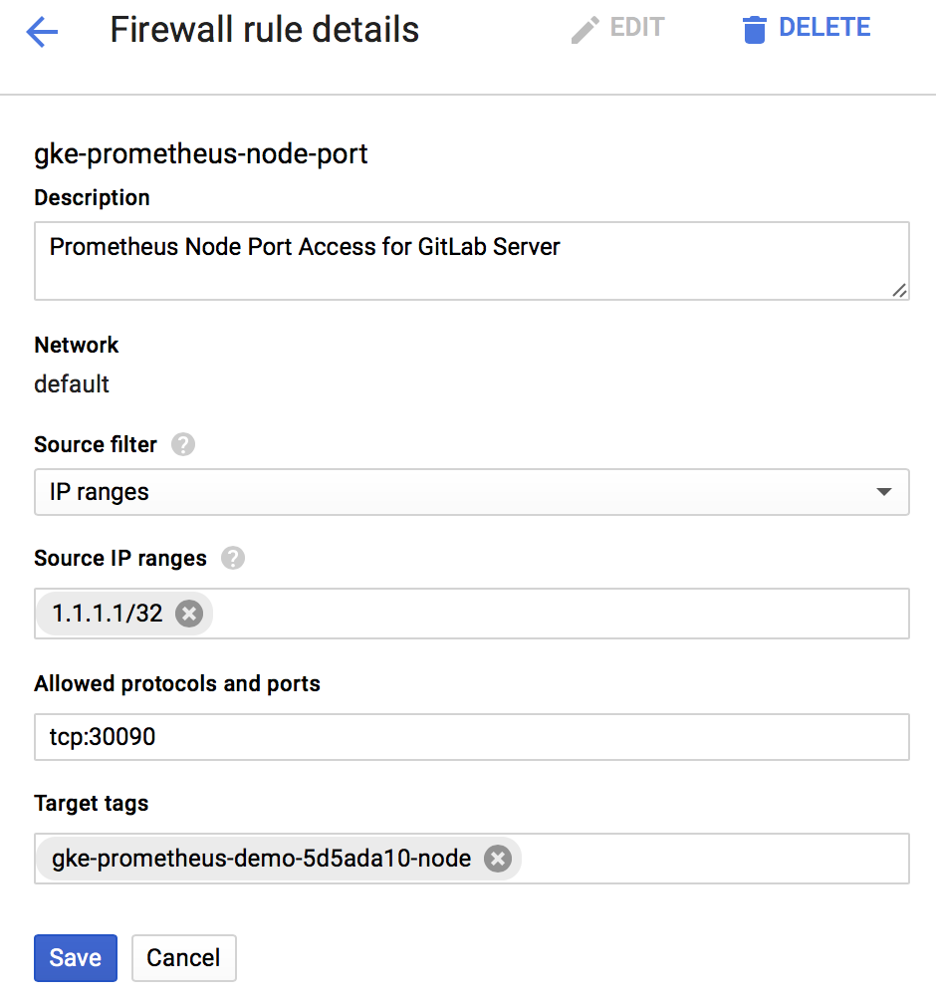
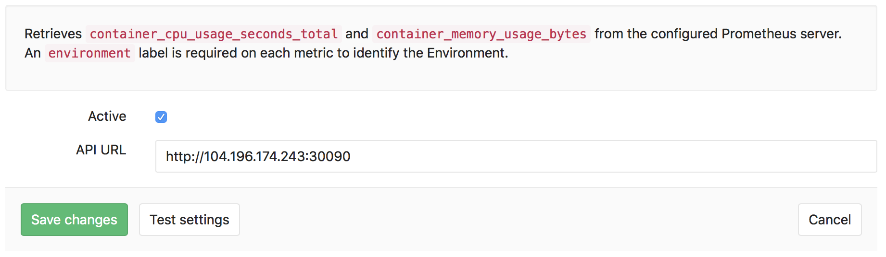

# Prometheus integration

GitLab offers powerful integration with Prometheus for monitoring your apps. Metrics are retrieved from the configured Prometheus server, and then displayed within the GitLab interface.

Each project can be configured with its own specific Prometheus server, see the [configuration](#configuration) section for more details. If you have a single Prometheus server which monitors all of your infrastructure, you can pre-fill the settings page with a default template. To configure the template, see the [Services Templates](services-templates) document.

## Requirements

Integration with Prometheus requires the following:
1. GitLab 9.0 or higher.
1. Your app must be deployed on [Kubernetes](kubernetes).
1. Prometheus must be configured to collect Kubernetes metrics.
1. Each metric must be have a label to indicate the environment.
1. GitLab must have network connectivity to the Prometheus sever.

## Configuration

There are a few steps necessary to set up integration between Prometheus and GitLab.

### Configuring Prometheus to collect Kubernetes metrics

In order for Prometheus to collect Kubernetes metrics, you first must have a Prometheus server. If you installed Omnibus GitLab inside of Kubernetes, you can simply use the bundled version of Prometheus. If you are using GitLab.com or installed GitLab outside of Kubernetes, you will likely need to run a Prometheus server within the Kubernetes cluster.

Once installed, the easiest way to monitor Kubernetes is to simply use Prometheus' support for [Kubernetes Service Discovery](prometheus-k8s-sd).

#### Configuring Omnibus GitLab's Prometheus to monitor Kubernetes

With GitLab running inside of Kubernetes, you can leverage the bundled version of Prometheus to collect the required metrics. To make this as easy as possible, we have added a new option within `gitlab.rb`. Simply set  `prometheus['monitor_kubernetes']` to true, and metrics will begin to be collected from Kubernetes.

More detailed information on configuring the bundled Prometheus server is available in our [Administration guide](gitlab-prometheus-k8s-monitor).

#### Setting up and configuring your own Prometheus server within Kubernetes

Setting up and configuring Prometheus within Kubernetes is quick and painless. The Prometheus project provides an [official Docker image](prometheus-docker-image) which we can use as a starting point.

To get started quickly, We have provided a [sample YML file](prometheus-yml) can be used as a template. This file will create a `prometheus` Namespace, Service, Deployment, and ConfigMap. You can upload this file to the Kubernetes dashboard using the `+ Create` at the top right, or use `kubectl`.

Once started, you should start to see the Prometheus service, deployment, and pod start within the `prometheus` namespace. The server will begin to collect metrics from each Kubernetes Node in the cluster, based on the configuration provided in the template.

##### Enabling and controlling access to the deployed Prometheus server

Since GitLab is not running within Kubernetes, the template provides external network access via a `NodePort` running on `30090`. This method allows access to be controlled using provider firewall rules, like within Google Compute Engine.

Since a `NodePort` does not automatically have firewall rules created for it, one will need to be created manually to allow access. In GCP/GKE, you will want to confirm the Node that the Prometheus pod is running on. This can be done either by looking at the Pod in the Kubernetes dashboard, or by running `kubectl describe pods -n prometheus`.

Next on GKE, we need to get the `tag` of the Node or VM Instance, so we can create an accurate firewall rule. The easiest way to do this is to go into the Google Cloud Platform Compute console and select the VM instance that matches the name of the Node gathered from the step above. In this case, the node tag needed is `gke-prometheus-demo-5d5ada10-node`. Also make a note of the `External IP`, which will be the IP address the Prometheus server is reachable on.

Armed with the proper Node tag, the firewall rule can now be created specifically for this node. To create the firewall rule, open the Google Cloud Platform Networking console, and select `Firewall Rules`.

Create a new rule:
* Specify the source IP range to match your desired access list, which should include your GitLab server. GitLab.com's IP address range is available [here](gitlab.com-ip-range), note that GitLab.com's IP's are subject to change without notification.
* Allowed protocol and port should be `tcp:30090`.
* The target tags should match the Node tag identified earlier in this step.

### Configuration in GitLab

Actual configuration of Prometheus integration is very simple. All you will need is the DNS or IP address of the Prometheus server you'd like to integrate with.

Navigate to the [Integrations page](project_services.md#accessing-the-project-services), click the **Prometheus** service, and then provide the base URL of the your server, for example http://prometheus.example.com/. The `Test Settings` button can be used to confirm connectivity from GitLab to the Prometheus server.

### Metrics and Labels

Presently GitLab retrieves performance data from two metrics, `container_cpu_usage_seconds_total` and `container_memory_usage_bytes`. These metrics are collected from the Kubernetes pods via Prometheus, and report CPU and Memory utilization of each container or Pod running in the cluster.

In order to isolate and only display relevant metrics for a given environment however, GitLab needs a method to detect which pods are associated. To do that, GitLab will specifically request metrics that have an `environment` tag that matches [$CI_ENVIRONMENT_SLUG](ci-environment-slug).

If you are using GitLab Auto-Deploy and one of the methods of configuring Prometheus above, the `environment` will be automatically added.

#### GitLab Prometheus Queries

The queries utilized by GitLab are:

| Metric | Query |
| --- | --- |
| Average Memory (MB) | (sum(container_memory_usage_bytes{container_name="app",environment="$CI_ENVIRONMENT_SLUG"}) / count(container_memory_usage_bytes{container_name="app",environment="$CI_ENVIRONMENT_SLUG"})) /1024/1024 |
| Average CPU Utilization (%) | sum(rate(container_cpu_usage_seconds_total{container_name="app",environment="$CI_ENVIRONMENT_SLUG"}[2m])) / count(container_cpu_usage_seconds_total{container_name="app",environment="$CI_ENVIRONMENT_SLUG"}) * 100 |

## Troubleshooting

[kubernetes]: https://kubernetes.io
[prometheus-k8s-sd]: https://prometheus.io/docs/operating/configuration/#<kubernetes_sd_config>
[gitlab-prometheus-k8s-monitor]: TODO
[prometheus-docker-image]: https://hub.docker.com/r/prom/prometheus/
[prometheus-yml]:samples/prometheus.yml
[gitlab.com-ip-range]: https://gitlab.com/gitlab-com/infrastructure/issues/434
[ci-environment-slug]: https://docs.gitlab.com/ce/ci/variables/#predefined-variables-environment-variables
