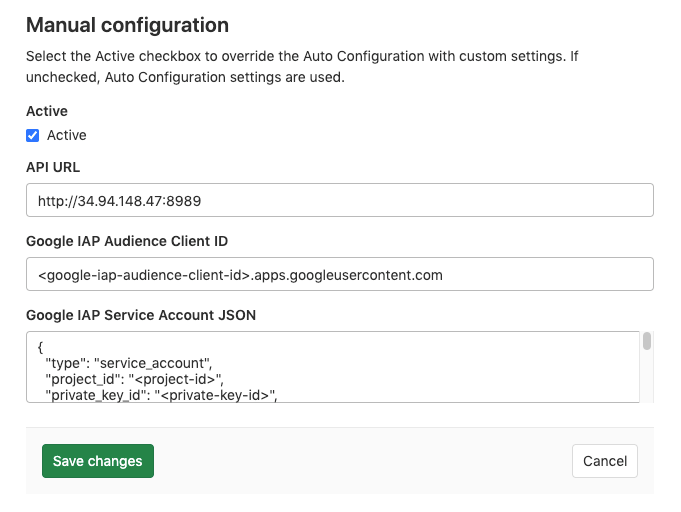

# Prometheus integration **(FREE)**

> [Introduced](https://gitlab.com/gitlab-org/gitlab-foss/-/merge_requests/8935) in GitLab 9.0.

GitLab offers powerful integration with [Prometheus](https://prometheus.io) for
monitoring key metrics of your apps, directly in GitLab.
Metrics for each environment are retrieved from Prometheus, and then displayed
in the GitLab interface.

There are two ways to set up Prometheus integration, depending on where your apps are running:

- For deployments on Kubernetes, GitLab can be [integrated with an in-cluster Prometheus](#prometheus-cluster-integration)
- For other deployment targets, [specify the Prometheus server](#manual-configuration-of-prometheus).

Once enabled, GitLab detects metrics from known services in the
[metric library](prometheus_library/index.md). You can also
[add your own metrics](../../../operations/metrics/index.md#adding-custom-metrics) and create
[custom dashboards](../../../operations/metrics/dashboards/index.md).

## Enabling Prometheus Integration

### Prometheus cluster integration

> - [Introduced](https://gitlab.com/gitlab-org/gitlab/-/merge_requests/55244) in GitLab 13.11.
> - [Replaced](https://gitlab.com/gitlab-org/gitlab/-/merge_requests/62725) the Prometheus cluster applications in GitLab 14.0.

GitLab can query an in-cluster Prometheus for your metrics.
See [Prometheus cluster integration](../../clusters/integrations.md#prometheus-cluster-integration) for details.

### Manual configuration of Prometheus

#### Requirements

Integration with Prometheus requires the following:

1. GitLab 9.0 or higher
1. Prometheus must be configured to collect one of the [supported metrics](prometheus_library/index.md)
1. Each metric must be have a label to indicate the environment
1. GitLab must have network connectivity to the Prometheus server

#### Getting started

Installing and configuring Prometheus to monitor applications is fairly straightforward.

1. [Install Prometheus](https://prometheus.io/docs/prometheus/latest/installation/)
1. Set up one of the [supported monitoring targets](prometheus_library/index.md)
1. Configure the Prometheus server to
   [collect their metrics](https://prometheus.io/docs/prometheus/latest/configuration/configuration/#scrape_config)

#### Configuration in GitLab

The actual configuration of Prometheus integration in GitLab
requires the domain name or IP address of the Prometheus server you'd like
to integrate with. If the Prometheus resource is secured with Google's Identity-Aware Proxy (IAP),
you can pass information like Client ID and Service Account credentials.
GitLab can use these to access the resource. More information about authentication from a
service account can be found at Google's documentation for
[Authenticating from a service account](https://cloud.google.com/iap/docs/authentication-howto#authenticating_from_a_service_account).

1. Navigate to the [Integrations page](overview.md#accessing-integrations) at
   **Settings > Integrations**.
1. Click the **Prometheus** service.
1. For **API URL**, provide the domain name or IP address of your server, such as
   `http://prometheus.example.com/` or `http://192.0.2.1/`.
1. (Optional) In **Google IAP Audience Client ID**, provide the Client ID of the
   Prometheus OAuth Client secured with Google IAP.
1. (Optional) In **Google IAP Service Account JSON**, provide the contents of the
   Service Account credentials file that is authorized to access the Prometheus resource.
   The JSON key `token_credential_uri` is discarded to prevent
   [Server-side Request Forgery (SSRF)](https://www.hackerone.com/blog-How-To-Server-Side-Request-Forgery-SSRF).
1. Click **Save changes**.

#### Thanos configuration in GitLab

You can configure [Thanos](https://thanos.io/) as a drop-in replacement for Prometheus
with GitLab. Use the domain name or IP address of the Thanos server you'd like
to integrate with.

1. Navigate to the [Integrations page](overview.md#accessing-integrations).
1. Click the **Prometheus** service.
1. Provide the domain name or IP address of your server, for example
   `http://thanos.example.com/` or `http://192.0.2.1/`.
1. Click **Save changes**.

### Precedence with multiple Prometheus configurations

Although you can enable both a [manual configuration](#manual-configuration-of-prometheus)
and [cluster integration](#prometheus-cluster-integration) of Prometheus, you
can use only one:

- If you have enabled a
  [Prometheus manual configuration](#manual-configuration-of-prometheus)
  and a [Prometheus cluster integration](#prometheus-cluster-integration),
  the manual configuration takes precedence and is used to run queries from
  [custom dashboards](../../../operations/metrics/dashboards/index.md) and
  [custom metrics](../../../operations/metrics/index.md#adding-custom-metrics).
- If you have managed Prometheus applications installed on Kubernetes clusters
  at **different** levels (project, group, instance), the order of precedence is described in
  [Cluster precedence](../../instance/clusters/index.md#cluster-precedence).
- If you have managed Prometheus applications installed on multiple Kubernetes
  clusters at the **same** level, the Prometheus application of a cluster with a
  matching [environment scope](../../../ci/environments/index.md#scoping-environments-with-specs) is used.

## Determining the performance impact of a merge

> - [Introduced](https://gitlab.com/gitlab-org/gitlab-foss/-/merge_requests/10408) in GitLab 9.2.
> - GitLab 9.3 added the [numeric comparison](https://gitlab.com/gitlab-org/gitlab-foss/-/issues/27439) of the 30 minute averages.

Developers can view the performance impact of their changes in the merge
request workflow. This feature requires [Kubernetes](prometheus_library/kubernetes.md) metrics.

When a source branch has been deployed to an environment, a sparkline and
numeric comparison of the average memory consumption displays. On the
sparkline, a dot indicates when the current changes were deployed, with up to 30 minutes of
performance data displayed before and after. The comparison shows the difference
between the 30 minute average before and after the deployment. This information
is updated after each commit has been deployed.

Once merged and the target branch has been redeployed, the metrics switches
to show the new environments this revision has been deployed to.

Performance data is available for the duration it is persisted on the
Prometheus server.

