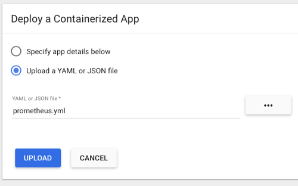
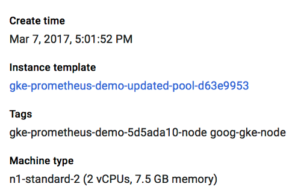
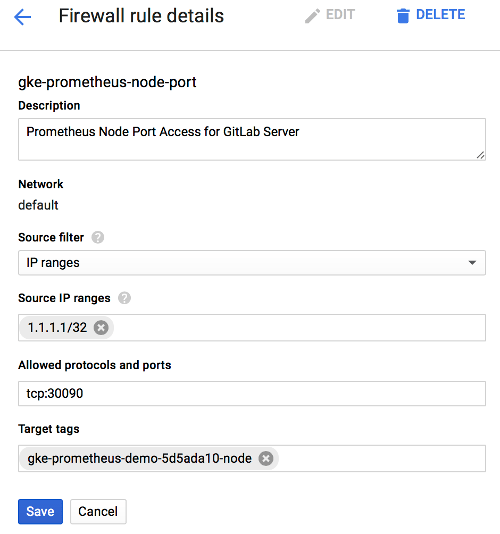

# Prometheus integration

> [Introduced][ce-8935] in GitLab 9.0.

GitLab offers powerful integration with [Prometheus] for monitoring your apps.
Metrics are retrieved from the configured Prometheus server, and then displayed
within the GitLab interface.

Each project can be configured with its own specific Prometheus server, see the
[configuration](#configuration) section for more details. If you have a single
Prometheus server which monitors all of your infrastructure, you can pre-fill
the settings page with a default template. To configure the template, see the
[Services templates](services_templates.md) document.

## Requirements

Integration with Prometheus requires the following:

1. GitLab 9.0 or higher
1. Prometheus must be configured to collect one of the [supported metrics](prometheus_library/metrics.md)
1. Each metric must be have a label to indicate the environment
1. GitLab must have network connectivity to the Prometheus server

## Getting started with Prometheus monitoring

Depending on your deployment and where you have located your GitLab server, there are a few options to get started with Prometheus monitoring.

* If both GitLab and your applications are installed in the same Kubernetes cluster, you can leverage the [bundled Prometheus server within GitLab](#configuring-omnibus-gitlab-prometheus-to-monitor-kubernetes).
* If your applications are deployed on Kubernetes, but GitLab is not in the same cluster, then you can [configure a Prometheus server in your Kubernetes cluster](#configuring-your-own-prometheus-server-within-kubernetes).
* If your applications are not running in Kubernetes, [get started with Prometheus](#getting-started-with-prometheus-outside-of-kubernetes).

### Getting started with Prometheus outside of Kubernetes

Installing and configuring Prometheus to monitor applications is fairly straight forward.

1. [Install Prometheus](https://prometheus.io/docs/introduction/install/)
1. Set up one of the [supported monitoring targets](prometheus_library/metrics.md)
1. Configure the Prometheus server to [collect their metrics](https://prometheus.io/docs/operating/configuration/#scrape_config)

### Configuring Omnibus GitLab Prometheus to monitor Kubernetes deployments

With Omnibus GitLab running inside of Kubernetes, you can leverage the bundled
version of Prometheus to collect the supported metrics. Once enabled, Prometheus will automatically begin monitoring Kubernetes Nodes and any [annotated Pods](https://prometheus.io/docs/operating/configuration/#<kubernetes_sd_config>).

1. Read how to configure the bundled Prometheus server in the
   [Administration guide][gitlab-prometheus-k8s-monitor].
1. Now that Prometheus is configured, proceed on
   [configuring the Prometheus project service in GitLab](#configuration-in-gitlab).

### Configuring your own Prometheus server within Kubernetes

Setting up and configuring Prometheus within Kubernetes is quick and painless.
The Prometheus project provides an [official Docker image][prometheus-docker-image]
which we can use as a starting point.

To get started quickly, we have provided a [sample YML file][prometheus-yml]
that can be used as a template. This file will create a `prometheus` **Namespace**,
**Service**, **Deployment**, and **ConfigMap** in Kubernetes. You can upload
this file to the Kubernetes dashboard using **+ Create** at the top right.



Or use `kubectl`:

```bash
kubectl apply -f path/to/prometheus.yml
```

Once deployed, you should see the Prometheus service, deployment, and
pod start within the `prometheus` namespace. The server will begin to collect
metrics from each Kubernetes Node in the cluster, based on the configuration
provided in the template. It will also attempt to collect metrics from any Kubernetes Pods that have been [annotated for Prometheus](https://prometheus.io/docs/operating/configuration/#pod).

Since GitLab is not running within Kubernetes, the template provides external
network access via a `NodePort` running on `30090`. This method allows access
to be controlled using provider firewall rules, like within Google Compute Engine.

Since a `NodePort` does not automatically have firewall rules created for it,
one will need to be created manually to allow access. In GCP/GKE, you will want
to confirm the Node that the Prometheus pod is running on. This can be done
either by looking at the Pod in the Kubernetes dashboard, or by running:

```bash
kubectl describe pods -n prometheus
```

Next on GKE, we need to get the `tag` of the Node or VM Instance, so we can
create an accurate firewall rule. The easiest way to do this is to go into the
Google Cloud Platform Compute console and select the VM instance that matches
the name of the Node gathered from the step above. In this case, the node tag
needed is `gke-prometheus-demo-5d5ada10-node`. Also make a note of the
**External IP**, which will be the IP address the Prometheus server is reachable
on.



Armed with the proper Node tag, the firewall rule can now be created
specifically for this node. To create the firewall rule, open the Google Cloud
Platform Networking console, and select **Firewall Rules**.

Create a new rule:

- Specify the source IP range to match your desired access list, which should
  include your GitLab server. A sample of GitLab.com's IP address range is
  available [in this issue][gitlab.com-ip-range], but note that GitLab.com's IPs
  are subject to change without prior notification.
- Allowed protocol and port should be `tcp:30090`.
- The target tags should match the Node tag identified earlier in this step.



---

Now that Prometheus is configured, proceed to
[configure the Prometheus project service in GitLab](##configuration-in-gitlab).

## Configuration in GitLab

The actual configuration of Prometheus integration within GitLab is very simple.
All you will need is the DNS or IP address of the Prometheus server you'd like
to integrate with.

1. Navigate to the [Integrations page](project_services.md#accessing-the-project-services)
1. Click the **Prometheus** service
1. Provide the base URL of the your server, for example `http://prometheus.example.com/`.
   The **Test Settings** button can be used to confirm connectivity from GitLab
   to the Prometheus server.


## Monitoring CI/CD Environments

Once configured, GitLab will attempt to retrieve performance metrics for any
environment which has had a successful deployment.

GitLab will automatically scan the Prometheus server for known metrics and attempt to identify the metrics for a particular environment. The supported metrics and scan process is detailed in our [Prometheus Metric Library documentation](prometheus_library/metrics.html).

[Learn more about monitoring environments.](../../../ci/environments.md#monitoring-environments)

## Determining the performance impact of a merge

> [Introduced][ce-10408] in GitLab 9.2.
> GitLab 9.3 added the [numeric comparison](https://gitlab.com/gitlab-org/gitlab-ce/issues/27439) of the 30 minute averages.
> Requires [Kubernetes](prometheus_library/kubernetes.md) metrics

Developers can view theperformance impact of their changes within the merge
request workflow. When a source branch has been deployed to an environment, a sparkline and numeric comparison of the average memory consumption will appear. On the sparkline, a dot
indicates when the current changes were deployed, with up to 30 minutes of
performance data displayed before and after. The comparison shows the difference between the 30 minute average before and after the deployment. This information is updated after
each commit has been deployed.

Once merged and the target branch has been redeployed, the metrics will switch
to show the new environments this revision has been deployed to.

Performance data will be available for the duration it is persisted on the
Prometheus server.


## Troubleshooting

If the "Attempting to load performance data" screen continues to appear, it could be due to:

- No successful deployments have occurred to this environment.
- Prometheus does not have performance data for this environment, or the metrics
  are not labeled correctly. To test this, connect to the Prometheus server and
  [run a query](#gitlab-prometheus-queries), replacing `$CI_ENVIRONMENT_SLUG`
  with the name of your environment.

[autodeploy]: ../../../ci/autodeploy/index.md
[kubernetes]: https://kubernetes.io
[kube]: ./kubernetes.md
[prometheus-k8s-sd]: https://prometheus.io/docs/operating/configuration/#<kubernetes_sd_config>
[prometheus]: https://prometheus.io
[gitlab-prometheus-k8s-monitor]: ../../../administration/monitoring/prometheus/index.md#configuring-prometheus-to-monitor-kubernetes
[prometheus-docker-image]: https://hub.docker.com/r/prom/prometheus/
[prometheus-yml]:samples/prometheus.yml
[gitlab.com-ip-range]: https://gitlab.com/gitlab-com/infrastructure/issues/434
[ci-environment-slug]: ../../../ci/variables/#predefined-variables-environment-variables
[ce-8935]: https://gitlab.com/gitlab-org/gitlab-ce/merge_requests/8935
[ce-10408]: https://gitlab.com/gitlab-org/gitlab-ce/merge_requests/10408
[promgldocs]: ../../../administration/monitoring/prometheus/index.md
