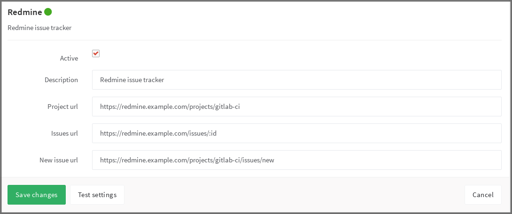

# Redmine Service

To enable the Redmine integration in a project, navigate to the
[Integrations page](project_services.md#accessing-the-project-services), click
the **Redmine** service, and fill in the required details on the page as described
in the table below.

| Field | Description |
| ----- | ----------- |
| `description`   | A name for the issue tracker (to differentiate between instances, for example) |
| `project_url`   | The URL to the project in Redmine which is being linked to this GitLab project |
| `issues_url`    | The URL to the issue in Redmine project that is linked to this GitLab project. Note that the `issues_url` requires `:id` in the URL. This ID is used by GitLab as a placeholder to replace the issue number. |
| `new_issue_url` | This is the URL to create a new issue in Redmine for the project linked to this GitLab project |

Once you have configured and enabled Redmine:

- the **Issues** link on the GitLab project pages takes you to the appropriate
  Redmine issue index
- clicking **New issue** on the project dashboard creates a new Redmine issue

As an example, below is a configuration for a project named gitlab-ci.

## Referencing issues in Redmine

Issues in Redmine can be referenced in two alternative ways:
1. `#<ID>` where `<ID>` is a number (example `#143`)
2. `<PROJECT>-<ID>` where `<PROJECT>` starts with a capital letter which is
  then followed by capital letters, numbers or underscores, and `<ID>` is
  a number (example `API_32-143`).

We suggest using the longer format if you have both internal and external issue trackers enabled. If you use the shorter format and an issue with the same ID exists in the internal issue tracker the internal issue will be linked.

Please note that `<PROJECT>` part is ignored and links always point to the
address specified in `issues_url`.
