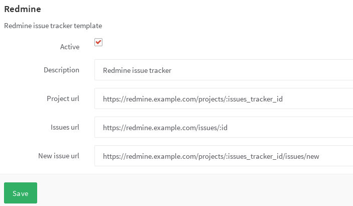

# Services templates

A GitLab administrator can add a service template that sets a default for each
project. After a service template is enabled, it will be applied to **all**
projects that don't have it already enabled and its details will be pre-filled
on the project's Service page. By disabling the template, it will be disabled
for new projects only.

## Enable a service template

Navigate to the **Admin Area > Service Templates** and choose the service
template you wish to create.

## Services for external issue trackers

In the image below you can see how a service template for Redmine would look
like.

---

For each project, you will still need to configure the issue tracking
URLs by replacing `:issues_tracker_id` in the above screenshot with the ID used
by your external issue tracker. Prior to GitLab v7.8, this ID was configured in
the project settings, and GitLab would automatically update the URL configured
in `gitlab.yml`. This behavior is now deprecated and all issue tracker URLs
must be configured directly within the project's **Integrations** settings.
