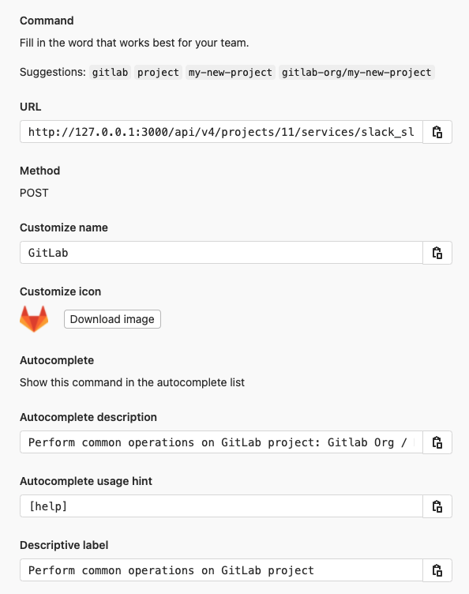

# Slack slash commands **(CORE ONLY)**

> Introduced in GitLab 8.15.

Slack slash commands allow you to control GitLab and view content right inside
Slack, without having to leave it. This requires configurations in both Slack and GitLab.

GitLab can also send events (e.g., `issue created`) to Slack as notifications.
This is the separately configured [Slack Notifications Service](slack.md).

NOTE: **Note:**
For GitLab.com, use the [Slack app](gitlab_slack_application.md) instead.

## Configuration

1. Slack slash commands are scoped to a project. Navigate to the [Integrations page](overview.md#accessing-integrations) in your project's settings, i.e. **Project > Settings > Integrations**.
1. Select the **Slack slash commands** integration to configure it. This page contains required information to complete the configuration in Slack. Leave this browser tab open.
1. Open a new browser tab and sign in to your Slack team. [Start a new Slash Commands integration](https://my.slack.com/services/new/slash-commands).
1. Enter a trigger term. We suggest you use the project name. Click **Add Slash Command Integration**.
1. Complete the rest of the fields in the Slack configuration page using information from the GitLab browser tab. In particular, the URL needs to be copied and pasted. Click **Save Integration** to complete the configuration in Slack.
1. While still on the Slack configuration page, copy the **token**. Go back to the GitLab browser tab and paste in the **token**.
1. Ensure that the **Active** toggle is enabled and click **Save changes** to complete the configuration in GitLab.

## Usage

You can now use the [Slack slash commands](../../../integration/slash_commands.md).
