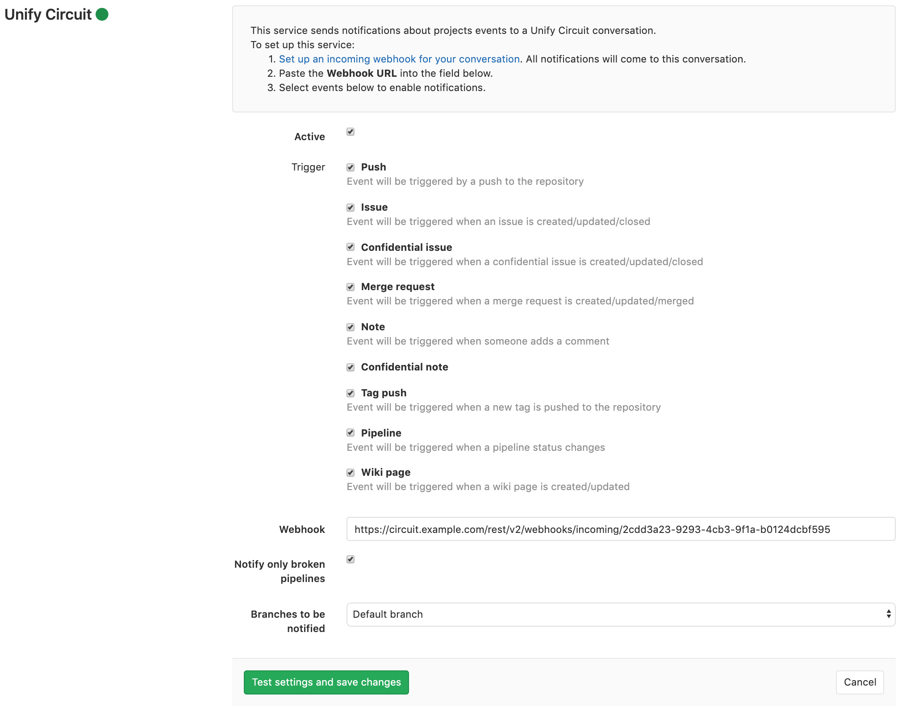

# Unify Circuit service **(FREE)**

The Unify Circuit service sends notifications from GitLab to the conversation for which the webhook was created.

## On Unify Circuit

1. Open the conversation in which you want to see the notifications.
1. From the conversation menu, select **Configure Webhooks**.
1. Click **ADD WEBHOOK** and fill in the name of the bot to post the messages. Optionally
   define an avatar.
1. Click **SAVE** and copy the **Webhook URL** of your webhook.

For more information, see the [Unify Circuit documentation for configuring incoming webhooks](https://www.circuit.com/unifyportalfaqdetail?articleId=164448).

## On GitLab

When you have the **Webhook URL** for your Unify Circuit conversation webhook, you can set up the GitLab service.

1. Navigate to the [Integrations page](overview.md#accessing-integrations) in your project's settings, i.e. **Project > Settings > Integrations**.
1. Select the **Unify Circuit** integration to configure it.
1. Ensure that the **Active** toggle is enabled.
1. Check the checkboxes corresponding to the GitLab events you want to receive in Unify Circuit.
1. Paste the **Webhook URL** that you copied from the Unify Circuit configuration step.
1. Configure the remaining options and click `Save changes`.

Your Unify Circuit conversation now starts receiving GitLab event notifications as configured.

