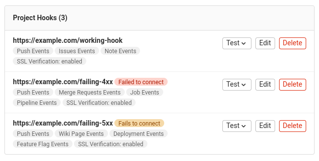

# Webhooks

DETAILS:
**Tier:** Free, Premium, Ultimate
**Offering:** GitLab.com, Self-managed, GitLab Dedicated

Webhooks are custom HTTP callbacks triggered by an event
such as pushing code to a repository or posting a comment on an issue.
Webhooks send JSON data about the event to the URI configured for the webhook.
For more information about these events and the JSON data sent in the webhook payload,
see [webhook events](webhook_events.md).

You can use webhooks to:

- Trigger CI/CD jobs, update external issue trackers and
  backup mirrors, or deploy to your production server.
- [Integrate with Twilio to receive SMS alerts](https://www.datadoghq.com/blog/send-alerts-sms-customizable-webhooks-twilio/)
  every time an issue is created for a specific project or group in GitLab.
- [Assign labels automatically to merge requests](https://about.gitlab.com/blog/2016/08/19/applying-gitlab-labels-automatically/).

GitLab.com enforces [webhook limits](../../../user/gitlab_com/index.md#webhooks), including:

- The maximum number of webhooks per project or group
- The number of webhook calls per minute
- The number of seconds a webhook is timed out

For GitLab self-managed, an administrator can change these limits.

## Group webhooks

DETAILS:
**Tier:** Premium, Ultimate

You can configure a group webhook, which is triggered by events
that occur across all projects in the group and its subgroups. If you configure identical webhooks
in a group and a project, they are both triggered by an event in the
project.

Group webhooks can also be configured to listen for events that are
specific to a group, including:

- [Group member events](webhook_events.md#group-member-events)
- [Subgroup events](webhook_events.md#subgroup-events)

## Configure webhooks in GitLab

### Create a webhook

> - **Name** and **Description** [introduced](https://gitlab.com/gitlab-org/gitlab/-/merge_requests/141977) in GitLab 16.9.

To create a webhook for a project or group:

1. In your project or group, on the left sidebar, select **Settings > Webhooks**.
1. Select **Add new webhook**.
1. In **URL**, enter the URL of the webhook endpoint.
   The URL must be percent-encoded if it contains one or more special characters.
1. Optional. In **Name**, enter the name of the webhook.
1. Optional. In **Description**, enter the description of the webhook.
1. Optional. In **Secret token**, enter the secret token to validate requests.

   The token is sent with the webhook request in the `X-Gitlab-Token` HTTP header.
   Your webhook endpoint can check the token to verify the request is legitimate.

1. In the **Trigger** section, select the checkbox for each GitLab
   [event](webhook_events.md) you want to trigger the webhook.
1. Optional. Clear the **Enable SSL verification** checkbox
   to disable [SSL verification](index.md#ssl-verification).
1. Select **Add webhook**.

### Mask sensitive portions of webhook URLs

> - [Introduced](https://gitlab.com/gitlab-org/gitlab/-/merge_requests/99995) in GitLab 15.5 [with a flag](../../../administration/feature_flags.md) named `webhook_form_mask_url`. Disabled by default.
> - [Generally available](https://gitlab.com/gitlab-org/gitlab/-/issues/376106) in GitLab 15.7. Feature flag `webhook_form_mask_url` removed.

You can define and mask sensitive portions of webhook URLs and replace them
with configured values any number of times when webhooks are executed.
Sensitive portions do not get logged and are encrypted at rest in the database.

To mask sensitive portions of the webhook URL:

1. In your project or group, on the left sidebar, select **Settings > Webhooks**.
1. In **URL**, enter the full webhook URL.
1. Select **Mask portions of URL**.
1. In **Sensitive portion of URL**, enter the portion you want to mask.
1. In **How it looks in the UI**, enter the masking value.

To interpolate sensitive portions for each webhook, use `url_variables`.
For example, if a webhook has the following URL:

```plaintext
https://webhook.example.com/{path}?key={value}
```

You must define the following variables:

- `path`
- `value`

Variable names must contain only lowercase letters (`a-z`), numbers (`0-9`), or underscores (`_`).
You can define URL variables directly with the REST API.

### Custom headers

> - [Introduced](https://gitlab.com/gitlab-org/gitlab/-/merge_requests/146702) in GitLab 16.11 [with a flag](../../../administration/feature_flags.md) named `custom_webhook_headers`. Enabled by default.
> - [Generally available](https://gitlab.com/gitlab-org/gitlab/-/issues/448604) in GitLab 17.0. Feature flag `custom_webhook_headers` removed.

You can add up to 20 custom headers in the webhook configuration as part of the request.
You can use these custom headers for authentication to external services.

Custom headers must not override the values of [delivery headers](#delivery-headers).
The header name must:

- Contain only alphanumeric characters, periods, dashes, or underscores.
- Start with a letter and end with a letter or number.
- Have no consecutive periods, dashes, or underscores.

Custom headers appear in [**Recent events**](#view-webhook-request-history) with masked values.

### Custom webhook template

> - [Introduced](https://gitlab.com/gitlab-org/gitlab/-/merge_requests/142738) in GitLab 16.10 [with a flag](../../../administration/feature_flags.md) named `custom_webhook_template`. Enabled by default.
> - [Generally available](https://gitlab.com/gitlab-org/gitlab/-/issues/439610) in GitLab 17.0. Feature flag `custom_webhook_template` removed.

You can set a custom payload template in the webhook configuration.
The request body is rendered from the template with data for the current event.
The template must render as valid JSON.

You can use any field from the [payload of an event](webhook_events.md), such as
`{{build_name}}` for a job event or `{{deployable_url}}` for a deployment event.
To access properties nested in objects, specify the path segments separated by periods.

Given this custom payload template:

```json
{
  "event": "{{object_kind}}",
  "project_name": "{{project.name}}"
}
```

The request payload combines the template with a `push` event:

```json
{
  "event": "push",
  "project_name": "Example"
}
```

Custom webhook templates cannot access properties in arrays.
Support for this feature is proposed in [issue 463332](https://gitlab.com/gitlab-org/gitlab/-/issues/463332).

### Filter push events by branch

You can filter push events by branch. Use one of the following options to filter which push events are sent to your webhook endpoint:

- **All branches**: push events from all branches.
- **Wildcard pattern**: push events from a branch that matches a wildcard pattern (for example, `*-stable` or `production/*`).
- **Regular expression**: push events from a branch that matches a regular expression (regex).
  The regex pattern must follow the [RE2 syntax](https://github.com/google/re2/wiki/Syntax).
  For example, to exclude `main`, you can use:

  ```plaintext
  \b(?:m(?!ain\b)|ma(?!in\b)|mai(?!n\b)|[a-l]|[n-z])\w*|\b\w{1,3}\b|\W+
  ```

To configure branch filtering for a project or group, see
[Configure a webhook in GitLab](#configure-webhooks-in-gitlab)

## View webhook request history

> - **Recent events** for group webhooks [introduced](https://gitlab.com/gitlab-org/gitlab/-/issues/325642) in GitLab 15.3.

Prerequisites:

- For project webhooks, you must have at least the Maintainer role for the project.
- For group webhooks, you must have the Owner role for the group.

GitLab records the history of each webhook request.
In **Recent events**, you can view all requests made to a webhook in the last two days.

To view the request history for a webhook:

1. On the left sidebar, select **Search or go to** and find your project or group.
1. Select **Settings > Webhooks**.
1. Select **Edit** for the webhook.
1. Go to the **Recent events** section.

The table includes the following details about each request:

- HTTP status code (green for `200`-`299` codes, red for the others, and `internal error` for failed deliveries)
- Triggered event
- Elapsed time of the request
- Relative time for when the request was made


### Inspect request and response details

Prerequisites:

- For project webhooks, you must have at least the Maintainer role for the project.
- For group webhooks, you must have the Owner role for the group.

Each webhook request in [**Recent events**](#view-webhook-request-history) has a **Request details** page.
This page contains the body and headers of:

- The response GitLab received from the webhook receiver endpoint
- The webhook request GitLab sent

To inspect the request and response details of a webhook event:

1. On the left sidebar, select **Search or go to** and find your project or group.
1. Select **Settings > Webhooks**.
1. Select **Edit** for the webhook.
1. Go to the **Recent events** section.
1. Select **View details** for the event.

To send the request again with the same data and the same [`Idempotency-Key` header](#delivery-headers)), select **Resend Request**.
If the webhook URL has changed, you cannot resend the request.

## Webhook receiver requirements

Webhook receiver endpoints should be fast and stable.
Slow and unstable receivers might be [disabled automatically](#auto-disabled-webhooks) to ensure system reliability.
Webhooks that [time out](../../../user/gitlab_com/index.md#other-limits) might lead to duplicate events.

Endpoints should follow these best practices:

- **Respond quickly with a `200` or `201` status response.**
  Avoid any significant processing of webhooks in the same request.
  Instead, implement a queue to handle webhooks after they are received.
  Webhook receivers that do not respond before the [timeout limit](../../../user/gitlab_com/index.md#other-limits)
  might be disabled automatically on GitLab.com.
- **Be prepared to handle duplicate events.**
  If a webhook has timed out, the same event might be sent twice.
  To mitigate this issue, ensure your endpoint is reliably fast and stable.
- **Keep the response headers and body minimal.**
  GitLab stores the response headers and body so you can
  [inspect them later in the webhook request history](#inspect-request-and-response-details) to help diagnose problems.
  You should limit the number and size of returned headers.
  You can also respond to the webhook request with an empty body.
- Only return client error status responses (in the `4xx` range) to indicate the webhook is misconfigured.
  Responses in this range might cause your webhooks to be disabled automatically.
  For example, if your receiver supports only push events, you can return `400` for issue payloads.
  Alternatively, you can ignore unrecognized event payloads.
- Never return `500` server error status responses if the event has been handled.
  These responses might cause the webhook to be disabled automatically.
- Invalid HTTP responses are treated as failed requests.

## Auto-disabled webhooks

> - [Generally available](https://gitlab.com/gitlab-org/gitlab/-/issues/329849) for project webhooks in GitLab 15.7. Feature flag `web_hooks_disable_failed` removed.
> - [Introduced](https://gitlab.com/gitlab-org/gitlab/-/issues/385902) for group webhooks in GitLab 15.10.
> - [Disabled on self-managed](https://gitlab.com/gitlab-org/gitlab/-/issues/390157) in GitLab 15.10 [with a flag](../../../administration/feature_flags.md) named `auto_disabling_web_hooks`.

FLAG:
On self-managed GitLab, by default this feature is not available. To make it available, an administrator can [enable the feature flag](../../../administration/feature_flags.md) named `auto_disabling_web_hooks`.
On GitLab.com, this feature is available. On GitLab Dedicated, this feature is not available.

Project or group webhooks that fail four consecutive times are disabled automatically.

To view auto-disabled webhooks:

1. On the left sidebar, select **Search or go to** and find your project or group.
1. Select **Settings > Webhooks**.

An auto-disabled webhook appears in the list of project or group webhooks as:

- **Fails to connect** if the webhook is [temporarily disabled](#temporarily-disabled-webhooks)
- **Failed to connect** if the webhook is [permanently disabled](#permanently-disabled-webhooks)



### Temporarily disabled webhooks

Project or group webhooks that return response codes in the `5xx` range
or experience a [timeout](../../../user/gitlab_com/index.md#webhooks) or other HTTP errors
are considered to be failing intermittently and are temporarily disabled.
These webhooks are initially disabled for one minute, which is extended
on each subsequent failure up to a maximum of 24 hours.

You can [re-enable temporarily disabled webhooks manually](#re-enable-disabled-webhooks)
if the webhook receiver no longer returns an error.

### Permanently disabled webhooks

Project or group webhooks that return response codes in the `4xx` range
are considered to be misconfigured and are permanently disabled.

These webhooks remain disabled until you [re-enable them manually](#re-enable-disabled-webhooks).

### Re-enable disabled webhooks

> - Introduced in GitLab 15.2 [with a flag](../../../administration/feature_flags.md) named `webhooks_failed_callout`. Disabled by default.
> - [Generally available](https://gitlab.com/gitlab-org/gitlab/-/issues/365535) in GitLab 15.7. Feature flag `webhooks_failed_callout` removed.

To re-enable a temporarily or permanently disabled webhook manually, [send a test request](#test-a-webhook).

The webhook is re-enabled if the test request returns a response code in the `2xx` range.

## Test a webhook

You can trigger a webhook manually, to ensure it's working properly. You can also send
a test request to re-enable a [disabled webhook](#re-enable-disabled-webhooks).

For example, to test `push events`, your project should have at least one commit. The webhook uses this commit in the webhook.

NOTE:
Testing is not supported for some types of events for project and groups webhooks.
For more information, see [issue 379201](https://gitlab.com/gitlab-org/gitlab/-/issues/379201).

Prerequisites:

- To test project webhooks, you must have at least the Maintainer role for the project.
- To test group webhooks, you must have the Owner role for the group.

To test a webhook:

1. In your project or group, on the left sidebar, select **Settings > Webhooks**.
1. Scroll down to the list of configured webhooks.
1. From the **Test** dropdown list, select the type of event to test.

You can also test a webhook from its edit page.


## Delivery headers

> - `X-Gitlab-Event-UUID` header [introduced](https://gitlab.com/gitlab-org/gitlab/-/issues/329743) in GitLab 14.8.
> - `X-Gitlab-Instance` header [introduced](https://gitlab.com/gitlab-org/gitlab/-/issues/31333) in GitLab 15.5.
> - `X-Gitlab-Webhook-UUID` header [introduced](https://gitlab.com/gitlab-org/gitlab/-/issues/230830) in GitLab 16.2.
> - `Idempotency-Key` header [introduced](https://gitlab.com/gitlab-org/gitlab/-/issues/388692) in GitLab 17.4.

Webhook requests to your endpoint include the following headers:

| Header | Description | Example |
| ------ | ------ | ------ |
| `User-Agent` | User agent in the format `"Gitlab/<VERSION>"`. | `"GitLab/15.5.0-pre"` |
| `X-Gitlab-Instance` | Hostname of the GitLab instance that sent the webhook. | `"https://gitlab.com"` |
| `X-Gitlab-Webhook-UUID` | Unique ID per webhook. | `"02affd2d-2cba-4033-917d-ec22d5dc4b38"` |
| `X-Gitlab-Event` | Name of the webhook type. Corresponds to [event types](webhook_events.md) but in the format `"<EVENT> Hook"`. | `"Push Hook"` |
| `X-Gitlab-Event-UUID` | Unique ID per webhook that is not recursive. A hook is recursive if triggered by an earlier webhook that hit the GitLab instance. Recursive webhooks have the same value for this header. | `"13792a34-cac6-4fda-95a8-c58e00a3954e"` |
| `Idempotency-Key` | Unique ID that remains consistent across webhook retries. Use this header to ensure idempotency of webhook effects on integrations. | `"f5e5f430-f57b-4e6e-9fac-d9128cd7232f"` |

## Debug webhooks

To debug GitLab webhooks and capture payloads, you can use:

- [Public webhook inspection and testing tools](#public-webhook-inspection-and-testing-tools)
- [Webhook request and response details](#inspect-request-and-response-details)
- [The GitLab Development Kit (GDK)](#gitlab-development-kit-gdk)
- [A private webhook receiver](#create-a-private-webhook-receiver)

For information about webhook events and the JSON data sent in the webhook payload,
see [webhook events](webhook_events.md).

### Public webhook inspection and testing tools

You can use public tools to inspect and test webhook payloads. These tools act as catch-all endpoints for HTTP requests and respond with a `200 OK` HTTP status code. You can use these payloads to develop your webhook services.

You should exercise caution when using these tools as you might be sending sensitive data to external tools.
You should use test tokens with these tools and rotate any secrets inadvertently sent to a third party.
To keep your webhook payloads private, [create a private webhook receiver](#create-a-private-webhook-receiver) instead.

These public tools include:

- [Beeceptor](https://beeceptor.com) to create a temporary HTTPS endpoint and inspect incoming payloads
- [Webhook.site](https://webhook.site) to review incoming payloads
- [Webhook Tester](https://webhook-test.com) to inspect and debug incoming payloads

### GitLab Development Kit (GDK)

For a safer development environment, you can use the [GitLab Development Kit (GDK)](https://gitlab.com/gitlab-org/gitlab-development-kit) to develop against GitLab webhooks locally. With the GDK, you can send webhooks from your local GitLab instance to a webhook receiver running locally on your machine. To use this approach, you must install and configure the GDK.

### Create a private webhook receiver

Prerequisites:

- You must have Ruby installed.

If you cannot send webhook payloads to a [public receiver](#public-webhook-inspection-and-testing-tools),
you can create your own private webhook receiver.

To create a private webhook receiver:

1. Save the following file as `print_http_body.rb`:

   ```ruby
   require 'webrick'

   server = WEBrick::HTTPServer.new(:Port => ARGV.first)
   server.mount_proc '/' do |req, res|
     puts req.body
   end

   trap 'INT' do
     server.shutdown
   end
   server.start
   ```

1. Choose an unused port (for example, `8000`) and start the script:

   ```shell
   ruby print_http_body.rb 8000
   ```

1. In GitLab, [configure the webhook](#configure-webhooks-in-gitlab) and add your
   receiver's URL (for example, `http://receiver.example.com:8000/`).
1. Select **Test**. You should see a similar message in the console:

   ```plaintext
   {"before":"077a85dd266e6f3573ef7e9ef8ce3343ad659c4e","after":"95cd4a99e93bc4bbabacfa2cd10e6725b1403c60",<SNIP>}
   example.com - - [14/May/2014:07:45:26 EDT] "POST / HTTP/1.1" 200 0
   - -> /
   ```

To add this receiver, you might have to [allow requests to the local network](../../../security/webhooks.md).

## How image URLs are displayed in the webhook body

Relative image references are rewritten to use an absolute URL
in the body of a webhook.
For example, if an image, merge request, comment, or wiki page includes the
following image reference:

```markdown

```

If:

- GitLab is installed at `gitlab.example.com`.
- The project is at `example-group/example-project`.

The reference is rewritten in the webhook body as follows:

```markdown

```

Image URLs are not rewritten if:

- They already point to HTTP, HTTPS, or
  protocol-relative URLs.
- They use advanced Markdown features like link labels.

## Configure webhooks to support mutual TLS

DETAILS:
**Offering:** Self-managed

> - [Introduced](https://gitlab.com/gitlab-org/gitlab/-/issues/27450) in GitLab 16.9.

Prerequisites:

- You must be a GitLab administrator.

You can configure webhooks to support mutual TLS by configuring a client
certificate in PEM format. This certificate is set globally and
presented to the server during a TLS handshake. The certificate can also
be protected with a PEM passphrase.

To configure the certificate:

::Tabs

:::TabTitle Linux package (Omnibus)

1. Edit `/etc/gitlab/gitlab.rb`:

   ```ruby
   gitlab_rails['http_client']['tls_client_cert_file'] = '<PATH TO CLIENT PEM FILE>'
   gitlab_rails['http_client']['tls_client_cert_password'] = '<OPTIONAL PASSWORD>'
   ```

1. Save the file and reconfigure GitLab:

   ```shell
   sudo gitlab-ctl reconfigure
   ```

:::TabTitle Docker

1. Edit `docker-compose.yml`:

   ```yaml
   version: "3.6"
   services:
     gitlab:
       image: 'gitlab/gitlab-ee:latest'
       restart: always
       hostname: 'gitlab.example.com'
       environment:
         GITLAB_OMNIBUS_CONFIG: |
            gitlab_rails['http_client']['tls_client_cert_file'] = '<PATH TO CLIENT PEM FILE>'
            gitlab_rails['http_client']['tls_client_cert_password'] = '<OPTIONAL PASSWORD>'
   ```

1. Save the file and restart GitLab:

   ```shell
   docker compose up -d
   ```

:::TabTitle Self-compiled (source)

1. Edit `/home/git/gitlab/config/gitlab.yml`:

   ```yaml
   production: &base
     http_client:
       tls_client_cert_file: '<PATH TO CLIENT PEM FILE>'
       tls_client_cert_password: '<OPTIONAL PASSWORD>'
   ```

1. Save the file and restart GitLab:

   ```shell
   # For systems running systemd
   sudo systemctl restart gitlab.target

   # For systems running SysV init
   sudo service gitlab restart
   ```

::EndTabs

## Configuring firewalls for webhook traffic

When configuring firewalls for webhooks traffic, you can configure assuming that webhooks are usually sent asynchronously from Sidekiq nodes. However, there are cases
when webhooks are sent synchronously from Rails nodes, including when:

- [Testing a Webhook](#test-a-webhook) in the UI.
- [Retrying a Webhook](#inspect-request-and-response-details) in the UI.

## Related topics

- [Webhook events and webhook JSON payloads](webhook_events.md)
- [Project hooks API](../../../api/projects.md#hooks)
- [Group hooks API](../../../api/groups.md#hooks)
- [System hooks API](../../../api/system_hooks.md)

## Troubleshooting

### `unable to get local issuer certificate`

When SSL verification is enabled, you might get an error that GitLab
cannot verify the SSL certificate of the webhook endpoint.
Typically, this error occurs because the root certificate is not issued
by a trusted certificate authority as determined by [CAcert.org](http://www.cacert.org/).

To resolve this issue, consider using [SSL Checker](https://www.sslshopper.com/ssl-checker.html) to identify errors.
Missing intermediate certificates are a common cause of verification failure.

### Webhook is not triggered

> - Webhooks not triggered in Silent Mode [introduced](https://gitlab.com/gitlab-org/gitlab/-/issues/393639) in GitLab 16.3.

If a webhook is not triggered, check that:

- The webhook was not [disabled automatically](#auto-disabled-webhooks).
- The GitLab instance is not in [Silent Mode](../../../administration/silent_mode/index.md).
