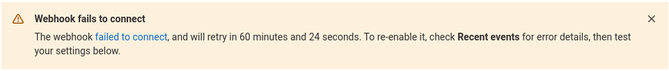
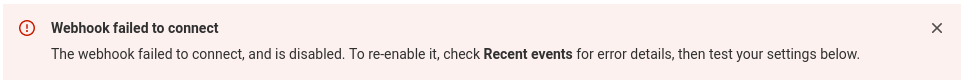

# Webhooks

DETAILS:
**Tier:** Free, Premium, Ultimate
**Offering:** GitLab.com, Self-managed, GitLab Dedicated

[Webhooks](https://en.wikipedia.org/wiki/Webhook) are custom HTTP callbacks
that you define. They are usually triggered by an
event, such as pushing code to a repository or posting a comment on an issue.
When the event occurs, the source app makes an HTTP request to the URI
configured for the webhook. The action to take may be anything. For example,
you can use webhooks to:

- Trigger continuous integration (CI) jobs, update external issue trackers,
  update a backup mirror, or deploy to your production server.
- Send a notification to
  [Slack](https://api.slack.com/incoming-webhooks) every time a job fails.
- [Integrate with Twilio to be notified via SMS](https://www.datadoghq.com/blog/send-alerts-sms-customizable-webhooks-twilio/)
  every time an issue is created for a specific project or group in GitLab.
- [Automatically assign labels to merge requests](https://about.gitlab.com/blog/2016/08/19/applying-gitlab-labels-automatically/).

You can configure your GitLab project or [group](#group-webhooks) to trigger a
[percent-encoded](https://developer.mozilla.org/en-US/docs/Glossary/percent-encoding) webhook URL
when an event occurs. For example, when new code is pushed or a new issue is created. The webhook
listens for specific [events](#events) and GitLab sends a POST request with data to the webhook URL.

Usually, you set up your own [webhook receiver](#create-an-example-webhook-receiver)
to receive information from GitLab and send it to another app, according to your requirements.
We have a [built-in receiver](gitlab_slack_application.md#slack-notifications)
for sending [Slack](https://api.slack.com/incoming-webhooks) notifications per project.

GitLab.com enforces [webhook limits](../../../user/gitlab_com/index.md#webhooks),
including:

- The maximum number of webhooks and their size, both per project and per group.
- The number of webhook calls per minute.

## Group webhooks

DETAILS:
**Tier:** Premium, Ultimate
**Offering:** GitLab.com, Self-managed, GitLab Dedicated

You can configure a group webhook, which is triggered by events
that occur across all projects in the group and its subgroups. If you configure identical webhooks
in a group and a project, they are both triggered by an event in the
project.

Group webhooks can also be configured to listen for events that are
specific to a group, including:

- [Group member events](webhook_events.md#group-member-events)
- [Subgroup events](webhook_events.md#subgroup-events)

## Configure a webhook in GitLab

To configure a webhook for a project or group:

1. In your project or group, on the left sidebar, select **Settings > Webhooks**.
1. Select **Add new webhook**.
1. In **URL**, enter the URL of the webhook endpoint.
   The URL must be percent-encoded if it contains one or more special characters.
1. In **Secret token**, enter the [secret token](#validate-payloads-by-using-a-secret-token) to validate payloads.
1. In the **Trigger** section, select the [events](webhook_events.md) to trigger the webhook.
1. Optional. Clear the **Enable SSL verification** checkbox to disable [SSL verification](index.md#ssl-verification).
1. Select **Add webhook**.

## Mask sensitive portions of webhook URLs

> - [Introduced](https://gitlab.com/gitlab-org/gitlab/-/merge_requests/99995) in GitLab 15.5 [with a flag](../../../administration/feature_flags.md) named `webhook_form_mask_url`. Disabled by default.
> - [Enabled on GitLab.com](https://gitlab.com/gitlab-org/gitlab/-/issues/376106) in GitLab 15.6.
> - [Generally available](https://gitlab.com/gitlab-org/gitlab/-/issues/376106) in GitLab 15.7. Feature flag `webhook_form_mask_url` removed.

You can define and mask sensitive portions of webhook URLs and replace them
with configured values any number of times when webhooks are executed.
Sensitive portions do not get logged and are encrypted at rest in the database.

To mask sensitive portions of the webhook URL:

1. In your project or group, on the left sidebar, select **Settings > Webhooks**.
1. In **URL**, enter the full webhook URL.
1. Select **Mask portions of URL**.
1. In **Sensitive portion of URL**, enter the portion you want to mask.
1. In **How it looks in the UI**, enter the masking value.

To interpolate sensitive portions for each webhook, use `url_variables`.
For example, if a webhook has the following URL:

```plaintext
https://webhook.example.com/{path}?key={value}
```

You must define the following variables:

- `path`
- `value`

Variable names must contain only lowercase letters (`a-z`), numbers (`0-9`), or underscores (`_`).
You can define URL variables directly with the REST API.
The host portion of the URL (such as `webhook.example.com`) must remain valid without using a mask variable.
Otherwise, a `URI is invalid` error occurs.

## Custom headers

> - [Introduced](https://gitlab.com/gitlab-org/gitlab/-/merge_requests/146702) in GitLab 16.11 [with a flag](../../../administration/feature_flags.md) named `custom_webhook_headers`. Enabled by default.

FLAG:
On self-managed GitLab, by default this feature is available. To hide the feature, an administrator can
[disable the feature flag](../../../administration/feature_flags.md) named `custom_webhook_headers`.
On GitLab.com and GitLab Dedicated, this feature is available.

You can add up to 20 custom headers in the webhook configuration as part of the request.
You can use these custom headers for authentication to external services.

Custom headers must not override the values of [delivery headers](#delivery-headers).
The header name must:

- Contain only alphanumeric characters, periods, dashes, or underscores.
- Start with a letter and end with a letter or number.
- Have no consecutive periods, dashes, or underscores.

Custom headers appear in [recent deliveries](#recently-triggered-webhook-payloads-in-gitlab-settings) with masked values.

## Custom webhook template

> - [Introduced](https://gitlab.com/gitlab-org/gitlab/-/merge_requests/142738) in GitLab 16.10 [with a flag](../../../administration/feature_flags.md) named `custom_webhook_template`. Enabled by default.

FLAG:
On self-managed GitLab, by default this feature is available. To hide the feature, an administrator can
[disable the feature flag](../../../administration/feature_flags.md) named `custom_webhook_template`.
On GitLab.com and GitLab Dedicated, this feature is available.

You can set a custom payload template in the webhook configuration. The request body is rendered from the template
with the data for the current event. The template must render as valid JSON.

You can use any field from the [payload of any event](webhook_events.md), such as `{{build_name}}` for a job event and `{{deployable_url}}`
for a deployment event. To access properties nested in objects, specify the path segments separated with `.`. For example:

Given this custom payload template:

```json
{
  "event": "{{object_kind}}",
  "project_name": "{{project.name}}"
}
```

You'll have this request payload that combines the template with a `push` event:

```json
{
  "event": "push",
  "project_name": "Example"
}
```

## Configure your webhook receiver endpoint

Webhook receiver endpoints should be fast and stable.
Slow and unstable receivers might be [disabled automatically](#auto-disabled-webhooks) to ensure system reliability. Webhooks that fail might lead to [duplicate events](#webhook-fails-or-multiple-webhook-requests-are-triggered).

Endpoints should follow these best practices:

- **Respond quickly with a `200` or `201` status response.** Avoid any significant processing of webhooks in the same request.
  Instead, implement a queue to handle webhooks after they are received. Webhook receivers that do not respond before the [timeout limit](#webhook-timeout-limits) might be [disabled automatically](#auto-disabled-webhooks) on GitLab.com.
- **Be prepared to handle duplicate events.** In [some circumstances](#webhook-fails-or-multiple-webhook-requests-are-triggered), the same event may be sent twice. To mitigate this issue, ensure your endpoint is
  reliably fast and stable.
- **Keep the response headers and body minimal.**
  GitLab does not examine the response headers or body. GitLab stores them so you can examine them later in the logs to help diagnose problems. You should limit the number and size of headers returned. You can also respond to the webhook request with an empty body.
- Only return client error status responses (in the `4xx` range) to
  indicate that the webhook has been misconfigured. Responses in this range might cause your webhooks to be [disabled automatically](#auto-disabled-webhooks). For example, if your receiver
  only supports push events, you can return `400` if sent an issue
  payload, as that is an indication that the hook has been set up
  incorrectly. Alternatively, you can ignore unrecognized event
  payloads.
- Never return `500` server error status responses if the event has been handled. These responses might cause the webhook to be [disabled automatically](#auto-disabled-webhooks).
- Invalid HTTP responses are treated as failed requests.

## Webhook timeout limits

For GitLab.com, the timeout limit for webhooks is [10 seconds](../../../user/gitlab_com/index.md#other-limits).
For GitLab self-managed, an administrator can [change the webhook timeout limit](../../../administration/instance_limits.md#webhook-timeout).

## Auto-disabled webhooks

> - [Introduced](https://gitlab.com/gitlab-org/gitlab/-/merge_requests/60837) for project webhooks in GitLab 13.12 [with a flag](../../../administration/feature_flags.md) named `web_hooks_disable_failed`. Disabled by default.
> - [Generally available](https://gitlab.com/gitlab-org/gitlab/-/issues/329849) for project webhooks in GitLab 15.7. Feature flag `web_hooks_disable_failed` removed.
> - [Introduced](https://gitlab.com/gitlab-org/gitlab/-/issues/385902) for group webhooks in GitLab 15.10.
> - [Disabled on self-managed](https://gitlab.com/gitlab-org/gitlab/-/issues/390157) in GitLab 15.10 [with a flag](../../../administration/feature_flags.md) named `auto_disabling_web_hooks`.

FLAG:
On self-managed GitLab, by default this feature is not available. To make it available, an administrator can [enable the feature flag](../../../administration/feature_flags.md) named `auto_disabling_web_hooks`.
On GitLab.com, this feature is available. On GitLab Dedicated, this feature is not available.

Project or group webhooks that fail four consecutive times are disabled automatically.

Project or group webhooks that return response codes in the `5xx` range or experience a
[timeout](#webhook-timeout-limits) or other HTTP errors are understood to be failing
intermittently and are temporarily disabled. These webhooks are initially disabled
for one minute, which is extended on each subsequent failure up to a maximum of 24 hours.

Project or group webhooks that return response codes in the `4xx` range are understood to be
misconfigured and are permanently disabled until you [manually re-enable](#re-enable-disabled-webhooks)
the webhooks yourself.

### Re-enable disabled webhooks

> - Introduced in GitLab 15.2 [with a flag](../../../administration/feature_flags.md) named `webhooks_failed_callout`. Disabled by default.
> - [Generally available](https://gitlab.com/gitlab-org/gitlab/-/issues/365535) in GitLab 15.7. Feature flag `webhooks_failed_callout` removed.

If a webhook is failing, a banner displays at the top of the edit page explaining
why the webhook is disabled and when it is automatically re-enabled. For example:



In the case of a failed webhook, an error banner is displayed:



To re-enable a failing or failed webhook, [send a test request](#test-a-webhook). If the test
request succeeds, the webhook is re-enabled.

## Test a webhook

You can trigger a webhook manually, to ensure it's working properly. You can also send
a test request to re-enable a [disabled webhook](#re-enable-disabled-webhooks).

For example, to test `push events`, your project should have at least one commit. The webhook uses this commit in the webhook.

NOTE:
Testing is not supported for some types of events for project and groups webhooks.
For more information, see [issue 379201](https://gitlab.com/gitlab-org/gitlab/-/issues/379201).

Prerequisites:

- To test project webhooks, you must have at least the Maintainer role for the project.
- To test group webhooks, you must have the Owner role for the group.

To test a webhook:

1. In your project or group, on the left sidebar, select **Settings > Webhooks**.
1. Scroll down to the list of configured webhooks.
1. From the **Test** dropdown list, select the type of event to test.

You can also test a webhook from its edit page.


## Create an example webhook receiver

To test how GitLab webhooks work, you can use
an echo script running in a console session. For the following script to
work you must have Ruby installed.

1. Save the following file as `print_http_body.rb`:

   ```ruby
   require 'webrick'

   server = WEBrick::HTTPServer.new(:Port => ARGV.first)
   server.mount_proc '/' do |req, res|
     puts req.body
   end

   trap 'INT' do
     server.shutdown
   end
   server.start
   ```

1. Choose an unused port (for example, `8000`) and start the script:

   ```shell
   ruby print_http_body.rb 8000
   ```

1. In GitLab, [configure the webhook](#configure-a-webhook-in-gitlab) and add your
   receiver's URL, for example, `http://receiver.example.com:8000/`.

1. Select **Test**. You should see something like this in the console:

   ```plaintext
   {"before":"077a85dd266e6f3573ef7e9ef8ce3343ad659c4e","after":"95cd4a99e93bc4bbabacfa2cd10e6725b1403c60",<SNIP>}
   example.com - - [14/May/2014:07:45:26 EDT] "POST / HTTP/1.1" 200 0
   - -> /
   ```

NOTE:
You may need to [allow requests to the local network](../../../security/webhooks.md) for this
receiver to be added.

## Validate payloads by using a secret token

You can specify a secret token to validate received payloads.
The token is sent with the hook request in the
`X-Gitlab-Token` HTTP header. Your webhook endpoint can check the token to verify
that the request is legitimate.

## Filter push events by branch

You can filter push events by branch. Use one of the following options to filter which push events are sent to your webhook endpoint:

- **All branches**: push events from all branches.
- **Wildcard pattern**: push events from a branch that matches a wildcard pattern (for example, `*-stable` or `production/*`).
- **Regular expression**: push events from a branch that matches a regular expression (regex).
  The regex pattern must follow the [RE2 syntax](https://github.com/google/re2/wiki/Syntax).
  For example, to exclude `main`, you can use:

  ```plaintext
  \b(?:m(?!ain\b)|ma(?!in\b)|mai(?!n\b)|[a-l]|[n-z])\w*|\b\w{1,3}\b|\W+
  ```

To configure branch filtering for a project or group, see
[Configure a webhook in GitLab](#configure-a-webhook-in-gitlab).

## How image URLs are displayed in the webhook body

Relative image references are rewritten to use an absolute URL
in the body of a webhook.
For example, if an image, merge request, comment, or wiki page includes the
following image reference:

```markdown

```

If:

- GitLab is installed at `gitlab.example.com`.
- The project is at `example-group/example-project`.

The reference is rewritten in the webhook body as follows:

```markdown

```

Image URLs are not rewritten if:

- They already point to HTTP, HTTPS, or
  protocol-relative URLs.
- They use advanced Markdown features like link labels.

## Events

For more information about supported events for webhooks, see [webhook events](webhook_events.md).

## Delivery headers

> - `X-Gitlab-Event-UUID` header [introduced](https://gitlab.com/gitlab-org/gitlab/-/issues/329743) in GitLab 14.8.
> - `X-Gitlab-Instance` header [introduced](https://gitlab.com/gitlab-org/gitlab/-/issues/31333) in GitLab 15.5.
> - `X-Gitlab-Webhook-UUID` header [introduced](https://gitlab.com/gitlab-org/gitlab/-/issues/230830) in GitLab 16.2.

Webhook requests to your endpoint include the following headers:

| Header | Description | Example |
| ------ | ------ | ------ |
| `User-Agent` | User agent in the format `"Gitlab/<VERSION>"`. | `"GitLab/15.5.0-pre"` |
| `X-Gitlab-Instance` | Hostname of the GitLab instance that sent the webhook. | `"https://gitlab.com"` |
| `X-Gitlab-Webhook-UUID` | Unique ID per webhook. | `"02affd2d-2cba-4033-917d-ec22d5dc4b38"` |
| `X-Gitlab-Event` | Name of the webhook type. Corresponds to [event types](webhook_events.md) but in the format `"<EVENT> Hook"`. | `"Push Hook"` |
| `X-Gitlab-Event-UUID` | Unique ID per webhook that is not recursive. A hook is recursive if triggered by an earlier webhook that hit the GitLab instance. Recursive webhooks have the same value for this header. | `"13792a34-cac6-4fda-95a8-c58e00a3954e"` |

## Develop webhooks

If you don't have an existing HTTPS endpoint or URL for your webhook setup, you must deploy one on a server. This HTTPS endpoint is used in configuration. To develop against GitLab webhooks and capture the payloads, you can use:

- [Public webhook inspection and testing tools](#public-webhook-inspection-and-testing-tools)
- [The GitLab Development Kit (GDK)](#gitlab-development-kit-gdk)
- [Recently triggered webhook payloads in GitLab settings](#recently-triggered-webhook-payloads-in-gitlab-settings)

### Public webhook inspection and testing tools

You can use public tools to inspect and test webhook payloads. These tools act as catch-all endpoints for HTTP requests and respond with a `200 OK` HTTP status code. You can use these payloads to develop your webhook services.

You should exercise caution when using these tools as you might be sending sensitive data to external tools. You should use test tokens with these tools and rotate any secrets inadvertently sent to a third party.

These public tools include:

- [Beeceptor](https://beeceptor.com) to create a temporary HTTPS endpoint and inspect incoming payloads
- [Webhook.site](https://webhook.site) to review incoming payloads
- [Webhook Tester](https://webhook-test.com) to inspect and debug incoming payloads

### GitLab Development Kit (GDK)

For a safer development environment, you can use the [GitLab Development Kit (GDK)](https://gitlab.com/gitlab-org/gitlab-development-kit) to develop against GitLab webhooks locally. With the GDK, you can send webhooks from your local GitLab instance to a webhook receiver running locally on your machine. To use this approach, you must install and configure the GDK.

### Recently triggered webhook payloads in GitLab settings

You can [review recently triggered webhook payloads](#troubleshooting) in GitLab settings. For each webhook event, a detail page exists with information about the data GitLab sends and receives from the webhook endpoint.

## Configure webhooks to support mutual TLS

DETAILS:
**Offering:** Self-managed, GitLab Dedicated

> - [Introduced](https://gitlab.com/gitlab-org/gitlab/-/issues/27450) in GitLab 16.9.

Prerequisites:

- You must be a GitLab administrator.

You can configure webhooks to support mutual TLS by configuring a client
certificate in PEM format. This certificate is set globally and
presented to the server during a TLS handshake. The certificate can also
be protected with a PEM passphrase.

To configure the certificate, follow the instructions below.

::Tabs

:::TabTitle Linux package (Omnibus)

1. Edit `/etc/gitlab/gitlab.rb`:

   ```ruby
   gitlab_rails['http_client']['tls_client_cert_file'] = '<PATH TO CLIENT PEM FILE>'
   gitlab_rails['http_client']['tls_client_cert_password'] = '<OPTIONAL PASSWORD>'
   ```

1. Save the file and reconfigure GitLab:

   ```shell
   sudo gitlab-ctl reconfigure
   ```

:::TabTitle Docker

1. Edit `docker-compose.yml`:

   ```yaml
   version: "3.6"
   services:
     gitlab:
       image: 'gitlab/gitlab-ee:latest'
       restart: always
       hostname: 'gitlab.example.com'
       environment:
         GITLAB_OMNIBUS_CONFIG: |
            gitlab_rails['http_client']['tls_client_cert_file'] = '<PATH TO CLIENT PEM FILE>'
            gitlab_rails['http_client']['tls_client_cert_password'] = '<OPTIONAL PASSWORD>'
   ```

1. Save the file and restart GitLab:

   ```shell
   docker compose up -d
   ```

:::TabTitle Self-compiled (source)

1. Edit `/home/git/gitlab/config/gitlab.yml`:

   ```yaml
   production: &base
     http_client:
       tls_client_cert_file: '<PATH TO CLIENT PEM FILE>'
       tls_client_cert_password: '<OPTIONAL PASSWORD>'
   ```

1. Save the file and restart GitLab:

   ```shell
   # For systems running systemd
   sudo systemctl restart gitlab.target

   # For systems running SysV init
   sudo service gitlab restart
   ```

::EndTabs

## Related topics

- [Project hooks API](../../../api/projects.md#hooks)
- [Group hooks API](../../../api/groups.md#hooks)
- [System hooks API](../../../api/system_hooks.md)

## Troubleshooting

> - **Recent events** for group webhooks [introduced](https://gitlab.com/gitlab-org/gitlab/-/issues/325642) in GitLab 15.3.

GitLab records the history of each webhook request.
You can view requests made in the last 2 days in the **Recent events** table.

Prerequisites:

- To troubleshoot project webhooks, you must have at least the Maintainer role for the project.
- To troubleshoot group webhooks, you must have the Owner role for the group.

To view the table:

1. In your project or group, on the left sidebar, select **Settings > Webhooks**.
1. Scroll down to the webhooks.
1. Each [auto-disabled webhook](#auto-disabled-webhooks) has a badge listing it as:

   - **Failed to connect** if it's misconfigured and must be manually re-enabled.
   - **Fails to connect** if it's temporarily disabled and is automatically
     re-enabled after the timeout limit has elapsed.

   

1. Select **Edit** for the webhook you want to view.

The table includes the following details about each request:

- HTTP status code (green for `200`-`299` codes, red for the others, and `internal error` for failed deliveries)
- Triggered event
- Elapsed time of the request
- Relative time for when the request was made


Each webhook event has a corresponding **Details** page. This page details the data that GitLab sent (request headers and body) and received (response headers and body).
To view the **Details** page, select **View details** for the webhook event.

To repeat the delivery with the same data, select **Resend Request**.

NOTE:
If you update the URL or secret token of the webhook, data is delivered to the new address.

### Unable to get local issuer certificate

When SSL verification is enabled, you might get an error that GitLab cannot
verify the SSL certificate of the webhook endpoint.
Typically, this error occurs because the root certificate isn't
issued by a trusted certification authority as
determined by [CAcert.org](http://www.cacert.org/).

If that is not the case, consider using [SSL Checker](https://www.sslshopper.com/ssl-checker.html) to identify faults.
Missing intermediate certificates are common causes of verification failure.

### Webhook fails or multiple webhook requests are triggered

If you're receiving multiple webhook requests, the webhook might have [timed out](#webhook-timeout-limits).

### Webhook is not triggered

> - Webhooks not triggered in Silent Mode [introduced](https://gitlab.com/gitlab-org/gitlab/-/issues/393639) in GitLab 16.3.

If a webhook is not triggered, check that:

- The webhook was not [disabled automatically](#auto-disabled-webhooks).
- The GitLab instance is not in [Silent Mode](../../../administration/silent_mode/index.md).
