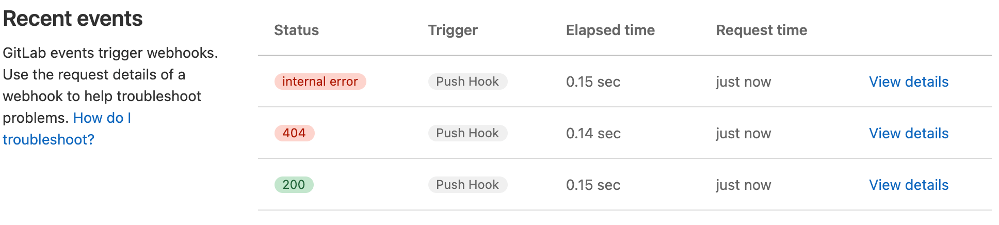

DETAILS:
**Tier:** Free, Premium, Ultimate
**Offering:** GitLab.com, GitLab Self-Managed, GitLab Dedicated

Webhooks are custom HTTP callbacks that send JSON data about events in GitLab to a configured URI.

You can use webhooks to:

- Trigger CI/CD jobs.
- Update external issue trackers.
- Deploy to your production server.
- [Integrate with Twilio to receive SMS alerts](https://www.datadoghq.com/blog/send-alerts-sms-customizable-webhooks-twilio/)
  every time an issue is created for a project or group in GitLab.
- [Assign labels to merge requests automatically](https://about.gitlab.com/blog/2016/08/19/applying-gitlab-labels-automatically/).

## Webhook events

Various events in GitLab can trigger webhooks. For example:

- Pushing code to a repository.
- Posting a comment on an issue.
- Creating a merge request.

For a complete list of events and the JSON data sent in the webhook payload, see [webhook events](webhook_events.md).

## Webhook limits

GitLab.com enforces [webhook limits](../../gitlab_com/_index.md#webhooks), including:

- Maximum number of webhooks per project or group.
- Number of webhook calls per minute.
- Webhook timeout duration.

For GitLab Self-Managed, administrators can modify these limits.

## Group webhooks

DETAILS:
**Tier:** Premium, Ultimate

Group webhooks are custom HTTP callbacks that send notifications for events across all projects in a group and its subgroups.

### Types of group webhook events

You can configure group webhooks to listen for:

- All events that occur in projects in the group and subgroups.
- Group-specific events:
  - [Group member events](webhook_events.md#group-member-events).
  - [Project events](webhook_events.md#project-events)
  - [Subgroup events](webhook_events.md#subgroup-events).

### Webhooks in both a project and a group

If you configure identical webhooks in both a group and a project in that group,
both webhooks are triggered for events in that project.
This allows for flexible event handling at different levels of your GitLab organization.

## Configure webhooks

Create and configure webhooks in GitLab to integrate with your project's workflow.
Use these features to set up webhooks that meet your specific requirements.

### Create a webhook

> - **Name** and **Description** [introduced](https://gitlab.com/gitlab-org/gitlab/-/merge_requests/141977) in GitLab 16.9.

Create a webhook to send notifications about events in your project or group.

Prerequisites:

- For project webhooks, you must have at least the Maintainer role for the project.
- For group webhooks, you must have the Owner role for the group.

To create a webhook:

1. On the left sidebar, select **Search or go to** and find your project or group.
1. Select **Settings > Webhooks**.
1. Select **Add new webhook**.
1. In **URL**, enter the URL of the webhook endpoint.
   Use percent-encoding for special characters.
1. Optional. Enter a **Name** and **Description** for the webhook.
1. Optional. In **Secret token**, enter a token to validate requests.
1. In the **Trigger** section, select the [events](webhook_events.md) to trigger the webhook.
1. Optional. To disable [SSL verification](_index.md#ssl-verification), clear the **Enable SSL verification** checkbox.
1. Select **Add webhook**.

The secret token is sent with the webhook request in the `X-Gitlab-Token` HTTP header.
Your webhook endpoint can use this token to verify the legitimacy of the request.

### Mask sensitive portions of webhook URLs

> - [Introduced](https://gitlab.com/gitlab-org/gitlab/-/merge_requests/99995) in GitLab 15.5 [with a flag](../../../administration/feature_flags.md) named `webhook_form_mask_url`. Disabled by default.
> - [Generally available](https://gitlab.com/gitlab-org/gitlab/-/issues/376106) in GitLab 15.7. Feature flag `webhook_form_mask_url` removed.

Mask sensitive portions of webhook URLs to enhance security.
Masked portions are replaced with configured values when webhooks are executed, are not logged, and
are encrypted at rest in the database.

To mask sensitive portions of a webhook URL:

1. On the left sidebar, select **Search or go to** and find your project or group.
1. Select **Settings > Webhooks**.
1. In **URL**, enter the full URL of the webhook.
1. To define masked portions, select **Mask portions of URL**.
1. In **Sensitive portion of URL**, enter the part of the URL you want to mask.
1. In **How it looks in the UI**, enter the value to display instead of the masked portion.
   Variable names must contain only lowercase letters (`a-z`), numbers (`0-9`), or underscores (`_`).
1. Select **Save changes**.

The masked values appear hidden in the UI.
For example, if you've defined variables `path` and `value`, the webhook URL can look like this:

```plaintext
https://webhook.example.com/{path}?key={value}
```

### Custom headers

> - [Introduced](https://gitlab.com/gitlab-org/gitlab/-/merge_requests/146702) in GitLab 16.11 [with a flag](../../../administration/feature_flags.md) named `custom_webhook_headers`. Enabled by default.
> - [Generally available](https://gitlab.com/gitlab-org/gitlab/-/issues/448604) in GitLab 17.0. Feature flag `custom_webhook_headers` removed.

Add custom headers to webhook requests for authentication to external services.
You can configure up to 20 custom headers per webhook.

Custom headers must:

- Not override the values of [delivery headers](#delivery-headers).
- Contain only alphanumeric characters, periods, dashes, or underscores.
- Start with a letter and end with a letter or number.
- Have no consecutive periods, dashes, or underscores.

Custom headers show in [**Recent events**](#view-webhook-request-history) with masked values.

### Custom webhook template

> - [Introduced](https://gitlab.com/gitlab-org/gitlab/-/merge_requests/142738) in GitLab 16.10 [with a flag](../../../administration/feature_flags.md) named `custom_webhook_template`. Enabled by default.
> - [Generally available](https://gitlab.com/gitlab-org/gitlab/-/issues/439610) in GitLab 17.0. Feature flag `custom_webhook_template` removed.

Create a custom payload template for your webhook to control the data sent in the request body.

#### Create a custom webhook template

- For project webhooks, you must have at least the Maintainer role for the project.
- For group webhooks, you must have the Owner role for the group.

To create a custom webhook template:

1. Go to your webhook configuration.
1. Set a custom webhook template.
1. Ensure the template renders as valid JSON.

Use fields from the [payload of an event](webhook_events.md) in your template. For example:

- `{{build_name}}` for a job event
- `{{deployable_url}}` for a deployment event

To access nested properties, use periods to separate path segments.

#### Example custom webhook template

For this custom payload template:

```json
{
  "event": "{{object_kind}}",
  "project_name": "{{project.name}}"
}
```

The resulting request payload for a `push` event is:

```json
{
  "event": "push",
  "project_name": "Example"
}
```

Custom webhook templates cannot access properties in arrays.
Support for this feature is proposed in [issue 463332](https://gitlab.com/gitlab-org/gitlab/-/issues/463332).

### Filter push events by branch

Filter `push` events sent to your webhook endpoint by the branch name.
Use one of these filtering options:

- **All branches**: Receive push events from all branches.
- **Wildcard pattern**: Receive push events from branches that match a wildcard pattern.
- **Regular expression**: Receive push events from branches that match a regular expression (regex).

#### Use a wildcard pattern

To filter by using a wildcard pattern:

1. In the webhook configuration, select **Wildcard pattern**.
1. Enter a pattern.
   For example:
   - `*-stable` to match branches ending with `-stable`.
   - `production/*` to match branches in the `production/` namespace.

#### Use a regular expression

To filter by using a regular expression:

1. In the webhook configuration, select **Regular expression**.
1. Enter a regex pattern that follows the [RE2 syntax](https://github.com/google/re2/wiki/Syntax).

For example, to exclude the `main` branch, use:

```plaintext
\b(?:m(?!ain\b)|ma(?!in\b)|mai(?!n\b)|[a-l]|[n-z])\w*|\b\w{1,3}\b|\W+
```

### Configure webhooks to support mutual TLS

DETAILS:
**Offering:** GitLab Self-Managed

> - [Introduced](https://gitlab.com/gitlab-org/gitlab/-/issues/27450) in GitLab 16.9.

Configure webhooks to support mutual TLS by setting a global client certificate in PEM format.

Prerequisites:

- You must be a GitLab administrator.

To configure mutual TLS for webhooks:

1. Prepare a client certificate in PEM format.
1. Optional: Protect the certificate with a PEM passphrase.
1. Configure GitLab to use the certificate.

::Tabs

:::TabTitle Linux package (Omnibus)

1. Edit `/etc/gitlab/gitlab.rb`:

   ```ruby
   gitlab_rails['http_client']['tls_client_cert_file'] = '<PATH TO CLIENT PEM FILE>'
   gitlab_rails['http_client']['tls_client_cert_password'] = '<OPTIONAL PASSWORD>'
   ```

1. Save the file and reconfigure GitLab:

   ```shell
   sudo gitlab-ctl reconfigure
   ```

:::TabTitle Docker

1. Edit `docker-compose.yml`:

   ```yaml
   version: "3.6"
   services:
     gitlab:
       image: 'gitlab/gitlab-ee:latest'
       restart: always
       hostname: 'gitlab.example.com'
       environment:
         GITLAB_OMNIBUS_CONFIG: |
            gitlab_rails['http_client']['tls_client_cert_file'] = '<PATH TO CLIENT PEM FILE>'
            gitlab_rails['http_client']['tls_client_cert_password'] = '<OPTIONAL PASSWORD>'
   ```

1. Save the file and restart GitLab:

   ```shell
   docker compose up -d
   ```

:::TabTitle Self-compiled (source)

1. Edit `/home/git/gitlab/config/gitlab.yml`:

   ```yaml
   production: &base
     http_client:
       tls_client_cert_file: '<PATH TO CLIENT PEM FILE>'
       tls_client_cert_password: '<OPTIONAL PASSWORD>'
   ```

1. Save the file and restart GitLab:

   ```shell
   # For systems running systemd
   sudo systemctl restart gitlab.target

   # For systems running SysV init
   sudo service gitlab restart
   ```

::EndTabs

After configuration, GitLab presents this certificate to the server during TLS handshakes for webhook connections.

### Configure firewalls for webhook traffic

Configure firewalls for webhook traffic based on how GitLab sends webhooks:

- Asynchronously from Sidekiq nodes (most common)
- Synchronously from Rails nodes (in specific cases)

Webhooks are sent synchronously from Rails nodes when:

- [Testing a webhook](#test-a-webhook) in the UI
- [Retrying a webhook](#inspect-request-and-response-details) in the UI

When configuring firewalls, ensure both Sidekiq and Rails nodes can send webhook traffic.

## Manage webhooks

Monitor and maintain your configured webhooks in GitLab.

### View webhook request history

> - **Recent events** for group webhooks [introduced](https://gitlab.com/gitlab-org/gitlab/-/issues/325642) in GitLab 15.3.

View the history of webhook requests to monitor their performance and troubleshoot issues.

Prerequisites:

- For project webhooks, you must have at least the Maintainer role for the project.
- For group webhooks, you must have the Owner role for the group.

To view the request history for a webhook:

1. On the left sidebar, select **Search or go to** and find your project or group.
1. Select **Settings > Webhooks**.
1. Select **Edit** for the webhook.
1. Go to the **Recent events** section.

The **Recent events** section displays all requests made to a webhook in the last two days.
The table includes:

- HTTP status code:
  - Green for `200`-`299` codes
  - Red for other codes
  - `internal error` for failed deliveries
- Triggered event
- Elapsed time of the request
- Relative time the request was made



#### Inspect request and response details

Prerequisites:

- For project webhooks, you must have at least the Maintainer role for the project.
- For group webhooks, you must have the Owner role for the group.

Each webhook request in [**Recent events**](#view-webhook-request-history) has a **Request details** page.
This page contains the body and headers of:

- The response GitLab received from the webhook receiver endpoint
- The webhook request GitLab sent

To inspect the request and response details of a webhook event:

1. On the left sidebar, select **Search or go to** and find your project or group.
1. Select **Settings > Webhooks**.
1. Select **Edit** for the webhook.
1. Go to the **Recent events** section.
1. Select **View details** for the event.

To send the request again with the same data and the same [`Idempotency-Key` header](#delivery-headers)), select **Resend Request**.
If the webhook URL has changed, you cannot resend the request.
For resending programmatically, refer to our [API documentation](../../../api/project_webhooks.md#resend-a-project-webhook-event).

### Test a webhook

Test a webhook to ensure it's working properly or to re-enable a [disabled webhook](#re-enable-disabled-webhooks).

Prerequisites:

- For project webhooks, you must have at least the Maintainer role for the project.
- For group webhooks, you must have the Owner role for the group.
- To test `push events`, your project must have at least one commit.

To test a webhook:

1. On the left sidebar, select **Search or go to** and find your project or group.
1. Select **Settings > Webhooks**.
1. In the list of configured webhooks, locate the webhook you want to test.
1. From the **Test** dropdown list, select the type of event to test.

Alternatively, you can test a webhook from its edit page.


Testing is not supported for some types of events for project and group webhooks.
For more information, see [issue 379201](https://gitlab.com/gitlab-org/gitlab/-/issues/379201).

## Webhook reference

Use this technical reference to:

- Understand how GitLab webhooks work.
- Integrate webhooks with your systems.
- Set up, troubleshoot, and optimize your webhook configurations.

### Webhook receiver requirements

Implement fast and stable webhook receiver endpoints to ensure reliable webhook delivery.

Slow, unstable, or incorrectly configured receivers may be [disabled automatically](#auto-disabled-webhooks).
Invalid HTTP responses are treated as failed requests.

To optimize your webhook receivers:

1. Respond quickly with a `200` or `201` status:
   - Avoid processing webhooks in the same request.
   - Use a queue to handle webhooks after receiving them.
   - Respond before the [timeout limit](../../gitlab_com/_index.md#other-limits) to prevent automatic disabling on GitLab.com.
1. Handle potential duplicate events:
   - Prepare for duplicate events if a webhook times out.
   - Ensure your endpoint is consistently fast and stable.
1. Minimize response headers and body:
   - GitLab stores response headers and body for [later inspection](#inspect-request-and-response-details).
   - Limit the number and size of returned headers.
   - Consider responding with an empty body.
1. Use appropriate status codes:
   - Return client error status responses (`4xx` range) only for misconfigured webhooks.
   - For unsupported events, return `400` or ignore the payload.
   - Avoid `500` server error responses for handled events.

### Auto-disabled webhooks

> - [Generally available](https://gitlab.com/gitlab-org/gitlab/-/issues/329849) for project webhooks in GitLab 15.7. Feature flag `web_hooks_disable_failed` removed.
> - [Introduced](https://gitlab.com/gitlab-org/gitlab/-/issues/385902) for group webhooks in GitLab 15.10.
> - [Disabled on GitLab Self-Managed](https://gitlab.com/gitlab-org/gitlab/-/issues/390157) in GitLab 15.10 [with a flag](../../../administration/feature_flags.md) named `auto_disabling_web_hooks`.

FLAG:
The availability of this feature is controlled by a feature flag.
For more information, see the history.

GitLab automatically disables project or group webhooks that fail four consecutive times.

To view auto-disabled webhooks:

1. On the left sidebar, select **Search or go to** and find your project or group.
1. Select **Settings > Webhooks**.

In the webhook list, auto-disabled webhooks display as:

- **Fails to connect** for [temporarily disabled](#temporarily-disabled-webhooks) webhooks
- **Failed to connect** for [permanently disabled](#permanently-disabled-webhooks) webhooks


#### Temporarily disabled webhooks

Webhooks are temporarily disabled if they:

- Return response codes in the `5xx` range.
- Experience a [timeout](../../gitlab_com/_index.md#webhooks).
- Encounter other HTTP errors.

These webhooks are initially disabled for one minute, with the duration extending on subsequent failures up to 24 hours.

#### Permanently disabled webhooks

Webhooks are permanently disabled if they return response codes in the `4xx` range, indicating a misconfiguration.

#### Re-enable disabled webhooks

> - Introduced in GitLab 15.2 [with a flag](../../../administration/feature_flags.md) named `webhooks_failed_callout`. Disabled by default.
> - [Generally available](https://gitlab.com/gitlab-org/gitlab/-/issues/365535) in GitLab 15.7. Feature flag `webhooks_failed_callout` removed.

To re-enable a temporarily or permanently disabled webhook:

- [Send a test request](#test-a-webhook) to the webhook.

The webhook is re-enabled if the test request returns a response code in the `2xx` range.

### Delivery headers

> - `X-Gitlab-Event-UUID` header [introduced](https://gitlab.com/gitlab-org/gitlab/-/issues/329743) in GitLab 14.8.
> - `X-Gitlab-Instance` header [introduced](https://gitlab.com/gitlab-org/gitlab/-/issues/31333) in GitLab 15.5.
> - `X-Gitlab-Webhook-UUID` header [introduced](https://gitlab.com/gitlab-org/gitlab/-/issues/230830) in GitLab 16.2.
> - `Idempotency-Key` header [introduced](https://gitlab.com/gitlab-org/gitlab/-/issues/388692) in GitLab 17.4.

GitLab includes the following headers in webhook requests to your endpoint:

| Header                  | Description                                             | Example |
| ----------------------- | ------------------------------------------------------- | ------- |
| `User-Agent`            | User agent in the format `"Gitlab/<VERSION>"`.          | `"GitLab/15.5.0-pre"` |
| `X-Gitlab-Instance`     | Hostname of the GitLab instance that sent the webhook.  | `"https://gitlab.com"` |
| `X-Gitlab-Webhook-UUID` | Unique ID for each webhook.                             | `"02affd2d-2cba-4033-917d-ec22d5dc4b38"` |
| `X-Gitlab-Event`        | Webhook type name. Corresponds to [event types](webhook_events.md) in the format `"<EVENT> Hook"`. | `"Push Hook"` |
| `X-Gitlab-Event-UUID`   | Unique ID for non-recursive webhooks. Recursive webhooks (triggered by earlier webhooks) share the same value. | `"13792a34-cac6-4fda-95a8-c58e00a3954e"` |
| `Idempotency-Key`       | Unique ID consistent across webhook retries. Use to ensure idempotency in integrations. | `"f5e5f430-f57b-4e6e-9fac-d9128cd7232f"` |

### Image URL display in webhook body

GitLab rewrites relative image references to absolute URLs in webhook bodies.

#### Image URL rewriting example

If the original image reference in a merge request, comment, or wiki page is:

```markdown

```

The rewritten image reference in the webhook body would be:

```markdown

```

This example assumes:

- GitLab is installed at `gitlab.example.com`.
- The project is at `example-group/example-project`.

#### Exceptions to image URL rewriting

GitLab does not rewrite image URLs when:

- They already use HTTP, HTTPS, or protocol-relative URLs.
- They use advanced Markdown features, such as link labels.

## Related topics

- [Webhook events and webhook JSON payloads](webhook_events.md)
- [Project webhooks API](../../../api/project_webhooks.md)
- [Group webhooks API](../../../api/group_webhooks.md)
- [System hooks API](../../../api/system_hooks.md)
- [Troubleshooting](webhooks_troubleshooting.md)
